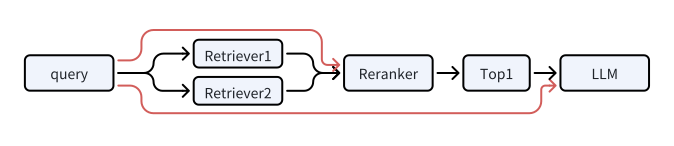

<div align="center">
  
</div>

# LazyLLM: 低代码构建多Agent大模型应用的开发工具
[EN](README.md)  |  [中文](README.CN.md)

[](https://github.com/LazyAGI/LazyLLM/actions/workflows/main.yml)
[](https://opensource.org/license/apache-2-0)
[](https://star-history.com/#LazyAGI/LazyLLM)
[](https://discord.gg/cDSrRycuM6)

## 一、简介

LazyLLM是一款低代码构建**多Agent**大模型应用的开发工具，协助开发者用极低的成本构建复杂的AI应用，并可以持续的迭代优化效果。LazyLLM提供了便捷的搭建应用的workflow，并且为应用开发过程中的各个环节提供了大量的标准流程和工具。<br>
基于LazyLLM的AI应用构建流程是**原型搭建 -> 数据回流 -> 迭代优化**，即您可以先基于LazyLLM快速跑通应用的原型，再结合场景任务数据进行bad-case分析，然后对应用中的关键环节进行算法迭代和模型微调，进而逐步提升整个应用的效果。<br>
LazyLLM致力于敏捷与效率的统一，开发者可以高效的迭代算法，然后将迭代好的算法应用到工业生产中，支持多用户、容错和高并发。
**用户文档**： https://docs.lazyllm.ai/ <br>

微信扫描下方二维码加入交流群(左)或通过观看视频了解更多(右)<br>
<p align="center">


</p>

## 二、特性

**便捷的AI应用组装流程**：即使您不了解大模型，您仍然可以像搭积木一样，借助我们内置的数据流和功能模块，轻松组建包含多个Agent的AI应用。<br>

**复杂应用一键部署**：我们提供一键部署所有模块的能力。具体就是：在POC阶段，LazyLLM通过一套轻量的网关机制，简化了多Agent应用的部署流程，解决了依次启动各个子模块（如LLM、Embedding等）服务并配置URL的问题，使整个过程更加顺畅高效。而在应用的发布阶段，LazyLLM则提供了一键封装镜像的能力，使得应用可以方便地利用k8s的网关、负载均衡、容错等能力。<br>

**跨平台兼容**：无需修改代码，即可一键切换IaaS平台，目前兼容裸金属服务器、开发机、Slurm集群、公有云等。这使得开发中的应用可以无缝迁移到其他IaaS平台，大大减少了代码修改的工作量。<br>

**支持网格搜索参数优化**：根据用户配置，自动尝试不同的基模型、召回策略和微调参数，对应用进行评测和优化。这使得超参数调优过程无需对应用代码进行大量侵入式修改，提高了调优效率，帮助用户快速找到最佳配置。<br>

**高效的模型微调**：支持对应用中的模型进行微调，持续提升应用效果。根据微调场景，自动选择最佳的微调框架和模型切分策略。这不仅简化了模型迭代的维护工作，还让算法研究员能够将更多精力集中在算法和数据迭代上，而无需处理繁琐的工程化任务。<br>

## 三、使用指南

LazyLLM可用来构建常用的人工智能应用，下面给出一些例子。

### 3.1 对话机器人

**这是一个简单的对话机器人示例。**

```python
# set environment variable: LAZYLLM_OPENAI_API_KEY=xx 
# or you can make a config file(~/.lazyllm/config.json) and add openai_api_key=xx
import lazyllm
chat = lazyllm.OnlineChatModule()
lazyllm.WebModule(chat).start().wait()
```

如果你想使用一个本地部署的模型，请确保自己安装了至少一个推理框架(lightllm或vllm)，然后代码如下：

```python
import lazyllm
# Model will be downloaded automatically if you have an internet connection.
chat = lazyllm.TrainableModule('internlm2-chat-7b')
lazyllm.WebModule(chat, port=23466).start().wait()
```

如果你是使用 `pip` 安装的 `lazyllm` ，并且保证python环境的`bin`目录已经在`$PATH`中，则你可以通过执行 `lazyllm run chatbot` 来快速启动一个对话机器人。如果你想使用本地模型，则需要用`--model`参数指定模型名称，例如你可以用`lazyllm run chatbot --model=internlm2-chat-7b` 来启动基于本地模型的对话机器人。

**这是一个带多模态和意图识别的高级机器人示例。**


<details>
<summary>点击获取import和prompt</summary>

```python
from lazyllm import TrainableModule, WebModule, deploy, pipeline
from lazyllm.tools import IntentClassifier

painter_prompt = '现在你是一位绘图提示词大师，能够将用户输入的任意中文内容转换成英文绘图提示词，在本任务中你需要将任意输入内容转换成英文绘图提示词，并且你可以丰富和扩充提示词内容。'
musician_prompt = '现在你是一位作曲提示词大师，能够将用户输入的任意中文内容转换成英文作曲提示词，在本任务中你需要将任意输入内容转换成英文作曲提示词，并且你可以丰富和扩充提示词内容。'
```
</details>

```python
base = TrainableModule('internlm2-chat-7b')
with IntentClassifier(base) as ic:
    ic.case['聊天', base]
    ic.case['语音识别', TrainableModule('SenseVoiceSmall')]
    ic.case['图片问答', TrainableModule('Mini-InternVL-Chat-2B-V1-5').deploy_method(deploy.LMDeploy)]
    ic.case['画图', pipeline(base.share().prompt(painter_prompt), TrainableModule('stable-diffusion-3-medium'))]
    ic.case['生成音乐', pipeline(base.share().prompt(musician_prompt), TrainableModule('musicgen-small'))]
    ic.case['文字转语音', TrainableModule('ChatTTS')]
WebModule(ic, history=[base], audio=True, port=8847).start().wait()
```

### 3.2 检索增强生成



<details>
<summary>点击获取import和prompt</summary>

```python

import os
import lazyllm
from lazyllm import pipeline, parallel, bind, _0, Document, Retriever, Reranker

prompt = '你将扮演一个人工智能问答助手的角色，完成一项对话任务。在这个任务中，你需要根据给定的上下文以及问题，给出你的回答。'
```
</details>

这是一个在线部署示例：

```python
documents = Document(dataset_path="file/to/yourpath", embed=lazyllm.OnlineEmbeddingModule(), manager=False)
documents.create_node_group(name="sentences", transform=SentenceSplitter, chunk_size=1024, chunk_overlap=100)
with pipeline() as ppl:
    with parallel().sum as ppl.prl:
        prl.retriever1 = Retriever(documents, group_name="sentences", similarity="cosine", topk=3)
        prl.retriever2 = Retriever(documents, "CoarseChunk", "bm25_chinese", 0.003, topk=3)

    ppl.reranker = Reranker("ModuleReranker", model="bge-reranker-large", topk=1) | bind(query=ppl.input)
    ppl.formatter = (lambda nodes, query: dict(context_str="".join([node.get_content() for node in nodes]), query=query)) | bind(query=ppl.input)
    ppl.llm = lazyllm.OnlineChatModule(stream=False).prompt(lazyllm.ChatPrompter(prompt, extra_keys=["context_str"]))

lazyllm.WebModule(ppl, port=23466).start().wait()
```

这是一个本地部署示例：

```python
documents = Document(dataset_path='/file/to/yourpath', embed=lazyllm.TrainableModule('bge-large-zh-v1.5'))
documents.create_node_group(name="sentences", transform=SentenceSplitter, chunk_size=1024, chunk_overlap=100)

with pipeline() as ppl:
    with parallel().sum as ppl.prl:
        prl.retriever1 = Retriever(documents, group_name="sentences", similarity="cosine", topk=3)
        prl.retriever2 = Retriever(documents, "CoarseChunk", "bm25_chinese", 0.003, topk=3)

    ppl.reranker = Reranker("ModuleReranker", model="bge-reranker-large", topk=1) | bind(query=ppl.input)
    ppl.formatter = (lambda nodes, query: dict(context_str="".join([node.get_content() for node in nodes]), query=query)) | bind(query=ppl.input)
    ppl.llm = lazyllm.TrainableModule("internlm2-chat-7b").prompt(lazyllm.ChatPrompter(prompt, extra_keys=["context_str"]))

lazyllm.WebModule(ppl, port=23456).start().wait()
```

https://github.com/LazyAGI/LazyLLM/assets/12124621/77267adc-6e40-47b8-96a8-895df165b0ce

如果你是使用 `pip` 安装的 `lazyllm` ，并且保证python环境的`bin`目录已经在`$PATH`中，则你可以通过执行 `lazyllm run rag --documents=/file/to/yourpath` 来快速启动一个检索增强机器人。如果你想使用本地模型，则需要用`--model`参数指定模型名称，例如你可以用`lazyllm run rag --documents=/file/to/yourpath --model=internlm2-chat-7b` 来启动基于本地模型的检索增强机器人。

### 3.3 故事创作

<details>
<summary>点击查看import和prompt</summary>

```python
import lazyllm
from lazyllm import pipeline, warp, bind
from lazyllm.components.formatter import JsonFormatter

toc_prompt=""" 你现在是一个智能助手。你的任务是理解用户的输入，将大纲以列表嵌套字典的列表。每个字典包含一个 `title` 和 `describe`，其中 `title` 中需要用Markdown格式标清层级，`describe` `describe` 是对该段的描述和写作指导。

请根据以下用户输入生成相应的列表嵌套字典：

输出示例:
[
    {
        "title": "# 一级标题",
        "describe": "请详细描述此标题的内容，提供背景信息和核心观点。"
    },
    {
        "title": "## 二级标题",
        "describe": "请详细描述标题的内容，提供具体的细节和例子来支持一级标题的观点。"
    },
    {
        "title": "### 三级标题",
        "describe": "请详细描述标题的内容，深入分析并提供更多的细节和数据支持。"
    }
]
用户输入如下：
"""

completion_prompt="""
你现在是一个智能助手。你的任务是接收一个包含 `title` 和 `describe` 的字典，并根据 `describe` 中的指导展开写作
输入示例:
{
    "title": "# 一级标题",
    "describe": "这是写作的描述。"
}

输出:
这是展开写作写的内容
接收如下：

"""

writer_prompt = {"system": completion_prompt, "user": '{"title": {title}, "describe": {describe}}'}
```
</details>

这是一个在线部署示例：

```python
with pipeline() as ppl:
    ppl.outline_writer = lazyllm.OnlineChatModule(stream=False).formatter(JsonFormatter()).prompt(toc_prompt)
    ppl.story_generater = warp(lazyllm.OnlineChatModule(stream=False).prompt(writer_prompt))
    ppl.synthesizer = (lambda *storys, outlines: "\n".join([f"{o['title']}\n{s}" for s, o in zip(storys, outlines)])) | bind(outlines=ppl.output('outline_writer'))
lazyllm.WebModule(ppl, port=23466).start().wait()
```

这是一个本地部署示例：

```python
with pipeline() as ppl:
    ppl.outline_writer = lazyllm.TrainableModule('internlm2-chat-7b').formatter(JsonFormatter()).prompt(toc_prompt)
    ppl.story_generater = warp(ppl.outline_writer.share(prompt=writer_prompt).formatter())
    ppl.synthesizer = (lambda *storys, outlines: "\n".join([f"{o['title']}\n{s}" for s, o in zip(storys, outlines)])) | bind(outlines=ppl.output('outline_writer'))
lazyllm.WebModule(ppl, port=23466).start().wait()
```

### 3.4 AI绘画助手

<details>
<summary>点击获取import和prompt</summary>

```python
import lazyllm
from lazyllm import pipeline

prompt = 'You are a drawing prompt word master who can convert any Chinese content entered by the user into English drawing prompt words. In this task, you need to convert any input content into English drawing prompt words, and you can enrich and expand the prompt word content.'
```
</details>

```python
with pipeline() as ppl:
    ppl.llm = lazyllm.TrainableModule('internlm2-chat-7b').prompt(lazyllm.ChatPrompter(prompt))
    ppl.sd3 = lazyllm.TrainableModule('stable-diffusion-3-medium')
lazyllm.WebModule(ppl, port=23466).start().wait()
```

## 四、功能点

1. **应用搭建**：定义了pipeline、parallel、diverter、if、switch、loop等工作流(Flow)，开发者可以基于任意的函数和模块来快速搭建多Agent的AI应用。支持对组装好的多Agent应用进行一键部署，也支持对应用进行部分或者全部的更新。
2. **跨平台**： 支持用户在不同的算力平台上获得一致的使用体验。目前兼容裸金属、Slurm、SenseCore等多种算力平台。
3. **支持大模型的微调和推理**
    * 离线(本地)模型服务：
        + 支持微调框架：collie、peft
        + 支持推理框架：lightllm、vllm
        + 支持根据用户场景自动选择最合适的框架和模型参数(如micro-bs、tp、zero等)。
    * 在线服务：
        + 支持微调服务：GPT、SenseNova、通义千问
        + 支持推理服务：GPT、SenseNova、Kimi、智谱、通义千问
        + 支持Embedding推理服务：Openai、SenseNova、GLM、通义千问
    * 支持开发者以统一的方式使用本地服务和线上服务
4. **支持RAG常用组件**：Document、Parser、Retriever、Reranker等。
5. **基础的界面支持**：如聊天界面、文档管理界面等。

## 五、安装

### 源码安装

```bash
git clone git@github.com:LazyAGI/LazyLLM.git
cd LazyLLM
pip install -r requirements.txt
```

如果想进行微调、推理部署或搭建rag应用等，则需使用 `pip install -r requirements.full.txt`

### pip安装

仅安装lazyllm及必要的依赖，可以使用
```bash
pip3 install lazyllm
```

安装lazyllm及所有的依赖，可以使用
```bash
pip3 install lazyllm
lazyllm install full
```

## 六、设计理念

LazyLLM的设计理念源自对我们对大模型在生产环节表现出的局限性的深刻洞察，我们深知现阶段的大模型尚无法完全端到端地解决所有实际问题。因此，基于LazyLLM的AI应用构建流程强调“快速原型搭建，结合场景任务数据进行bad-case分析，针对关键环节进行算法尝试和模型微调，进而逐步提升整个应用的效果”。LazyLLM处理了这个过程中繁琐的工程化工作，提供便捷的操作接口，让用户能够集中精力提升算法效果，打造出色的AI应用。<br>

LazyLLM的设计目标是让算法研究员和开发者能够能够从繁杂的工程实现中解脱出来，从而专注于他们最擅长的领域：算法和数据，解决他们在实际场景中的问题。无论你是初学者还是资深专家，我们希望LazyLLM都能为你提供一些帮助。对于初级开发者，LazyLLM彻底简化了AI应用的构建过程。他们无需再考虑如何将任务调度到不同的IaaS平台上，不必了解API服务的构建细节，也无需在微调模型时选择框架或切分模型，更不需要掌握任何Web开发知识。通过预置的组件和简单的拼接操作，初级开发者便能轻松构建出具备生产价值的工具。而对于资深的专家，LazyLLM提供了极高的灵活性，每个模块都支持定制和扩展，使用户能够轻松集成自己的算法以及业界先进的生产工具，打造更为强大的应用。<br>

为了让您不被困于所依赖的辅助工具的实现细节，在LazyLLM中，我们会尽最大努力让相同定位的模块拥有一致的使用体验；例如我们通过一套Prompt的规则，让线上模型（ChatGPT、SenseNova、Kimi、ChatGlm等）和本地模型在使用的时候拥有着相同的使用方式，方便您灵活的将应用中的本地模型替换为线上模型。

与市面上多数框架不同，LazyLLM在每个环节都精挑细选了2-3个我们认为最具优势的工具进行集成。这不仅简化了用户选择的过程，还确保了用户能够以最低的成本，搭建出最具生产力的应用。我们不追求工具或模型的数量，而是专注于质量和实际效果，致力于提供最优的解决方案。LazyLLM旨在为AI应用构建提供一条快速、高效、低门槛的路径，解放开发者的创造力，推动AI技术在实际生产中的落地和普及。<br>

最后，LazyLLM是一个用户至上的工具，您有什么想法都可以给我们留言，我们会尽自己所能解答您的困惑，让LazyLLM能给您带来便利。

## 七、架构说明


## 八、基本概念

### Component

Component是LazyLLM中最小的执行单元，它既可以是一个函数，也可以是一个bash命令。Component具备三个典型的能力：
1. 能借助launcher，实现用户无感的跨平台。
  - EmptyLauncher：本地运行，支持开发机、裸金属等；
  - RemoteLauncher：调度到计算节点运行，支持Slurm、SenseCore等。
2. 利用注册机制，实现方法的分组索引和快速查找。支持对函数和bash命令进行注册。下面是一个例子：
```python
import lazyllm
lazyllm.component_register.new_group('demo')

@lazyllm.component_register('demo')
def test(input):
    return f'input is {input}'

@lazyllm.component_register.cmd('demo')
def test_cmd(input):
    return f'echo input is {input}'

# >>> lazyllm.demo.test()(1)
# 'input is 1'
# >>> lazyllm.demo.test_cmd(launcher=launchers.slurm)(2)
# Command: srun -p pat_rd -N 1 --job-name=xf488db3 -n1 bash -c 'echo input is 2'
```

### Module
Module是LazyLLM中的顶层组件，具备训练、部署、推理和评测四项关键能力，每个模块可以选择实现其中的部分或者全部的能力，每项能力都可以由1到多个Component组成。如下表所示，我们内置了一些基础的Module供大家使用。


|                  |                 作用                  | 训练/微调 | 部署 | 推理 | 评测 |
| :---: |:-----------------------------------:| :---: | :---: | :---: | :---: |
| ActionModule     |      可以将函数、模块、flow等包装成一个Module      | 支持通过ActionModule对其Submodule进行训练/微调| 支持通过ActionModule对其Submodule进行部署 | ✅ | ✅ |
| UrlModule        |      将任意Url包装成Module，用于访问外部服务       | ❌ | ❌ | ✅ | ✅ |
| ServerModule     |     将任意的函数、flow或Module包装成API服务      | ❌ | ✅ | ✅ | ✅ |
| TrainableModule  | 可训练的Module，所有支持的模型均为TrainableModule | ✅ | ✅ | ✅ | ✅ |
| WebModule        |            启动一个多轮对话的界面服务            | ❌ | ✅ | ❌ | ✅ |
| OnlineChatModule |           接入在线模型的微调和推理服务            | ✅ | ✅ | ✅ | ✅ |
| OnlineEmbeddingModule |        接入在线Embedding模型的推理服务         | ❌ | ✅ | ✅ | ✅ |

### Flow

Flow 是LazyLLM中定义的数据流，描述了数据如何从一个可调用对象传递到另一个可调用的对象，您可以利用Flow直观而高效地组织和管理数据流动。基于预定义好的各种Flow，我们可以借助Module、Component、Flow甚至任一可调用的对象，轻松地构建和管理复杂的应用程序。目前LazyLLm中实现的Flow有Pipeline、Parallel、Diverter、Warp、IFS、Loop等，几乎可以覆盖全部的应用场景。利用Flow构建应用具备以下优势：
1. 您可以方便地组合、添加和替换各个模块和组件；Flow 的设计使得添加新功能变得简单，不同模块甚至项目之间的协作也变得更加容易。
2. 通过一套标准化的接口和数据流机制，Flow 减少了开发人员在处理数据传递和转换时的重复工作。开发人员可以将更多精力集中在核心业务逻辑上，从而提高整体开发效率。
3. 部分Flow 支持异步处理模式和并行执行，在处理大规模数据或复杂任务时，可以显著提高响应速度和系统性能。


## 九、 后续计划

### 9.1 时间线
V0.6 预计从9.1日开始，历时3个月，中间会不间断发布小版本，如v0.6.1, v0.6.2
V0.7 预计从12.1日开始，历时3个月，中间会不间断发布小版本，如v0.7.1, v0.7.2

### 9.2 功能模块
9.2.1 RAG
  - 9.2.1.1 工程
    - 沉淀LazyRAG中的能力到LazyLLM  （V0.6 ）
    - RAG的宏观问答能力扩展到多知识库 （V0.6 ）
    - RAG模块完全支持横向扩容，支持多机部署RAG的算法协同工作 （V0.6 ）
    - 知识图谱接入至少1个开源框架 （V0.6 ）
    - 支持常用的数据切分策略，不少于20种，覆盖各种类型的文档 （V0.6 ）
  - 9.2.1.2 数据能力
    - 表格解析（V0.6 - 0.7 ）
    - CAD图片解析（V0.7 -  ）
  - 9.2.1.3 算法能力
    - 支持对CSV等相对结构化的文本的处理 （V0.6 ）
    - 多跳检索（文档中的链接，参考文献等）  （V0.6 ）
    - 信息冲突处理 （V0.7 ）
    - AgenticRL & 写代码解问题能力（V0.7 ）

9.2.2 功能模块
  - 支持记忆的能力 （V0.6 ）
  - 分布式Launcher的支持 （V0.7）
  - 基于数据库的Globals支持 （V0.6 ）
  - ServerModule可以发布成mcp服务（v0.7）
  - 线上沙箱服务的集成（v0.7）

9.2.3 模型训推
  - 支持OpenAI接口的部署和推理 （V0.6 ）
  - 统一微调和推理的提示词 （V0.7 ）
  - Example中给出微调示例 （V0.7 ）
  - 集成2-3个提示词仓库，可以直接选择提示词仓库中的提示词 （V0.6 ）
  - 支持更智能的模型类型判断和推理框架选择，重构和简化auto-finetune选框架的逻辑 （V0.6 ）
  - GRPO全链路支持 （V0.7 ）

9.2.4 文档
  - 完善API文档，确保每个公开接口都有API文档，文档参数和函数参数一致，且有可执行的样例代码 （V0.6 ）
  - 完善CookBook文档，案例增加至50个，并有和LangChain / Llamaindex的对比 （代码量，速度，扩展性） （V0.6 ）
  - 完善Environment文档，补充在win/linux/macos的安装方式，补充对包的切分策略 （V0.6 ）
  - 完善Learn文档，先教大家用大模型；然后教大家构建agent；然后教大家用workflow；再教大家搭建rag； （V0.6 ）

9.2.5 质量
  - 通过对大部分模块进行Mock，将CI的时间降低到10分钟以内 （V0.6 ）
  - 增加每日构建，高耗时 / token的任务放到每日构建中执行 （V0.6 ）

9.2.6 开发、部署与发布
  - Debug优化（v0.7）
  - 过程监控  [输出 + 性能]（v0.7）
  - 依赖的训推框架的环境隔离和环境的自动建设（V0.6 ）

9.2.7 生态
  - 推动LazyCraft的开源 （V0.6 ）
  - 推动LazyRAG的开源 （V0.7 ）
  - 将代码传至Github以外的2个代码托管网站，并争取取得社区合作（V0.6 ）