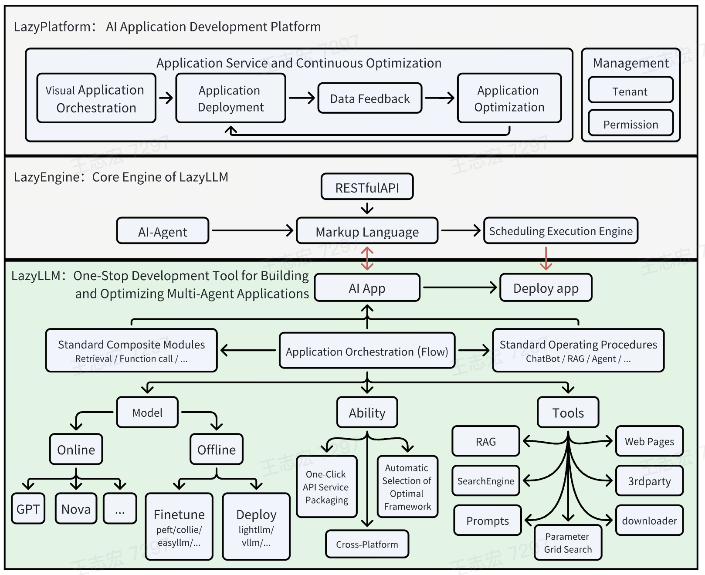

# LazyLLM: A  Low-code Development Tool For Building Multi-agent LLMs Applications.
[中文](README.md) |  [EN](README.ENG.md)

## What is LazyLLM?

LazyLLM is a low-code development tool for building multi-agent LLMs(large language models) applications. It assists developers in creating complex AI applications at very low costs and enables continuous iterative optimization. LazyLLM offers a convenient workflow for application building and provides numerous standard processes and tools for various stages of the application development process.<br>

The AI application development process based on LazyLLM follows the **prototype building -> data feedback -> iterative optimization** workflow. This means you can quickly build a prototype application using LazyLLM, then analyze bad cases using task-specific data, and subsequently iterate on algorithms and fine-tune models at critical stages of the application to gradually enhance the overall performance.<br>

## Features

**Convenient AI Application Assembly Process**: Even if you are not familiar with large models, you can still easily assemble AI applications with multiple agents using our built-in data flow and functional modules, just like Lego building.

**One-Click Deployment of Complex Applications**: We offer the capability to deploy all modules with a single click. Specifically, during the POC (Proof of Concept) phase, LazyLLM simplifies the deployment process of multi-agent applications through a lightweight gateway mechanism, solving the problem of sequentially starting each submodule service (such as LLM, Embedding, etc.) and configuring URLs, making the entire process smoother and more efficient. In the application release phase, LazyLLM provides the ability to package images with one click, making it easy to utilize Kubernetes' gateway, load balancing, and fault tolerance capabilities.

**Cross-Platform Compatibility**: Switch IaaS platforms with one click without modifying code, compatible with bare-metal servers, development machines, Slurm clusters, public clouds, etc. This allows developed applications to be seamlessly migrated to other IaaS platforms, greatly reducing the workload of code modification.<br>

**Support for Grid Search Parameter Optimization**: Automatically try different base models, retrieval strategies, and fine-tuning parameters based on user configurations to evaluate and optimize applications. This makes hyperparameter tuning efficient without requiring extensive intrusive modifications to application code, helping users quickly find the best configuration.<br>

**Efficient Model Fine-Tuning**: Support fine-tuning models within applications to continuously improve application performance. Automatically select the best fine-tuning framework and model splitting strategy based on the fine-tuning scenario. This not only simplifies the maintenance of model iterations but also allows algorithm researchers to focus more on algorithm and data iteration, without handling tedious engineering tasks.<br>


## What can you build with Lazyllm

LazyLLM can be used to build common artificial intelligence applications. Here are some examples.

### ChatBots

```python
# set environment variable: LAZYLLM_OPENAI_API_KEY=xx 
# or you can make a config file(~/.lazyllm/config.json) and add openai_api_key=xx
import lazyllm
t = lazyllm.OnlineChatModule(source="openai", stream=True)
w = lazyllm.WebModule(t)
w.start().wait()
```

If you want to use a locally deployed model, please ensure you have installed at least one inference framework (lightllm or vllm), and then use the following code

```python
import lazyllm
# Model will be download automatically if you have an internet connection
t = lazyllm.TrainableModule('internlm2-chat-7b')
w = lazyllm.WebModule(t)
w.start().wait()
```

### RAG

<details>
<summary>click to look up prompts and imports</summary>

```python

import os
import lazyllm
from lazyllm import pipeline, parallel, bind, _0, Document, Retriever, Rerank

prompt = 'You will play the role of an AI Q&A assistant and complete a dialogue task. In this task, you need to provide your answer based on the given context and question.'
```
</details>

```python
# If use redis, please set 'export LAZYLLM_RAG_STORE=Redis', and export LAZYLLM_REDIS_URL=redis://{IP}:{PORT}
documents = Document(dataset_path='/file/to/yourpath', lazyllm.TrainableModule('bge-large-zh-v1.5'))

#  input ---> retriver -->  reranker---> llm
#        |--------------↑            ↑
#        |---------------------------↑
with pipeline as ppl:
    ppl.retriever = Retriever(documents, similarity='chinese_bm25', parser='SentenceDivider', similarity_top_k=6)
    ppl.reranker = Rerank(types='Reranker', model='bge-reranker-large') | bind(ppl.input, _0)
    ppl.formatter = lambda ctx, query: dict(context_str=ctx, query_str=query) | bind(query=ppl.input)
    ppl.llm = lazyllm.TrainableModule('internlm2-chat-7b').prompt(lazyllm.ChatPrompter(prompt, extro_keys=['context_str'])) 

mweb = lazyllm.WebModule(ppl, port=23456).start().wait()
```

### Stories Creator

<details>
<summary>click to look up prompts and imports</summary>

```python
import lazyllm
from lazyllm import pipeline, parallel, Identity, warp, package
import time
import re, json

toc_prompt="""
You are now an intelligent assistant. Your task is to understand the user's input and convert the outline into a list of nested dictionaries. Each dictionary contains a `title` and a `describe`, where the `title` should clearly indicate the level using Markdown format, and the `describe` is a description and writing guide for that section.

Please generate the corresponding list of nested dictionaries based on the following user input:

Example output:
[
    {
        "title": "# Level 1 Title",
        "describe": "Please provide a detailed description of the content under this title, offering background information and core viewpoints."
    },
    {
        "title": "## Level 2 Title",
        "describe": "Please provide a detailed description of the content under this title, giving specific details and examples to support the viewpoints of the Level 1 title."
    },
    {
        "title": "### Level 3 Title",
        "describe": "Please provide a detailed description of the content under this title, deeply analyzing and providing more details and data support."
    }
]
User input is as follows:
"""

completion_prompt="""
You are now an intelligent assistant. Your task is to receive a dictionary containing `title` and `describe`, and expand the writing according to the guidance in `describe`.

Input example:
{
    "title": "# Level 1 Title",
    "describe": "This is the description for writing."
}

Output:
This is the expanded content for writing.
Receive as follows:

"""
```
</details>

```python
t1 = lazyllm.OnlineChatModule(source="openai", stream=False, prompter=ChatPrompter(instruction=toc_prompt))
t2 = lazyllm.OnlineChatModule(source="openai", stream=False, prompter=ChatPrompter(instruction=completion_prompt))

spliter = lambda s: tuple(eval(re.search(r'\[\s*\{.*\}\s*\]', s['message']['content'], re.DOTALL).group()))
writter = pipeline(lambda d: json.dumps(d, ensure_ascii=False), t2, lambda d : d['message']['content'])
collector = lambda dict_tuple, repl_tuple: "\n".join([v for d in [{**d, "describe": repl_tuple[i]} for i, d in enumerate(dict_tuple)] for v in d.values()])
m = pipeline(t1, spliter, parallel(Identity, warp(writter)), collector)

print(m({'query': 'Please help me write an article about the application of artificial intelligence in the medical field.'}))
```

## What can LazyLLM do

1. **Application Building**: Defines workflows such as pipeline, parallel, diverter, if, switch, and loop. Developers can quickly build multi-agent AI applications based on any functions and modules. Supports one-click deployment for assembled multi-agent applications, and also supports partial or complete updates to the applications.
2. **Platform-independent**: Consistent user experience across different computing platforms. Currently compatible with various platforms such as bare metal, Slurm, SenseCore, etc.
3. **Supports fine-tuning and inference for large models**:
    * Offline (local) model services:
        + Supports fine-tuning frameworks: collie, peft
        + Supports inference frameworks: lightllm, vllm
        + Supports automatically selecting the most suitable framework and model parameters (such as micro-bs, tp, zero, etc.) based on user scenarios..
    * Online services:
        + Supports fine-tuning services: GPT, SenseNova, Tongyi Qianwen
        + Supports inference services: GPT, SenseNova, Kimi, Zhipu, Tongyi Qianwen
        + Supports embedding inference services: OpenAI, SenseNova, GLM, Tongyi Qianwen
    * Support developers to use local services and online services uniformly.
4. **Supports common RAG (Retrieval-Augmented Generation) components**: Document, Parser, Retriever, Reranker, etc.
5. **Supports basic webs**: such as chat interface and document management interface, etc.

## Installation

### from source-code

```bash
git clone git@github.com:LazyAGI/LazyLLM.git
cd LazyLLM
pip install -c requirements.txt
```

`pip install -c requirements.full.txt` is used when you want to finetune, deploy or build your rag application.

### from pip

Only install lazyllm and necessary dependencies, you can use:
```bash
pip install lazyllm
```

Install lazyllm and all dependencies, you can use:
```bash
pip install lazyllm-full
```

## Design concept

The design philosophy of LazyLLM stems from a deep understanding of the current limitations of large models in production environments. We recognize that at this stage, large models cannot yet fully solve all practical problems end-to-end. Therefore, the AI application development process based on LazyLLM emphasizes "rapid prototyping, bad-case analysis using scenario-specific data, algorithmic experimentation, and model fine-tuning on key aspects to improve the overall application performance." LazyLLM handles the tedious engineering work involved in this process, offering convenient interfaces that allow users to focus on enhancing algorithmic effectiveness and creating outstanding AI applications.<br>

The goal of LazyLLM is to free algorithm researchers and developers from the complexities of engineering implementations, allowing them to concentrate on what they do best: algorithms and data, and solving real-world problems. Whether you are a beginner or an experienced expert, I hope LazyLLM can provide you with some assistance. For novice developers, LazyLLM thoroughly simplifies the AI application development process. They no longer need to worry about how to schedule tasks on different IaaS platforms, understand the details of API service construction, choose frameworks or split models during fine-tuning, or master any web development knowledge. With pre-built components and simple integration operations, novice developers can easily create tools with production value. For seasoned experts, LazyLLM offers a high degree of flexibility. Each module supports customization and extension, enabling users to seamlessly integrate their own algorithms and state-of-the-art production tools to build more powerful applications.<br>

To prevent you from being bogged down by the implementation details of dependent auxiliary tools, LazyLLM strives to ensure a consistent user experience across similar modules. For instance, we have established a set of Prompt rules that provide a uniform usage method for both online models (such as ChatGPT, SenseNova, Kimi, ChatGLM, etc.) and local models. This consistency allows you to easily and flexibly switch between local and online models in your applications.<br>

Unlike most frameworks on the market, LazyLLM carefully selects and integrates 2-3 tools that we believe are the most advantageous at each stage. This not only simplifies the user’s decision-making process but also ensures that users can build the most productive applications at the lowest cost. We do not pursue the quantity of tools or models, but focus on quality and practical effectiveness, committed to providing the optimal solutions. LazyLLM aims to provide a quick, efficient, and low-threshold path for AI application development, freeing developers' creativity, and promoting the adoption and popularization of AI technology in real-world production.<br>

Finally, LazyLLM is a user-centric tool. If you have any ideas or feedback, feel free to leave us a message. We will do our best to address your concerns and ensure that LazyLLM provides you with the convenience you need.<br>

## Architecture



## Basic concept

### Component

A Component is the smallest execution unit in LazyLLM; it can be either a function or a bash command. Components have three typical capabilities:
1. Cross-platform execution using a launcher, allowing seamless user experience:
  - EmptyLauncher: Runs locally, supporting development machines, bare metal, etc.
  - RemoteLauncher: Schedules execution on compute nodes, supporting Slurm, SenseCore, etc.
2. Implements a registration mechanism for grouping and quickly locating methods. Supports registration of functions and bash commands. Here is an example:

```python
import lazyllm
lazyllm.component_register.new_group('demo')

@lazyllm.component_register('demo')
def test(input):
    return f'input is {input}'

@lazyllm.component_register.cmd('demo')
def test_cmd(input):
    return f'echo input is {input}'

# >>> demo.test()(1)
# 'input is 1'
# >>> demo.test_cmd(launcher=launchers.slurm)(2)
# Command: srun -p pat_rd -N 1 --job-name=xf488db3 -n1 bash -c 'echo input is 2'
```

### Module

Modules are the top-level components in LazyLLM, equipped with four key capabilities: training, deployment, inference, and evaluation. Each module can choose to implement some or all of these capabilities, and each capability can be composed of one or more components. As shown in the table below, we have built-in some basic modules for everyone to use.

|      |Function | Training/Fine-tuning | Deployment | Inference | Evaluation |
| :---: | :---: | :---: | :---: | :---: | :---: |
| ActionModule | Can wrap functions, modules, flows, etc., into a Module | Supports training/fine-tuning of its Submodules through ActionModule | Supports deployment of its Submodules through ActionModule | ✅ | ✅ |
| UrlModule | Wraps any URL into a Module to access external services | ❌ | ❌ | ✅ | ✅ |
| ServerModule | Wraps any function, flow, or Module into an API service | ❌ | ✅ | ✅ | ✅
| TrainableModule | Trainable Module, all supported models are TrainableModules | ✅ | ✅ | ✅ | ✅ |
| WebModule | Launches a multi-round dialogue interface service | ❌ | ✅ | ❌ | ✅ |
| OnlineChatModule | Integrates online model fine-tuning and inference services | ✅ | ✅ | ✅ | ✅ |
| OnlineEmbeddingModule | Integrates online Embedding model inference services | ❌ | ✅ | ✅ | ✅ |


### Flow

Flow in LazyLLM defines the data stream, describing how data is passed from one callable object to another. You can use Flow to intuitively and efficiently organize and manage data flow. Based on various predefined Flows, we can easily build and manage complex applications using Modules, Components, Flows, or any callable objects. The Flows currently implemented in LazyLLM include Pipeline, Parallel, Diverter, Warp, IFS, Loop, etc., which can cover almost all application scenarios. Building applications with Flow offers the following advantages:
1. You can easily combine, add, and replace various modules and components; the design of Flow makes adding new features simple and facilitates collaboration between different modules and even projects.
2. Through a standardized interface and data flow mechanism, Flow reduces the repetitive work developers face when handling data transfer and transformation. Developers can focus more on core business logic, thus improving overall development efficiency.
3. Some Flows support asynchronous processing and parallel execution, significantly enhancing response speed and system performance when dealing with large-scale data or complex tasks.

## RoadMap

We plan to support the following features by the end of July:

RAG
- [ ]  Refactor the RAG module to remove the dependency on llamaindex
- [ ]  Support online parser

One-Click Deployment of Applications
- [ ]  Support one-click generation of Docker, one-click application startup, supporting high concurrency and fault tolerance

Model Service
- [ ]  Enhance the ability to automatically select fine-tuning/inference frameworks and parameters based on user scenarios
- [ ]  Support fine-tuning of 70B models
- [ ]  Support multiple inference services during model inference and achieve load balancing

Tools
- [ ]  Integrate common search engines
- [ ]  Support common formatters
- [ ]  Built-in Prompter templates

User Experience Optimization
- [ ] Optimize the flow of data in flow, support flexible data flow, and reduce the number of times Identity is used
