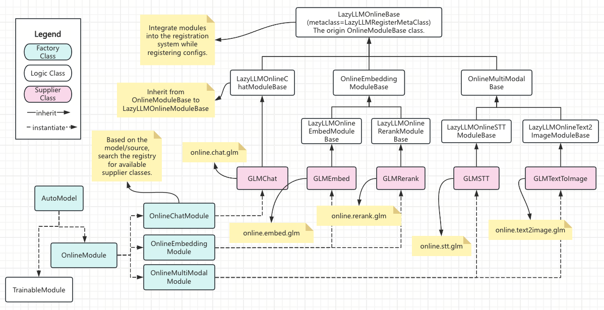

# Inheritance-as-Registration Specification

## 1. Mechanism Overview

### 1.1 Background and Purpose

In LazyLLM, there are many Online Modules and service modules, with clear type differences and a need for continuous expansion.
To reduce onboarding cost, unify management, and avoid maintenance complexity from explicit registration, LazyLLM introduces an **inheritance-based auto-registration mechanism**.

This mechanism uses **class inheritance relationships and naming conventions** to complete registration at module definition time, without any explicit registration calls from developers.

### 1.2 What “Registration” Means

When a module class meets the registration conditions, LazyLLM automatically performs the following:

1. Capability group (Group / Type) registration

    Create or extend the corresponding capability group node under the lazyllm namespace, for example:

    - `lazyllm.online.chat`

    - `lazyllm.online.stt`

    - `lazyllm.online.tts`

2. Supplier class registration

    Attach the concrete implementation class to the corresponding group and provide a unified access entry, for example:

    - `lazyllm.online.chat.doubao`

    - `lazyllm.online.stt.sensenova`

3. Configuration key declaration

    Based on module capability and supplier information, automatically declare required configuration keys (such as API key, model name, etc.), for example:

    - `<supplier>_model_name`

    - `<supplier>_stt_model_name`

## 2. Extending LazyLLM Online Classes

### 2.1 Capability Types and Base Class Selection

LazyLLM distinguishes module capabilities via the Base class hierarchy. When extending a module, you must inherit the Base class corresponding to the capability type.

Typical capability types include (examples):

| Capability Type  | Corresponding Base Class             |
|------------------|--------------------------------------|
| Chat             | OnlineChatModuleBase                 |
| Embed            | LazyLLMOnlineEmbedModuleBase         |
| Rerank           | LazyLLMOnlineRerankModuleBase        |
| STT              | LazyLLMOnlineSTTModuleBase           |
| TTS              | LazyLLMOnlineTTSModuleBase           |
| Text-to-Image    | LazyLLMOnlineText2ImageModuleBase    |
| Image Editing    | LazyLLMOnlineImageEditingModuleBase  |

> 💡 Rule: the Base class a module inherits determines which capability group it is registered to.

### 2.2 Class Naming Convention (Strict)

Module class names must follow the naming rule below:

```html
<SupplierName><TypeSuffix>
```

Where:

- SupplierName: supplier name (e.g., Doubao, SenseNova)
- TypeSuffix: capability type suffix, consistent with the inherited Base class (e.g., Chat, STT, TTS)

Correct examples:

- DoubaoChat
- SenseNovaSTT
- QwenTextToImage

Incorrect examples (will cause registration to fail):

- Class name does not end with a capability suffix, e.g., `DoubaoModule`
- Class name is inconsistent with the inherited Base type

## 3. Existing Online Module Architecture

### 3.1 Online Module Inheritance Hierarchy

As shown in the figure, LazyLLM Online modules adopt a layered inheritance structure:

- Top-level Base class: LazyLLMOnlineBase class, used to define the unified Online namespace (`lazyllm.online`)

- Capability Base classes
    - Capability families such as LazyLLMOnlineChatModuleBase, OnlineEmbeddingModuleBase, and OnlineMultiModalBase, used to define major capability groups. Among them, `LazyLLMOnlineChatModuleBase` defines the `lazyllm.online.chat` group, while the other two classes skip group registration, letting capability subclasses register specific capability tags.

    - Capability subclasses such as `LazyLLMOnlineRerankModuleBase`, `LazyLLMOnlineTTSModuleBase`, and `LazyLLMOnlineText2ImageModuleBase`. These define specific capability groups such as `lazyllm.online.rerank`, `lazyllm.online.tts`, etc.

- Supplier classes: concrete service implementation classes, following the class naming requirements in [Section 2.2](#22-class-naming-convention-strict).



### 3.2 Registration Results and Access

After registration, modules can be accessed as follows:

```python
import lazyllm

doubao_chat_cls = lazyllm.online.chat.doubao(**kwargs)
sensenova_stt_cls = lazyllm.online.stt.sensenova(**kwargs)
```

The access path remains stable for users and does not depend on the module’s implementation path.

## 4. Extension and Customization Rules

### 4.1 General Configuration and Capability Configuration

LazyLLM distinguishes two types of configuration keys:

1. Supplier-level configuration

    - e.g., `{supplier}_api_key`

    - Independent of capability type; when first registered, LazyLLM adds the corresponding api key configuration for all suppliers

2. Capability-level configuration

    - e.g., `{supplier}_stt_model_name`

    - Only present for the corresponding capability type; provides model name configuration for a supplier class of that capability

> Note: configuration key declaration is automatically handled by LazyLLM during registration. When extending a supplier class, you typically do not need to declare configuration explicitly unless the supplier has extra, specific requirements.

### 4.2 Basic Rules for Extending Supplier Classes

In most cases, extending a new Online supplier class requires only three steps:

- Step 1: choose the capability type and inherit the corresponding Base class

    Choose and inherit the Online Base class based on the capability implemented, for example:

    ```python
    class MyProviderChat(OnlineChatModuleBase):
        ...
    ```

    This inheritance determines that the class is registered to:

    ```bash
    lazyllm.online.chat
    ```

- Step 2: define the class name according to the naming convention

    As stated in [Section 2.2](#22-class-naming-convention-strict), the class name must follow:

    ```html
    <SupplierName><TypeSuffix>
    ```

    For example:
    - `MyProviderChat`
    - `MyProviderSTT`

    LazyLLM will automatically parse the supplier identifier from the class name and generate the corresponding access entry:

    ```bash
    lazyllm.online.chat.myprovider(...)
    ```

- Step 3: implement the supplier’s own logic

    Implement initialization and call logic in the class, such as client creation and request wrapping.

    ```python
    class MyProviderChat(OnlineChatModuleBase):
        def __init__(self, api_key: str, base_url: str = "..."):
            ...
    ```

    After completing the steps above, the supplier class will participate in auto-registration with no extra operations required.

### 4.3 Extending Supplier Subclasses for Multiple Capabilities

When the same supplier needs to support multiple capabilities (such as Chat, STT, Embedding), it is recommended to organize shared logic via a supplier-specific Base class.

For example:

```python
class _MyProviderBase:
    def __init__(self, api_key: str, base_url: str):
        ...
```

Each capability implementation class inherits both the corresponding Online Base and the supplier Base:

```python
class MyProviderChat(OnlineChatModuleBase, _MyProviderBase):
    ...

class MyProviderSTT(LazyLLMOnlineSTTModuleBase, _MyProviderBase):
    ...
```

During registration, LazyLLM will automatically generate common configuration keys based on supplier and capability type, including but not limited to:

- `{supplier}_api_key`
- `{supplier}_model_name`
- `{supplier}_{capability}_model_name`

When extending a supplier class, you typically do not need to declare these configuration keys explicitly; just read them in initialization according to the convention.
