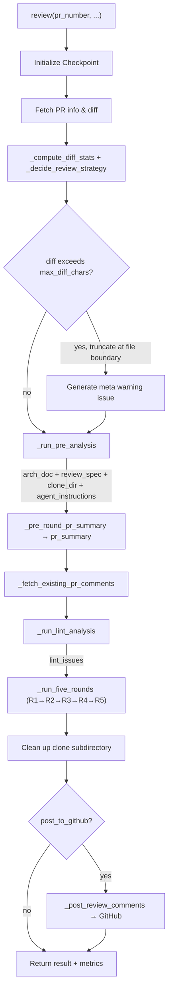

# LazyLLM Git PR Review Pipeline

This document describes the complete end-to-end PR review pipeline in the `lazyllm.tools.git.review` module. The entry point is `review()` in `runner.py`, which orchestrates pre-analysis (architecture parsing, historical spec extraction), five rounds of LLM analysis (R1–R4 + R5 merge/dedup), static Lint fusion, and finally posts results to GitHub.

Source directory: `lazyllm/tools/git/review/` (`runner.py`, `pre_analysis.py`, `rounds.py`, `constants.py`, `checkpoint.py`, `utils.py`, `poster.py`, `lint_runner.py`).

---

## 1. Architecture Overview

### 1.1 Module Responsibilities

| Module | Responsibility |
|--------|---------------|
| `runner.py` | **Main entry point**: orchestrates all sub-modules; diff fetching & truncation; strategy decisions (`_ReviewStrategy`); meta warning generation; clone directory cleanup; posting comments |
| `pre_analysis.py` | Repository clone; architecture document generation (`analyze_repo_architecture`); historical review spec extraction (`analyze_historical_reviews`); PR summary; R2 Agent toolset construction |
| `rounds.py` | **Five-round review core**: R1 hunk-level analysis, R2 adaptive Agent analysis, R3 global architecture analysis, R4 design doc + architect review, R5 merge/dedup |
| `lint_runner.py` | Static Lint analysis (no LLM calls); results injected directly into R5 |
| `checkpoint.py` | Checkpoint/resume: PR-level checkpoint; `ReviewStage` enum; invalidation control (`_invalidated_from`) |
| `constants.py` | Context budget constants; `BudgetManager`; issue density control; diff heuristic compression |
| `utils.py` | LLM call wrappers (retry/QPS); diff parsing; JSON parsing & repair; progress reporting |
| `poster.py` | Fetch existing PR comments; submit GitHub review (batch `submit_review` + per-comment fallback) |

### 1.2 End-to-End Flow Diagram



### 1.3 Stage Sequence

| # | Stage | Key Outputs |
|---|-------|-------------|
| 0 | Checkpoint init | `pr_dir`, `checkpoint.json`, `resume_from → _invalidated_from` |
| 1 | Diff fetch & truncation | `diff_text` (truncated at file boundary up to `max_diff_chars`), `hunks` |
| 2 | Strategy decision | `_DiffStats`, `_ReviewStrategy` (adaptive R2 parameters) |
| 3 | Meta Warning | `source='meta'` issue inserted when truncation occurs |
| 4 | Pre-analysis | `arch_doc`, `review_spec`, `clone_dir`, `agent_instructions` |
| 5 | PR summary | `pr_summary` |
| 6 | Existing comments | `existing_comments` (used for R5 dedup) |
| 7 | Lint analysis | `lint_issues` (injected directly into R5, no LLM) |
| 8 | Round 1 | hunk-level static review issue list |
| 9 | Round 2 | Adaptive Agent/LLM deep context review (chunk mode + group mode) |
| 10 | Round 3 | Global architecture multi-file batch analysis |
| 11 | Round 4 | R4a PR design doc → R4b architect review issues |
| 12 | Round 5 | Deterministic dedup + LLM merge + Lint fusion → `final_comments` |
| 13 | Post | Submit GitHub review; update checkpoint `UPLOAD` stage |
| 14 | Cleanup | Delete `{pr_dir}/clone/`; retain `checkpoint.json` |

---

## 2. Entry Point `review()` (`runner.py`)

### 2.1 Function Signature

```python
def review(
    pr_number: int,
    repo: str = 'LazyAGI/LazyLLM',
    token: Optional[str] = None,
    backend: Optional[str] = None,
    llm: Optional[Any] = None,
    api_base: Optional[str] = None,
    post_to_github: bool = True,
    max_diff_chars: Optional[int] = 120000,
    max_hunks: Optional[int] = 50,         # reserved, hunks are no longer truncated
    arch_cache_path: Optional[str] = None,
    review_spec_cache_path: Optional[str] = None,
    fetch_repo_code: bool = True,
    max_history_prs: int = 20,
    checkpoint_path: Optional[str] = None,
    clear_checkpoint: bool = False,
    resume_from: Optional[ReviewStage] = None,
    language: str = 'cn',
    keep_clone: bool = False,
) -> Dict[str, Any]
```

### 2.2 Diff Truncation Strategy

When `diff_text` exceeds `max_diff_chars` (default 120000), `_truncate_diff_at_file_boundary()` cuts at a **`diff --git` file boundary** (never mid-file) and appends `... [diff truncated: N file(s) omitted]`. A `meta`-type warning issue is prepended to the final result.

### 2.3 Adaptive Review Strategy (`_ReviewStrategy`)

R2 parameters are automatically selected based on `_DiffStats` (total effective lines, file count):

| PR Scale | Trigger | `max_files_for_r2` | `large_file_threshold` | `max_chunks_per_file` |
|----------|---------|---------------------|------------------------|----------------------|
| Very large | >3000 effective lines or >50 files | 10 | 100 lines | 2 |
| Large | >1000 lines or >20 files | 15 | 150 lines | 2 |
| Normal | otherwise | 20 (`R2_MAX_FILES`) | 200 lines | 3 (`R2_MAX_CHUNKS_PER_FILE`) |

Files beyond `max_files_for_r2` are passed through from R1 directly without entering R2.

### 2.4 Return Value

```python
{
    'summary': str,                  # one-line summary (issue count, posted count)
    'comments': List[Dict],          # meta_warnings + R5 final issue list
    'comments_posted': int,          # number of comments successfully posted to GitHub
    'comment_stats': Dict,           # counts by bug_category
    'pr_summary': str,               # PR change summary
    'pr_design_doc': str,            # PR design document generated by R4a
    'original_review_code': str,     # snapshot of the review module source (for reproducibility)
    'metrics': {
        'r2_mode': 'mixed' | 'skip',
        'r2_files_chunk': int,       # files processed in chunk mode
        'r2_files_group': int,       # files processed in group mode
        'r2_files_skipped': int,     # files skipped (exceeded max_files_for_r2)
        'r2_chunks_total': int,      # total chunks produced in chunk mode
        'truncated_diff_flag': bool,
        'truncated_hunks_flag': bool,  # always False (hunks no longer truncated)
        'lint_issues_count': int,
    }
}
```

---

## 3. Pre-Analysis (`pre_analysis.py`)

### 3.1 Orchestration: `_run_pre_analysis`

- Default `arch_cache_path`: `~/.lazyllm/review/cache/{safe_repo}/arch.json`.
- Default `review_spec_cache_path`: `~/.lazyllm/review/cache/{safe_repo}/spec.json`.
- `fetch_repo_code=True` and no cached `arch_doc`: full clone → `analyze_repo_architecture`.
- `fetch_repo_code=True` and cached `arch_doc`: restore from checkpoint; re-clone if `clone_dir` is missing (needed by R2 Agent).
- `fetch_repo_code=False`: no clone; still run `analyze_historical_reviews` if no cache.
- Returns: `(arch_doc, review_spec, clone_dir, agent_instructions)`.

### 3.2 Architecture Document Generation: `analyze_repo_architecture`

Produces a structured architecture document in 4 steps:

1. **Snapshot collection** (no LLM): `_collect_structured_snapshot()`, budget 6000 chars — directory tree, `__init__.py` headers, dependency files, `AGENTS.md`, etc.
2. **Outline generation** (1× JSON LLM): input `snapshot[:4000]`; output per-section `title` / `focus` / `search_hints` (13 sections).
3. **Section content fill** (multiple LLM calls): summary chain `prev_summaries` bounded by `_ARCH_PREV_SUMMARY_BUDGET=1500` to prevent context explosion.
4. **Public API Catalog** (1× JSON LLM + regex scan): directory tree ≤4000 chars; merged into `arch_doc` as the `[Public API Catalog]` section, used by R4 reuse checks.

Final output: `arch.json` containing `arch_doc`, `arch_index`, `arch_symbol_index`, etc.

### 3.3 Historical Review Spec: `analyze_historical_reviews`

Extracts rule cards from the most recent `max_history_prs` merged PR comments:

1. Fetch PR comments; filter out bot comments.
2. Compress overly long comments with LLM.
3. Merge comments across PRs; extract structured rules.
4. Rule format: `Rule ID`, `Title`, `Severity`, `Detect`, `Bad/Good Example`, `Auto Fix Suggestion`.
5. Cross-file consistency rules extracted separately.
6. Results written to `spec.json` and checkpoint.

### 3.4 PR Summary (1× text LLM)

Input: `pr_body[:800]` + `diff_text[:5000]`. Output: a natural-language summary providing intent context for all subsequent rounds.

### 3.5 R2 Agent Toolset: `_build_scoped_agent_tools_with_cache`

Scoped to `clone_dir`; provides the following read-only tools:

| Tool | Function |
|------|----------|
| `read_file_scoped` | Read a single file |
| `read_files_batch` | Read multiple files in one call |
| `grep_callers` | Search for callers of a symbol |
| `search_scoped` | Keyword search across the repository |
| `list_dir_scoped` | List directory contents |
| `shell_scoped` | Execute read-only shell commands |
| `analyze_symbol` | Analyze symbol definition and usage (may call LLM internally; results are in-process cached) |

### 3.6 Context Trimming Utilities

- **`_extract_arch_for_file(arch_doc, file_path, max_chars=3000)`**: parses `[Section]` segments; weights `_ARCH_ALWAYS_INJECT` sections higher; pre-filters Public API Catalog by file path scope (`_candidate_scopes`).
- **`_lookup_relevant_rules(review_spec, diff_content, max_detail)`**: extracts keywords from the first 200 lines of `diff_content` to match rules; at most `max_detail` full rule cards returned.

---

## 4. Five Rounds of Analysis (`rounds.py`)

### 4.1 Round 1: Hunk-Level Static Review

**Goal**: maximum recall — scan every visible code issue block by block.

**Mechanics**:
- **Concurrency**: `ThreadPoolExecutor(max_workers=4)`, grouped by file; multiple hunks can run in parallel.
- **Window batching**: hunks of the same file are split into windows by `R1_WINDOW_MAX_HUNKS=30` / `R1_WINDOW_MAX_DIFF_CHARS=60000` to avoid prompt overflow.
- **Abstract method subclass detection**: when the diff contains abstract method changes, subclass implementation signatures are automatically injected into file context to verify whether subclasses have been updated.
- **Simplicity check**: additionally scans newly added lines (`+` lines) for verbosity/redundancy issues; reported as `bug_category="style"`, `severity="normal"`.
- **Per-call LLM input**: truncated hunk content, `_read_file_context` (±50 lines + class/function scope), `_extract_arch_for_file(..., 3000)`, `review_spec`/`pr_summary` snippets (first 600 chars each), optional `symbol_index`, `agent_instructions`.
- **Output throttling**: capped by `max_issues_for_diff` (at most 5 per 100 effective lines) / `cap_issues_by_severity`.
- **Checkpoint**: key `r1_hunk_{safe_path}_{new_start}`; supports resume.

#### R1 Check Categories (10 types)

| Category (`bug_category`) | What it checks |
|---------------------------|----------------|
| `logic` | Boundary conditions, null values, wrong branches |
| `type` | Type mismatches, implicit type conversions |
| `safety` | Injection attacks, privilege escalation, sensitive data leakage |
| `exception` | Missing/wrong error handling; errors from multiple operations should be collected and re-raised together |
| `performance` | Redundant computation, large objects in memory, inefficient loops |
| `concurrency` | Race conditions, deadlocks |
| `design` | Wrong abstraction, bad inheritance, new interface violating existing protocol patterns (e.g. accepts whole object instead of narrow interface), unnecessary coupling |
| `style` | Naming/comments/formatting; redundant single-use variables, simplifiable conditions, loops replaceable with comprehensions |
| `maintainability` | Duplicate code, high coupling, code/config placed in wrong module (violates module ownership rules) |
| `dependency` | New hard dependency that should be optional (should be in `extras_require` not `install_requires`) |

#### R1 Strict Non-Reporting Rules (7 rules)

1. Issues existing in unchanged context lines unrelated to the diff.
2. Lint/style tool errors: unused imports, line-too-long, complexity metrics, missing blank lines, etc.
3. Defensive programming patterns: `max(n, 1)`, `or default`, `if x is None: x = []`, guard clauses, etc. (unless they introduce a concrete logical error).
4. "Duplicate code / should reuse X" — only if a compatible interface X can be confirmed to exist in the codebase.
5. "Breaking change" for abstract method / base class interface changes — only if at least one concrete subclass is confirmed to be out of sync.
6. Top-level side effects in entry-point scripts (`server.py`, `main.py`, `__main__.py`, or files containing `if __name__ == "__main__":`).
7. At most 5 issues per 100 effective diff lines; keep highest-severity ones when exceeded.

---

### 4.2 Round 2: Adaptive Deep Context Analysis

**Goal**: use full repository context to validate R1 issues and discover problems that require cross-file understanding.

#### File Classification

```
_classify_files_for_r2(file_diffs, large_file_threshold, max_files_for_r2)
  → large_files   (chunk mode: effective diff lines > large_file_threshold)
  → small_files   (group mode: effective diff lines ≤ large_file_threshold)
  → skipped_files (beyond max_files_for_r2; passed through from R1)
```

Files are sorted **descending** by effective diff lines, so the most important files enter chunk mode first.

#### Chunk Mode (large files)

1. **Related small file merging**: analyzes `import` statements in the large file diff; appends related small files to `symbol_context` (bounded by `_R2_RELATED_DIFF_BUDGET`).
2. **Agent context collection**: compress diff via `compress_diff_for_agent_heuristic(fdiff, _R2_AGENT_DIFF_BUDGET)`, then use `ReactAgent` to explore repository context (see toolset in §3.5), with `force_summarize=True`, `keep_full_turns=2`, and timeout control.
3. **Chunked extraction**: split file diff into chunks; for each chunk call `_r2_extract_issues()` (1× JSON LLM):
   - `_filter_symbol_context_for_chunk()`: extract identifiers from the chunk, filter Agent context to relevant lines (truncated to 3000 chars).
   - Make a **KEEP / MODIFY / DISCARD** decision for each R1 issue.
   - Discover **new issues** only detectable with cross-file context.
   - Record DISCARDed R1 `path:line` keys (into `discarded_r1_keys`).
4. Per-file chunk count bounded by `max_chunks_per_file` (hard cap: `R2_MAX_CHUNKS_HARD=8`).

#### Group Mode (small files)

1. `_r2_group_files(small_files)`: group by **directory**, at most 5 files per group.
2. Each group: **1× JSON LLM** (no Agent) — analyze all files in the group together, focusing on **cross-file consistency**.

#### R2 New Check Items (require cross-file context)

| Check Item | Description |
|------------|-------------|
| Interface inconsistency | Method signature changed but callers not updated |
| Abstraction violation | Bypassing base class contracts, accessing implementation details directly |
| Design breakage | Changes that violate existing codebase patterns |
| Missing symmetric update | Updated one side but missed the counterpart (e.g. encode/decode, serialize/deserialize) |
| Dependency direction violation | Lower-layer module imports upper-layer module |
| Protocol violation | New class/interface accepts whole object instead of narrow interface; violates module ownership; new hard dependency should be optional |

#### R2 Shared Context

`_r2_build_shared_context(diff_text)`: extracts cross-file shared symbols, PR-internal dependencies, interface change summaries, etc.; bounded by `_R2_SHARED_CTX_BUDGET=4000`; reusable across chunks.

---

### 4.3 Round 3: Global Architecture Analysis

**Goal**: analyze the impact of multi-file changes on the overall architecture from a systems architect's perspective.

**Mechanics**:
- `_round3_pack_file_batches()`: groups files into batches by available context budget (`SINGLE_CALL_CONTEXT_BUDGET - len(arch_use) - ...`); each batch: **1× JSON LLM**.
- Input: `arch_doc` (clipped to 38k), `_lookup_relevant_rules(review_spec, batch_diff[:12000], max_detail=12)`, `prev_json` (R1+R2 issue summaries; first 100 chars per problem; total 16k).
- Output validation: `path` must be in the batch; `line` must fall within diff added-line ranges (`_round3_issue_line_valid`).

#### R3 Check Items (6 categories)

| Check Item | Description |
|------------|-------------|
| Module boundary violation | Does the change blur responsibility boundaries between modules? |
| Duplicate logic | Is similar logic already implemented elsewhere? |
| Increased coupling | Does this change create tight coupling between previously independent components? |
| Design pattern violation | Does this break existing patterns (registry, factory, observer, etc.)? |
| Project review standard violation | Project-level rule cards extracted from historical PRs |
| Dependency inversion violation | Does a lower-layer module now import an upper-layer module? |

---

### 4.4 Round 4: PR Design Document + Architect Review

**Goal**: evaluate overall design quality from a principal architect's perspective, without repeating bug-finding from the earlier rounds.

**Default two-step path** (`prefer_combined=False`):

**R4a — PR Design Document Generation** (1× text LLM):
- Input: `arch_doc` (~12k) + `pr_summary` + `diff_text`.
- Output: structured PR design document with the following 9 sections:
  1. Background & Problem Definition
  2. Design Goals
  3. Design Approach (core idea, alternatives considered, architecture compliance)
  4. Module Impact Analysis
  5. API Design
  6. Usage Example
  7. Compatibility & Impact Scope
  8. Risks & Caveats
  9. Extensibility Analysis

**R4b — Architect Review** (1× JSON LLM):
- Input: `arch_doc` (~42k) + `pr_design_doc` (~12k) + annotated `diff_text`.
- Focuses on `bug_category: design | maintainability` issues.

**Optional combined path** (`prefer_combined=True`): 1× text LLM + JSON parse expecting a single JSON `{"pr_design_doc": ..., "issues": [...]}`; falls back to two-step path on parse failure.

#### R4b Evaluation Dimensions (10)

| Dimension | Core Questions |
|-----------|---------------|
| 1. Module Responsibility | Single responsibility? God class/module? Should this code live elsewhere? |
| 2. Layering & Dependencies | Layer boundaries respected? Circular dependencies introduced? Direction consistent? |
| 3. API Design | Minimal exposure? Self-documenting parameters? Principle of least surprise? Hidden preconditions? |
| 4. Consistency | Same interface pattern/init convention/error handling/naming as sibling code? |
| 5. Abstraction & Reuse | Reimplements something in Public API Catalog? Abstraction at right level? |
| 6. Complexity & Simplicity | Simplest possible solution? Unnecessary intermediaries, wrappers, or indirection? |
| 7. Extensibility | Extension points in right place? Magic strings/numbers that should be enums/config? |
| 8. Replaceability & Decoupling | Depends on concrete class instead of interface? Hidden global state? |
| 9. Testability | Unit-testable in isolation? Side effects mixed into pure logic? Implicit state? |
| 10. Overall Design Verdict | Optimal design? Most important architectural improvement? |

---

### 4.5 Round 5: Lint Fusion + Merge & Dedup

**Goal**: consolidate issues from R1–R4 and Lint, remove duplicates, compare against existing PR comments, and produce the final high-quality issue list.

**Processing pipeline**:

1. **Source aggregation**: `tag(r1_passthrough, 'r1') + tag(r2, 'r2') + tag(r3, 'r3') + tag(r4, 'r4') + tag(lint_issues, 'lint')`.
   - `r1_passthrough`: R1 issues for files covered by R2 have entries from `r2_covered_keys` and `discarded_r1_keys` removed.

2. **Deterministic dedup** `_deterministic_dedup()`:
   - Pass 1: group by `(path, line, bug_category)`; within each group keep by **severity first**, then **source priority** `r2 > r1 > r3 > r4`.
   - Pass 2: for same `(path, line)` across different categories, merge similar problems using token overlap (threshold 0.6); append each suggestion.

3. **Long content compression**: overly long issues/comments are first batch-compressed by LLM into one-liners (`_compress_new_issues` / `_compress_existing_comments`).

4. **LLM merge & dedup** (1× JSON LLM): compare compressed new issues against existing PR comments:
   - Remove exact/near-duplicate issues (same path+line: r2 preferred over r1);
   - Merge issues sharing the same root cause;
   - Filter out issues already covered by existing PR comments;
   - Re-rank by critical → medium → normal.
   - **Fallback**: if LLM returns empty, sort the deduped list by severity and output directly.

5. Each final issue carries **`_review_version: 2`**; a stale `final` checkpoint entry triggers full recomputation.

---

### 4.6 Lint Analysis (`lint_runner.py`)

Runs **before** the five LLM rounds; consumes no LLM calls.

| Tool | Language | Severity Inference |
|------|----------|--------------------|
| `ruff` / `flake8` | Python | E9/F8/syntax → critical; W/C → medium |
| `eslint` | JS/TS/JSX/TSX | Per-rule severity |
| `golint` | Go | Per-rule severity |
| `rubocop` | Ruby | Per-rule severity |
| `clippy` | Rust | Per-rule severity |

- Only lint results on **diff-covered lines** are retained (precise line-level filtering).
- Missing tools produce a `WARNING` and are skipped without affecting other rounds.
- Results tagged `{"source": "lint", ...}` are injected directly into R5.

---

## 5. Global Budget Management

### 5.1 Key Constants (`constants.py`)

| Constant | Value | Description |
|----------|-------|-------------|
| `SINGLE_CALL_CONTEXT_BUDGET` | 120,000 chars | Single LLM request context limit |
| `R1_DIFF_BUDGET` | `SINGLE_CALL_CONTEXT_BUDGET - 25000` ≈ 95k | Max combined hunk diff chars per R1 batch |
| `R1_WINDOW_MAX_HUNKS` | 30 | Max hunks per R1 window |
| `R1_WINDOW_MAX_DIFF_CHARS` | 60,000 | Max diff chars per R1 window |
| `R2_MAX_FILES` | 20 | Max files R2 processes (normal PR) |
| `R2_MAX_CHUNKS_PER_FILE` | 3 | Max chunks per file in chunk mode (normal PR) |
| `R2_MAX_CHUNKS_HARD` | 8 | Hard upper bound on chunks per file |
| `R2_UNIT_DIFF_BUDGET` | 40,000 chars | Max diff chars per R2 review unit (large file + related small files) |
| `TOTAL_CALL_BUDGET` | 60 calls | Total LLM call budget for the review session |
| `ISSUE_DENSITY_LINE_BLOCK` | 100 lines | Block size for issue density control |
| `ISSUE_DENSITY_MAX_PER_BLOCK` | 5 issues | Max issues per block |

### 5.2 Context Allocation by Stage

| Stage | Key Context Allocations |
|-------|------------------------|
| R1 hunk | hunk truncated to ~80 lines; arch 3000 chars; review_spec/pr_summary 600 chars each |
| R2 chunk (Agent) | diff compressed to `_R2_AGENT_DIFF_BUDGET`; shared_context 4000; arch 6000; R1 list 8000; symbol_context 3000 |
| R2 group | arch 4000; shared_context 4000; files_block 40000; r1_json 4000 |
| R3 batch | arch 38000; prev_json 16000; budget_files = remaining budget |
| R4a (doc) | arch 12000; diff uses remaining budget |
| R4b (architect) | arch 42000; pr_design_doc 12000; diff uses remaining budget |
| R5 | long content compressed first; 1× JSON LLM |

### 5.3 Long-Text Sampling: `_sample_text`

For long texts (e.g. `arch_doc`), applies **head + middle + tail** three-segment sampling (each 1/3 of budget) instead of head-only truncation, ensuring coverage across the beginning, middle, and end of long documents.

### 5.4 `BudgetManager`

`BudgetManager(total=120000, total_calls=60)` tracks both character budget (`allocate`) and call budget (`consume_call` / `remaining_calls`), supporting priority-based named slot allocation. Current truncation still uses `clip_text` / fixed slices in most rounds; `BudgetManager` is the unified entry point for gradual migration.

---

## 6. LLM Call Types Summary

| Type | Used For |
|------|----------|
| **JSON LLM** | R1 hunk analysis, R2 chunk extraction, R2 group joint analysis, R3 global analysis, R4b architect review, R5 merge/dedup, arch outline generation, rule extraction, Public API Catalog construction |
| **Text LLM** | Arch section content fill, PR summary, R4a design doc; combined attempt when `prefer_combined=True` |
| **ReactAgent** | R2 chunk mode context collection (tools: scoped read/search/shell + `analyze_symbol`) |
| **Retry** | `_llm_call_with_retry()`: auto-retry on JSON parse failure / rate limiting + `json_repair` fallback |

---

## 7. Caching & Checkpoint/Resume (`checkpoint.py`)

### 7.1 Two-Layer Storage

| Layer | Path | Contents |
|-------|------|----------|
| **PR checkpoint** | `~/.lazyllm/review/cache/{safe_repo}/{pr_number}/checkpoint.json` | `diff_text`, `pr_summary`, `r1_hunk_*`, `r2_file_*`, `r2_disc_*`, `r2_group_*`, `r2_shared_context`, `r3`, `pr_design_doc`, `r4`, `final_comments`, `clone_dir`, `_stage_done_*`, `_invalidated_from` |
| **Repo-level arch/spec cache** | `~/.lazyllm/review/cache/{safe_repo}/arch.json` / `spec.json` | `arch_doc`, `arch_section_*`, `public_api_catalog`, `agent_instructions`, `review_spec`, etc. |

### 7.2 Stage Order: `ReviewStage.ordered()`

```
CLONE → ARCH → SPEC → PR_SUMMARY → R1 → R2 → R3 → R4 → FINAL → UPLOAD
```

### 7.3 Invalidation Control

- `resume_from=ReviewStage.X`: writes `_invalidated_from`; does not delete old fields; `get(key)` returns `None` for any key whose stage index ≥ invalidation start.
- `clear_checkpoint=True`: deletes the checkpoint file and entire `pr_dir` (takes priority over `resume_from`).
- `mark_stage_done(FINAL)` clears `_invalidated_from`; downstream cache keys become accessible again after a full successful run.
- `get('clone_dir')`: returns `None` if the directory no longer exists (already cleaned up), triggering re-clone.

### 7.4 Directory State After Successful Run

- Deleted: `{pr_dir}/clone/` (repository source)
- Retained: `{pr_dir}/checkpoint.json` (available for future resume)

---

## 8. Comment Posting (`poster.py`)

- **`_fetch_existing_pr_comments`**: fetches `list_review_comments`; normalizes `body` / `path` / `line` for R5 dedup.
- **`_build_commentable_lines`**: parses diff hunks to build a valid line-number set (avoids GitHub 422 errors).
- **`_filter_commentable`**: filters out line numbers not in the diff range; issues without `path` / `line` (e.g. meta warnings) are not posted as line comments.
- **`_post_review_comments`**: prefers **`submit_review`** (`commit_id=head_sha`, `event=COMMENT`, with `review_body` + line comments); falls back to per-comment **`create_review_comment`**; posts in batches of 30; completed batches are recorded in the checkpoint for resume support.

---

## 9. Complete Check Items Reference

| Source | Category / Dimension | Typical Findings |
|--------|---------------------|-----------------|
| **R1** | `logic` | Boundary conditions, null values, wrong branches |
| **R1** | `type` | Type mismatches, implicit conversions |
| **R1** | `safety` | Injection, privilege escalation, sensitive data leakage |
| **R1** | `exception` | Missing/wrong exception handling; errors not aggregated |
| **R1** | `performance` | Redundant computation, large objects, inefficient loops |
| **R1** | `concurrency` | Race conditions, deadlocks |
| **R1** | `design` | Wrong abstraction, violates existing protocol patterns, unnecessary coupling |
| **R1** | `style` | Naming/comments, redundant variables, simplifiable conditions, comprehension opportunities |
| **R1** | `maintainability` | Duplicate code, high coupling, code in wrong module |
| **R1** | `dependency` | New hard dependency should be optional |
| **R2 (new)** | Interface inconsistency | Signature changed but callers not updated |
| **R2 (new)** | Abstraction violation | Bypasses base class contract |
| **R2 (new)** | Design breakage | Violates existing codebase patterns |
| **R2 (new)** | Missing symmetric update | encode changed but decode not updated |
| **R2 (new)** | Dependency direction violation | Lower-layer imports upper-layer |
| **R2 (new)** | Protocol violation | New interface accepts whole object; violates module ownership |
| **R3** | Module boundary violation | Blurred module responsibilities |
| **R3** | Duplicate logic | Similar logic already exists elsewhere |
| **R3** | Increased coupling | Previously independent components now tightly coupled |
| **R3** | Design pattern violation | Breaks registry/factory/observer patterns |
| **R3** | Project standard violation | Project-level rules from historical PRs |
| **R3** | Dependency inversion violation | Lower-layer imports upper-layer |
| **R4** | Module responsibility | God class/module, scattered logic |
| **R4** | Layering & dependencies | Layer boundaries, circular dependencies |
| **R4** | API design | Minimal exposure, least surprise, hidden constraints |
| **R4** | Consistency | Interface patterns/init/error handling/naming inconsistency |
| **R4** | Abstraction & reuse | Reimplements existing Public API Catalog entries |
| **R4** | Complexity & simplicity | Unnecessary intermediaries, wrappers, indirection |
| **R4** | Extensibility | Magic strings/numbers, hardcoded implementations |
| **R4** | Replaceability & decoupling | Depends on concrete class, global state |
| **R4** | Testability | Side effects mixed into pure logic, implicit state |
| **R4** | Overall design verdict | Most important architectural improvement |
| **Lint** | Syntax/style | Line-level errors from ruff/flake8/eslint/golint/clippy |

---

## 10. Known Limitations

| Area | Behavior | Notes |
|------|----------|-------|
| Diff truncation | Files beyond `max_diff_chars` are entirely skipped by all rounds | Meta warning notifies the reviewer |
| Arch outline | `snapshot[:4000]`; snapshot budget 6000 chars | Some snapshot content may not reach outline generation |
| PR summary | `body[:800]`, `diff[:5000]` | Changes near the end of large PRs may be invisible in the summary |
| R1 spec injection | `review_spec`/`pr_summary` capped at 600 chars | Asymmetric compared to R3's full spec injection |
| R2 chunk Agent | May not cover the tail of extremely long file diffs | `_filter_symbol_context_for_chunk` is identifier-based heuristic |
| R2 group | `files_block[:40000]`; no Agent exploration | Complex cross-file semantic dependencies covered by chunk mode instead |
| Rule matching | `_lookup_relevant_rules` only uses the first 200 lines of diff for keywords | Keywords concentrated in the tail may be missed |
| R5 dedup | Deterministic pass only collapses same-category entries; cross-category same-location duplicates rely on LLM | Degrades to severity-sorted output on LLM fallback |
| BudgetManager | Class and call budget tracking exist; full migration not yet complete | Coexists with legacy `clip_*` approaches |

---

*If you adjust budget constants, `ReviewStage.ordered()`, R2 strategy, R4/R5 behavior, check items, or add new rounds, please update this document accordingly.*
