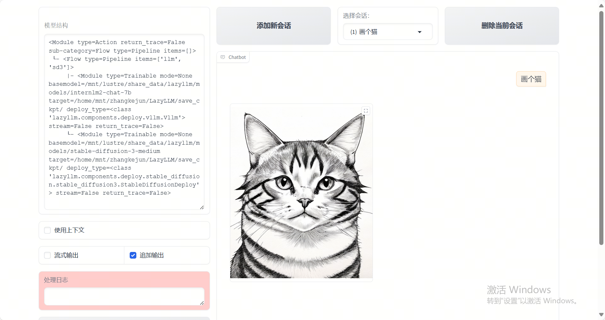

# multi_modal_output_agent
This project demonstrates how to use [LazyLLM](https://github.com/LazyAGI/LazyLLM) to build a multi-modal intelligent Agent.

Through this section, you will learn the following key points of LazyLLM:
- How to call the Stable Diffusion model to generate images.
- How to encapsulate and register a function as a tool.
- How to use WebModule to launch a client service with just a few lines of code.

## Code Implementation

### Project Dependencies
Ensure you have installed the following dependencies:
```bash
pip install lazyllm
```
### Designing the Prompt
We design a prompt that specifies its role as a master of drawing prompts, capable of translation, and able to generate and expand prompts based on user input. The details are as follows:
```python
prompt = ('You are a drawing prompt word master who can convert any Chinese content entered by the user into English drawing prompt words. '
          'In this task, you need to convert any input content into English drawing prompt words, and you can enrich and expand the prompt word content.')
```
### Setting Up the Models
Build your own large language model based on LazyLLM and set the prompt we just created for it:
```python
llm = lazyllm.TrainableModule('internlm2-chat-7b').prompt(lazyllm.ChatPrompter(prompt))
```
Additionally, we need to introduce the SD3 model. Although this is not an LLM model, TrainableModule supports using it in an LLM-like manner. Simply specify the model name directly in TrainableModule:
```python
sd3 = lazyllm.TrainableModule('stable-diffusion-3-medium')
```
### Assembling the Application
LazyLLM includes various types of control flows, which are generally used to manage the flow of data. By using control flows to assemble modules, we construct our Agent. Here, we choose to use the pipeline context manager to build a LazyLLM control flow, achieving sequential execution: first, the large language model generates the prompt, then the prompt is fed to the SD3 model to obtain the image.
```python
with pipeline() as ppl:
    ppl.llm = lazyllm.TrainableModule('internlm2-chat-7b').prompt(lazyllm.ChatPrompter(prompt))
    ppl.sd3 = lazyllm.TrainableModule('stable-diffusion-3-medium')
```
### Launching the Application
Finally, we wrap the control flow ppl into a client, start the deployment (start()), and keep the client running after deployment (wait()).
```python
lazyllm.WebModule(ppl, port=23468).start().wait()
```
### Complete Code
import lazyllm
from lazyllm import pipeline

prompt = ('You are a drawing prompt word master who can convert any Chinese content entered by the user into English drawing prompt words. '
          'In this task, you need to convert any input content into English drawing prompt words, and you can enrich and expand the prompt word content.')

with pipeline() as ppl:
    ppl.llm = lazyllm.TrainableModule('internlm2-chat-7b').prompt(lazyllm.ChatPrompter(prompt))
    ppl.sd3 = lazyllm.TrainableModule('stable-diffusion-3-medium')

lazyllm.WebModule(ppl, port=23468).start().wait()

The effect is as follows:

