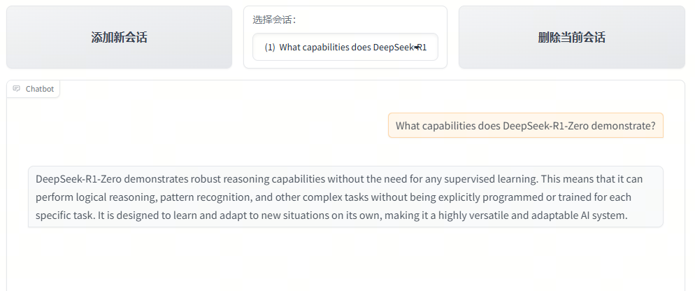

# Build a PDF ingestion and Question/Answering system

This tutorial explains how to build a **RAG (Retrieval-Augmented Generation)** system using the **LazyLLM framework**, which retrieves relevant content from PDF documents and generates answers.

------

### 1. Install dependencies

Make sure you have installed LazyLLM:

```bash
pip install lazyllm
```

Then import the required modules:

```python
import lazyllm
from lazyllm.tools.rag import Document
from lazyllm import pipeline, Retriever, Reranker, bind
```

### 2. Initialize models

In a RAG system, we need:

- **Embedding model**: Converts PDF text into vectors for similarity retrieval.
- **Reranker model**: Re-ranks the retrieved candidate text based on relevance.
- **LLM model**: Generates the final answer based on context and question.

In LazyLLM, we can use `TrainableModule` to start these models:

```python
# Start embedding model
embed_model = lazyllm.TrainableModule("bge-large-zh-v1.5").start()

# Start reranker model
rerank_model = lazyllm.TrainableModule("bge-reranker-large").start()
```

> Here we use **bge series models**, but you can replace them with any other available models.

### 3. Load PDF documents

We know that the retriever needs to fetch relevant information from a knowledge base, and the knowledge base can store content in various formats, either structured or unstructured. To decouple the retriever module from the storage format of the knowledge base, we need the **Reader** module. The reader's role is to load knowledge stored in various formats and provide it in a unified format for the retrieval module.

The `Reader` module in LazyLLM is used inside the `Document` class. Therefore, we create a `Document` instance based on a PDF and call the reader via the `Document` object, passing in the file path. LazyLLM uses the `pypdf` package to parse PDF files by default.

Here we use the paper [DeepSeek-R1](https://arxiv.org/pdf/2501.12948) as the example PDF, but you can use any PDF you like.

```python
documents = Document(
    dataset_path="data_path",
    embed=embed_model,
    manager=False
)

# Load PDF file
documents._impl._reader.load_data(
    input_files=["data_path/2501.12948v1.pdf"]
)
```

> LazyLLM provides [many other document loaders](https://docs.lazyllm.ai/zh-cn/latest/API%20Reference/tools/#lazyllm.tools.rag.readers) for different data sources, or you can create a [custom document loader](https://docs.lazyllm.ai/zh-cn/latest/Tutorial/5/).

### 4. Text splitting

Split the PDF content into chunks (by paragraphs or line breaks) to facilitate retrieval:

```python
documents.create_node_group(
    name="block",
    transform=lambda s: s.split("\n") if s else ''
)
```

### 5. Build the RAG pipeline

Using LazyLLM's `pipeline`, we can connect **Retriever → Reranker → Formatter → LLM** into an end-to-end flow.

```python
prompt = (
    "You will play the role of an AI Q&A assistant and complete a dialogue task. "
    "In this task, you need to provide your answer based on the given context and question."
)

with lazyllm.pipeline() as ppl:
    # 1. Retriever
    ppl.retriever = Retriever(
        doc=documents,
        group_name="block",
        topk=3,
        similarity='bm25'
    )

    # 2. Reranker
    ppl.reranker = Reranker(
        name='ModuleReranker',
        model=rerank_model,
        topk=1,
        output_format='content',
        join=True
    ) | bind(query=ppl.input)

    # 3. Formatter
    ppl.formatter = (
        lambda nodes, query: dict(context_str=nodes, query=query)
    ) | bind(query=ppl.input)

    # 4. LLM
    ppl.llm = lazyllm.TrainableModule('internlm2-chat-7b').prompt(
        lazyllm.ChatPrompter(instruction=prompt, extra_keys=['context_str'])
    ).start()
```

### 6. Start the web service

Finally, use `WebModule` to start an interactive interface:

```python
lazyllm.WebModule(ppl, port=23456).start().wait()
```

Once started, visit `http://localhost:23456` in your browser to interact with the RAG system. You can enter questions and get answers retrieved from the PDF content.

### Example




### Complete code

```python
import lazyllm
from lazyllm.tools.rag import Document
from lazyllm import pipeline, Retriever, Reranker, bind

# Initialize models
embed_model = lazyllm.TrainableModule("bge-large-zh-v1.5").start()
rerank_model = lazyllm.TrainableModule("bge-reranker-large").start()

# Load PDF
documents = Document(
    dataset_path="data_path/pdf_data",
    embed=embed_model,
    manager=False
)
documents._impl._reader.load_data(
    input_files=["data_path/pdf_data/2501.12948v1.pdf"]
)
documents.create_node_group(name="block", transform=lambda s: s.split("\n") if s else '')

prompt = (
    "You will play the role of an AI Q&A assistant and complete a dialogue task. "
    "In this task, you need to provide your answer based on the given context and question."
)

# Build RAG pipeline
with lazyllm.pipeline() as ppl:
    ppl.retriever = Retriever(
        doc=documents, 
        group_name="block", topk=3,
        similarity='bm25')
    
    ppl.reranker = Reranker(
        name='ModuleReranker',
        model=rerank_model,
        topk=1,
        output_format='content',
        join=True
    ) | bind(query=ppl.input)

    ppl.formatter = (
        lambda nodes, query: dict(context_str=nodes, query=query)
    ) | bind(query=ppl.input)

    ppl.llm = lazyllm.TrainableModule('internlm2-chat-7b').prompt(
        lazyllm.ChatPrompter(instruction=prompt, extra_keys=['context_str'])
    ).start()

# Start web service
lazyllm.WebModule(ppl, port=23456).start().wait()
```
