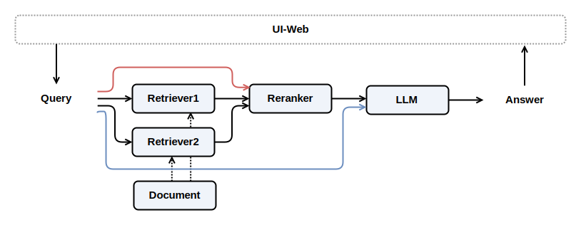

# Knowledge Base Q&A Assistant

In this article, we will implement a knowledge base Q&A assistant application.

> Through this section, you will learn the following key points of LazyLLM:
>
> - Use of RAG-related modules:
>      - `Document`
>      - `Retriever`
>      - `Reranker`

## Design Concept

To design a knowledge base document assistant, you first need to have a knowledge base (Documents). After building the knowledge base, you need some retrievers (Retriever) for matching high-similarity passages.
After retrieving the documents, it is usually necessary to combine the input and use the Reranker model to re-rank to obtain a better ordered passage. Finally, send the retrieved content and user questions to the large model for answering.

The overall design is shown as follows:



This design includes two retrievers, each matching the documents from different granularity for similarity.

## Code Implementation

Let's implement the above design concept based on LazyLLM.

### Design Prompt Template

According to the design, we need to make the large model answer questions by combining the retrieved documents and user input. At this time, we need to design a prompt template for the large model.

```python
prompt = 'You will play the role of an AI Q&A assistant and complete a dialogue task. In this task, you need to provide your answer based on the given context and question.'
```

### Set Up the Model

First, we need a knowledge base:

```python
documents = Document(dataset_path='/file/to/yourpath', embed=lazyllm.TrainableModule('bge-large-zh-v1.5'))
```

Here, the `Document` from LazyLLM is used, which accepts a path containing documents as a parameter,
In addition, a word embedding model (here using `bge-large-zh-v1.5`) is also required, which can vectorize the documents,
It can also vectorize the user's request. This allows the vectorized content of the two to be used for similarity calculation to retrieve the matching knowledge base passage content.

Then we define two retrievers to match from different document segmentation granularities:

```python
documents.create_node_group(name="sentences", transform=SentenceSplitter, chunk_size=1024, chunk_overlap=100)
retriever1 = Retriever(documents, group_name="sentences", similarity="cosine", topk=3)
retriever2 = Retriever(documents, "CoarseChunk", "bm25_chinese", 0.003, topk=3)
```

Here, the `Retriever` from LazyLLM is used.

- The retriever requires the first parameter to specify which database to use, here we use the knowledge base we just loaded.
- The second parameter `group_name` of the retriever needs to specify a group name.
    - The first retriever we created a custom group called `sentences` in the instance of `documents`, this group uses the node transformation method of sentence splitting `SentenceSplitter`, the sentence block size is 1024, and the overlap size is 100. When instantiating `Retriever`, this group is used, and cosine similarity is used to calculate similarity, and the top 3 most similar sentences are taken.
    - The second retriever uses the built-in `CoarseChunk` of LazyLLM, which also uses the node transformation method `SentenceSplitter`, but its sentence block size is larger, 1024, and the overlap size is also 100. Here, the method of similarity calculation is also specified as the Chinese BM25, and those with similarity lower than 0.003 will be discarded, the default is negative infinity which means not discarded. And finally, the top 3 most similar sentences are also taken.

Next, we define a reranker Reranker:

```python
reranker = Reranker("ModuleReranker", model="bge-reranker-large", topk=1)
```

Here, the `Reranker` from LazyLLM is used, which can reorder the retrieved content. Here, the most similar content after reordering is taken as the output.

Finally, let's set up the LLM model:

```python
llm = lazyllm.TrainableModule("internlm2-chat-7b").prompt(lazyllm.ChatPrompter(prompt, extro_keys=["context_str"]))
```

Here, `prompt` is set for `TrainableModule`, and a detailed description can be found in: [Master Painter](painting_master.md)

### Assemble the Application

Now let's assemble all the above modules together:

```python
with pipeline() as ppl:
    with parallel().sum as ppl.prl:
        prl.retriever1 = Retriever(documents, group_name="sentences", similarity="cosine", topk=3)
        prl.retriever2 = Retriever(documents, "CoarseChunk", "bm25_chinese", 0.003, topk=3)

    ppl.reranker = Reranker("ModuleReranker", model="bge-reranker-large", topk=1) | bind(query=ppl.input)
    ppl.formatter = (lambda nodes, query: dict(context_str="".join([node.get_content() for node in nodes]), query=query)) | bind(query=ppl.input)
    ppl.llm = lazyllm.TrainableModule("internlm2-chat-7b").prompt(lazyllm.ChatPrompter(prompt, extro_keys=["context_str"]))
```

In the above code, `parallel().sum` loads all the outputs of the parallel elements together. Here, two types of retrievers are specified for retrieval,
Each has 3 results, and after the `.sum` setting, the results can be added together to obtain 6 retrieved results.

```python
ppl.formatter = (lambda nodes, query: dict(context_str="".join([node.get_content() for node in nodes]), query=query)) | bind(query=ppl.input)
```

Here, an anonymous function is defined for formatting, which feeds the formatted content to the large model.
It should be noted that the user's input is `bind` here (refer to `bind` in: [Great Writer](great_writer.md)). It corresponds to the blue line in the design diagram.
In addition, `reranker` is also `bind` with the user's input, corresponding to the red line in the design diagram.

### Start the Application

Finally, we wrap the control flow `ppl` into a client and start deployment (`start()`), and keep the client open after deployment (`wait()`).

```python
lazyllm.WebModule(ppl, port=23456).start().wait()
```

## Full Code

<details>
<summary>click to look up prompts and imports</summary>

```python

import os
import lazyllm
from lazyllm import pipeline, parallel, bind, SentenceSplitter, Document, Retriever, Reranker

prompt = 'You will play the role of an AI Q&A assistant and complete a dialogue task. In this task, you need to provide your answer based on the given context and question.'
```
</details>

```python
documents = Document(dataset_path='/file/to/yourpath', embed=lazyllm.TrainableModule('bge-large-zh-v1.5'))
documents.create_node_group(name="sentences", transform=SentenceSplitter, chunk_size=1024, chunk_overlap=100)

with pipeline() as ppl:
    with parallel().sum as ppl.prl:
        prl.retriever1 = Retriever(documents, group_name="sentences", similarity="cosine", topk=3)
        prl.retriever2 = Retriever(documents, "CoarseChunk", "bm25_chinese", 0.003, topk=3)

    ppl.reranker = Reranker("ModuleReranker", model="bge-reranker-large", topk=1) | bind(query=ppl.input)
    ppl.formatter = (lambda nodes, query: dict(context_str="".join([node.get_content() for node in nodes]), query=query)) | bind(query=ppl.input)
    ppl.llm = lazyllm.TrainableModule("internlm2-chat-7b").prompt(lazyllm.ChatPrompter(prompt, extro_keys=["context_str"]))

lazyllm.WebModule(ppl, port=23456).start().wait()
```