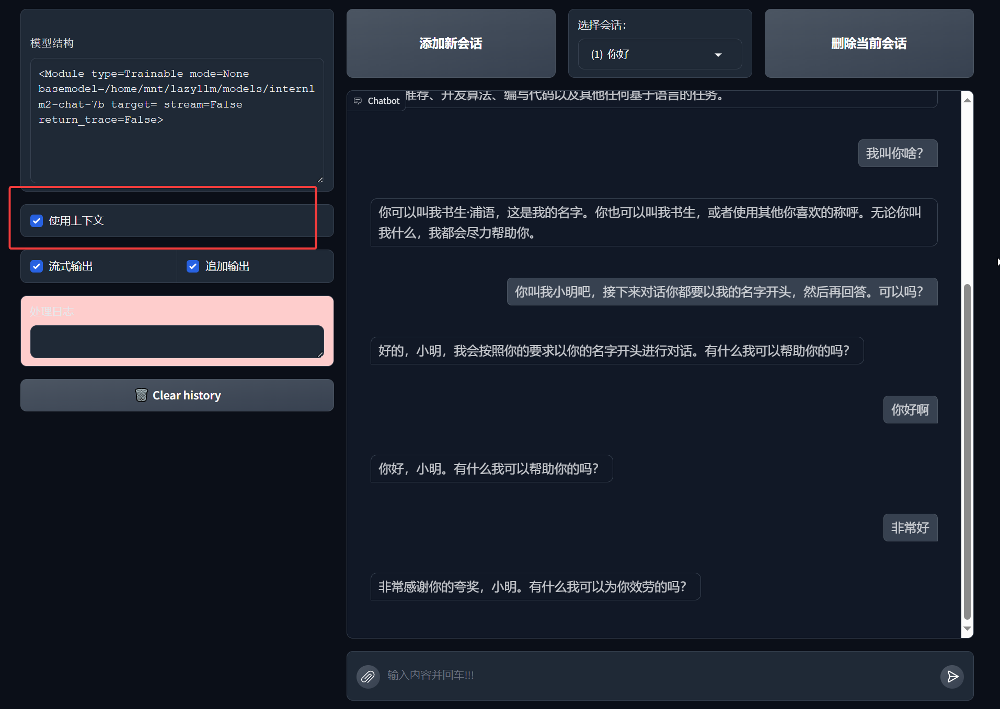

# Build Your First Chatbot

Let's begin our journey into LazyLLM with a classic chatbot.

> By the end of this section, you will have learned the following key points about LazyLLM:
>
> - The use of `TrainableModule` and `WebModule` for model deployment and client publishing;
> - How to specify a model;
> - How to set up history.

## Build a Chatbot in Three Lines of Code

Question: How many steps does it take to build a chatbot with LazyLLM?

Answer: Three steps!

1. Import `lazyllm`;
2. Specify the model to be used;
3. Start the client.

Here's the effect:


Yes, it's that simple! Below are the three lines of code to build the chatbot:

```python
import lazyllm
chat = lazyllm.TrainableModule('internlm2-chat-7b')
lazyllm.WebModule(chat, port=23466).start().wait()
```

Let's delve into the details.

### Specifying the Model

```python
chat = lazyllm.TrainableModule('internlm2-chat-7b')
```

- `TrainableModule` is a core module of LazyLLM, which is very powerful and capable of pre-training, fine-tuning, and model deployment. Here we are only concerned with its deployment capabilities. At least one model name must be specified when using it.
- `internlm2-chat-7b` is the model we are using in this example. There are three ways to specify a model in LazyLLM:
    - Specify the exact model name (e.g., 'internlm2-chat-7b' here): LazyLLM will automatically download the model from the internet;
    - Specify the exact model name (e.g., 'internlm2-chat-7b') + set the environment variable `export LAZYLLM_MODEL_PATH="/path/to/modelzoo"`: LazyLLM will then find the model at `path/to/modelazoo/internlm2-chat-7b/`;
    - Use the absolute path of the model directly: `path/to/modelazoo/internlm2-chat-7b`.

### Starting the Model

```python
lazyllm.WebModule(chat, port=23466).start().wait()
```

- `WebModule` is another core module of LazyLLM, which can wrap any callable into a client.
The wrapping effect is as shown at the beginning. The callable is passed as the first argument, here we are wrapping our deployable model chat with a client shell.
- `port` is used to specify the port for client publishing. The `port` can be omitted; if not specified, LazyLLM will find an unused port between 20500 and 20799 to use. We can also specify a range of available ports.
- `start` is crucial in LazyLLM, which means to initiate. Once `start` is executed, it will run the entire application's training, deployment, and even evaluation tasks if specified.
Here, since no tasks are specified in `TrainableModule` and `WebModule`, it defaults to only the deployment task, which is to deploy an `internlm2-chat-7b` model and start a Web client.
- `wait` is used to keep the client running after it starts without shutting down.

After deployment and client startup, LazyLLM will print the accessible URL in the terminal.

## Multiround Dialogue Chatbot

Astute readers may have noticed that the chatbot in the demo image above has memory capabilities; it can engage in multiround dialogues. Now let's modify the single-turn dialogue bot from the previous section to enable it for multiround dialogues.

### Specifying history

Modify the `WebModule` by specifying the `history` parameter as follows:

```python
import lazyllm
chat = lazyllm.TrainableModule('internlm2-chat-7b')
lazyllm.WebModule(chat, port=23466, history=[chat]).start().wait()
```

`history` is a memory list that specifies the modules for which context needs to be saved. Here we only need to remember the chat module, so we specify it. In a multi-robot setup, you can specify as needed.

### Enabling Context Usage

Specifying `history` is the first step to enabling context. To ensure the memory function is activated, you must also enable the context feature when using the client, as shown below:



And there you have it, our first chatbot is created! Let's start chatting with it!
