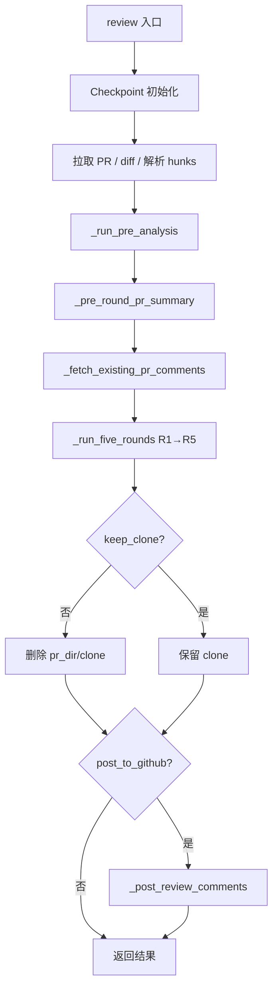

# LazyLLM Git PR Review 完整流程说明

本文档描述 `lazyllm.tools.git.review` 中一次 PR review 的端到端流程：预分析、五轮分析（R1–R5）、合并去重、发帖，以及缓存与断点续跑。源码目录：`lazyllm/tools/git/review/`（`runner.py`、`pre_analysis.py`、`rounds.py`、`constants.py`、`checkpoint.py`、`utils.py`、`poster.py`）。

全局单次请求上下文预算见 `constants.SINGLE_CALL_CONTEXT_BUDGET`（默认 **80000** 字符），各轮在该预算内预留固定开销后再塞入 diff / arch 等。

**结构性优化（已实现）**：`BudgetManager`（按优先级分配总预算，供后续各轮逐步接入）、R2 对每 diff 分块的 **`_filter_symbol_context_for_chunk`**（符号上下文与 chunk 对齐）、R4 **默认两步**（R4a 设计文档 → R4b 架构师 issue，可选单次合并 `prefer_combined=True`）、R5 **先确定性去重再 LLM**、checkpoint 对 **`clone_dir` 存在性**、`r1`/`r2` 聚合键的 stage 映射，以及 **`mark_stage_done` 仅在 FINAL 清除 `_invalidated_from`**。

---

## 1. 端到端流程总览

### 1.1 流程图（逻辑顺序）



### 1.2 阶段一览

| 顺序 | 阶段 | 主要产物 / 作用 |
|------|------|-----------------|
| 0 | Checkpoint | `pr_dir`、`checkpoint.json`、`resume_from` → `_invalidated_from` |
| 1 | Diff | `diff_text`（可 `max_diff_chars` 截断）、`hunks`（可 `max_hunks` 截断） |
| 2 | 预分析 | `arch_doc`、`review_spec`、`clone_dir`、`agent_instructions` |
| 3 | PR 摘要 | `pr_summary` |
| 4 | 已有评论 | `existing_comments`（供 R5 去重，**不**参与 R1–R4 生成） |
| 5 | R1 | 按 hunk/批次的静态审查 |
| 6 | R2 | 每文件 Agent 收集符号上下文 + 按 diff 分块抽取 issue |
| 7 | R3 | 多文件分批的全局/规则视角 |
| 8 | R4 | **默认** R4a（`_round4_generate_pr_doc`）→ R4b（`_round4_architect_review`，输入含 `pr_design_doc`）；可选 `prefer_combined=True` 尝试单次 JSON `{pr_design_doc, issues}`，失败则仍落回两步 |
| 9 | R5 | 先 **`_deterministic_dedup`**（同 path+line+category 折叠），再压缩 + **1×JSON LLM** 与已有评论合并；打 `_review_version: 2` |
| 10 | 发帖 | `submit_review` / 逐条 `create_review_comment` |
| 11 | 清理 | 默认删除 `{pr_dir}/clone/`，保留 `checkpoint.json` |

---

## 2. 入口 `review()`（`runner.py`）

1. **Checkpoint**
   - `pr_dir = ~/.lazyllm/review/cache/{safe_repo}/{pr_number}/`（`lazyllm.config['home']` 下，见 `_ReviewCheckpoint`）。
   - `checkpoint_path` 默认：`{pr_dir}/checkpoint.json`。
   - `clear_checkpoint=True`：清空 checkpoint 文件并 `shutil.rmtree(pr_dir)`（含 clone），从零开始。
   - 否则：`resume_from=ReviewStage.X` 时写入 `_invalidated_from`（**不物理删除**历史字段），见第 7 节。

2. **PR 与 diff**
   - `diff_text`：优先 `ckpt.get('diff_text')`；否则 API 拉取，可按 `max_diff_chars` 截断并写回 checkpoint。
   - `hunks = _parse_unified_diff(diff_text)`，可按 `max_hunks` 截断。

3. **预分析** `_run_pre_analysis(...)` → `arch_doc`、`review_spec`、`clone_dir`、`agent_instructions`。

4. **PR 摘要** `_pre_round_pr_summary`：checkpoint 命中则跳过，否则 1 次文本 LLM。

5. **拉取已有 PR 评论** `_fetch_existing_pr_comments`：在**进入五轮之前**执行，结果传入 `_run_five_rounds`，**仅用于 R5** 与已发帖评论去重。

6. **五轮** `_run_five_rounds`：R1 → R2 → R3 → R4 → R5（FINAL）。

7. **清理 clone**：`keep_clone=False` 时仅删除 `{pr_dir}/clone/`，**保留** `checkpoint.json`。

8. **可选发帖** `_post_review_comments`：需 `head_sha`；行级评论仅针对带 `path` + `line` 的 issue。

9. **返回值**：含 `comments`、`pr_summary`、`pr_design_doc`（R4 写入 checkpoint 的 `pr_design_doc`）等。

---

## 3. 全局预算与 Token 说明（估算）

代码中多为 **字符预算**。下表与 `constants.py`、`rounds.py` 中的常量对齐；**1 次调用** 指一次 `_safe_llm_call`（JSON）或 `_safe_llm_call_text`（纯文本）。实际 token 需按模型分词换算。

### 3.1 `BudgetManager`（`constants.py`）

`BudgetManager(total=SINGLE_CALL_CONTEXT_BUDGET)` 通过 **`register(name, priority, max_chars)`** 注册具名槽位，**`allocate(arch=..., diff=..., ...)`** 按 **priority 降序** 依次从总预算中扣减，每槽最多 `min(max_chars, remaining)`，超出则截断并追加 `...(truncated)`。未注册的 `**kwargs` 键原样透传、不截断。

当前各轮仍以既有 `clip_text` / 固定 slice 为主；`BudgetManager` 为统一预算入口，可在后续将 R1/R3 等逐步迁移到该接口。

| 常量 / 阶段 | 说明 |
|-------------|------|
| `SINGLE_CALL_CONTEXT_BUDGET` | 单次请求总上下文约 80k 字符 |
| `R1_DIFF_BUDGET` | `SINGLE_CALL_CONTEXT_BUDGET - 25000` → R1 同一批内合并的 hunk diff 总长上限约 **55k** |
| R1 单 hunk | hunk 内容 `_truncate_hunk_content` 约 80 行；`review_spec`/`pr_summary` 各取前 **600** 字符 |
| R2 | Agent：`compress_diff_for_agent_heuristic(fdiff, _R2_AGENT_DIFF_BUDGET)`；抽取 diff 分块 `_R2_EXTRACT_DIFF_CHUNK`；每块前对 Agent 输出做 **`_filter_symbol_context_for_chunk(symbol_context, diff_chunk)`** 再送入 `_r2_extract_issues`（最多 **3000** 字符）；`shared_context` 上限 `_R2_SHARED_CTX_BUDGET=4000`；抽取阶段 arch `_R2_ARCH_BUDGET=6000`；R1 列表 JSON `_R2_R1_BUDGET=8000` |
| R3 | `arch_use` 约 **38k**；`prev_json` 默认最多 **16k**；多文件按 `budget_files` 打包成 batch，每 batch 一次 LLM |
| R4（默认） | **两步各 1 次文本/JSON**：R4a `_round4_generate_pr_doc`（`arch` 约 **12k**，`diff` 按 hunk 预算）；R4b `_round4_architect_review`（`arch` 约 **42k**，`pr_design_doc` 约 **12k** 等） |
| R4（可选合并） | `prefer_combined=True` 时一次 `_safe_llm_call_text` + JSON 解析；失败则日志后执行与默认相同的两步 |
| R5 | **`_deterministic_dedup`** 后，长评论 / 长 issue 批量压缩，再 **1×JSON LLM** 与已有评论合并 |

---

## 4. 预分析（`pre_analysis.py`）

### 4.1 编排 `_run_pre_analysis`

- 默认 `arch_cache_path`：`{repo_cache_dir}/arch.json`；`review_spec_cache_path`：`{repo_cache_dir}/spec.json`。
- **`fetch_repo_code=True` 且无 `arch_doc`**：`_run_arch_analysis`（clone → `analyze_repo_architecture`）。
- **`fetch_repo_code=True` 且已有 `arch_doc`**：从 checkpoint 恢复；若缺 `clone_dir` 则再 clone 供 R2 Agent；尽量加载 `agent_instructions`。
- **`fetch_repo_code=False`**：不重新 clone；仍走 `_run_spec_analysis` 拉规则（若 checkpoint 无 `review_spec`）。
- 返回：`(arch_doc, review_spec, clone_dir, agent_instructions)`。

### 4.2 架构文档 `analyze_repo_architecture`

1. **`_collect_structured_snapshot`**（无 LLM）  
   预算 `_ARCH_SNAPSHOT_BUDGET=6000`：目录树、`__init__.py` 头、依赖、`AGENTS.md` 等。

2. **`_arch_generate_outline`**（**1×JSON LLM**）  
   - 输入：`snapshot[:4000]`。  
   - 有 agent 指令时节数约 9，否则约 12；含首尾固定章节等。  
   - 输出：每节 `title` / `focus` / `search_hints`。

3. **各节填充**（每节若干次 LLM，视实现为单节或批量；摘要链 `prev_summaries` 受 `_ARCH_PREV_SUMMARY_BUDGET=1500` 约束）。

4. **`_build_public_api_catalog`**（**1×JSON LLM** + 正则扫描）  
   - 目录树≤4000；结果合并进 `arch_doc` 的 `[Public API Catalog]`。

5. **落盘** `_save_cache_multi(arch.json)`：`arch_doc`、`arch_index`、`arch_symbol_index` 等。

### 4.3 历史 review 规则 `analyze_historical_reviews`

- 拉取已合并 PR 评论；过滤 bot；长评论压缩再抽规则；多 PR 再合并；写入 `spec.json` / checkpoint。

### 4.4 PR 摘要 `_pre_round_pr_summary`

- **1×文本 LLM**：`pr_body[:800]`、`diff_text[:5000]`（大 PR 仅覆盖 diff 前部）。

### 4.5 上下文裁剪与规则查找

- **`_extract_arch_for_file(arch_doc, file_path, max_chars=3000)`**  
  解析 `[Section]`；`_ARCH_ALWAYS_INJECT` 标题加权；Public API Catalog 按 `_candidate_scopes(file_path)` 过滤。

- **`_lookup_relevant_rules(review_spec, diff_content, max_detail)`**  
  从 `diff_content` **前 200 行** 提关键词匹配规则 `title`；完整规则卡最多 `max_detail` 条。

### 4.6 Round 2 用 Agent 工具（`clone_dir` 限定在仓库内）

`_build_scoped_agent_tools` / `_build_scoped_agent_tools_with_cache`：`read_file_scoped`、`read_files_batch`、`grep_callers`、`search_scoped`、`list_dir_scoped`、`shell_scoped`（只读），以及带缓存的 **`analyze_symbol`**（内部可再调 LLM）。

---

## 5. 五轮分析（`rounds.py`）

### 5.1 Round 1：按 hunk / 批次的静态审查

- **并发**：`ThreadPoolExecutor(max_workers=4)`，按文件分组。
- **批处理**：同文件多个 hunk 按 **`R1_DIFF_BUDGET`** 合并；单 hunk 可走单条分析。
- **每条输入**：截断 hunk、`_read_file_context`（含 scope）、`_extract_arch_for_file(..., 3000)`、`review_spec`/`pr_summary` 片段、可选 `symbol_index`、**`agent_instructions`**。
- **输出**：JSON 数组；全 PR 级按 `max_issues_for_diff` / `cap_issues_by_severity` 限流。
- **Checkpoint**：`r1_hunk_{safe_path}_{new_start}`。

### 5.2 Round 2：Agent 上下文 + 按块抽取

- **无 `clone_dir`**：跳过 R2，返回 `[]` 与空 `discarded` 集合。
- **共享上下文**：`r2_shared_context` 可缓存；静态构建 `_r2_build_shared_context(diff_text)`（跨文件共享符号、PR 内依赖、接口变更等），上限 `_R2_SHARED_CTX_BUDGET`。
- **每文件**：
  1. **Agent**：`compress_diff_for_agent_heuristic` + **`_R2_AGENT_DIFF_BUDGET`** → `_r2_build_file_context`（`ReactAgent`，`read_file_scoped` 等 tools，`diff_chunk` 进 prompt 最多 **8000** 字符，`force_summarize_context` 含 diff 前 **1200** 字符）。
  2. **分块抽取**：`_split_file_diff_into_chunks(fdiff, _R2_EXTRACT_DIFF_CHUNK)`，每块先 **`chunk_ctx = _filter_symbol_context_for_chunk(symbol_context, diff_chunk)`**（从 chunk 中提取标识符，过滤 Agent 输出中与当前块相关的行，再截断至 3000 字符），再调用 **`_r2_extract_issues(..., chunk_ctx, ...)`**（KEEP/MODIFY/DISCARD R1 + 新 issue），产出 `r2_disc_{path}` 记录被丢弃的 R1 `path:line`。
- **Checkpoint**：`r2_file_*`、`r2_disc_*`。

### 5.3 Round 3：多文件分批的全局/规则视角

- **输入**：`round2` 参数实际传入 **`r1 + r2`**（`prev_issues`），按文件过滤到当前 batch。
- **每 batch 1×JSON LLM**：`arch_doc` 截断至 **~38k**；`_lookup_relevant_rules(..., batch_diff_joined[:12000], max_detail=12)`；`prev_json` 由 `_round3_build_prev_json` 生成（默认总长 **16k**，每条 problem 前 **100** 字符）；`files_block` 为 batch 内多文件 diff。
- **校验**：issue 的 `path` 须在 batch 内且行号落在该文件 diff 新增行范围内。

### 5.4 Round 4：设计文档 + 架构师评审（R4a / R4b）

- **默认路径**（`prefer_combined=False`，`runner` 未传参即如此）：**R4a** `_round4_generate_pr_doc`（文本设计文档）→ **R4b** `_round4_architect_review`（JSON issues，`pr_design_doc` 作为输入之一）。数据流：`R1+R2+R3 的 prev_issues` → R4a 产出 doc → R4b 结合 doc + arch + diff 产出 issues。
- **可选合并路径**（`prefer_combined=True`）：一次 **`_safe_llm_call_text`** + `_parse_llm_json_object`，期望单个 JSON `{ "pr_design_doc", "issues" }`；`arch` 约 **40k**、`diff` 经 `clip_diff_by_hunk_budget(..., SINGLE_CALL_CONTEXT_BUDGET - 42000)`。解析失败则打日志后**仍执行**上述两步。
- **`pr_design_doc` 与 `r4`** 写入 checkpoint；`runner.review()` 返回的 `pr_design_doc` 来自 checkpoint 的 **`pr_design_doc`** 键。

### 5.5 Round 5（FINAL）：合并去重

1. **`_deterministic_dedup`**：按 **`(path, line, bug_category)`** 分组；组内保留 **severity 更优** 的一条，同 severity 时按 **`source` 优先级** `r2 > r1 > r3 > r4` 选一条。减少送入后续步骤的重复项。
2. **`_compress_existing_comments`** / **`_compress_new_issues`**：超长则批量 LLM 压成短句；否则截断。（索引基于 dedup 后的列表。）
3. **1×JSON LLM**：新 issue（带 `source`: r1/r2/r3/r4）与已有 PR 评论对比；提示词仍要求同 path+line 时 **r2 优先于 r1**；输出仅保留 `idx` 等，再从 **deduped** 列表恢复完整字段。
4. 若 LLM 返回空，fallback 按 **critical > medium > normal** 对 **deduped** 排序。
5. 每条最终 issue 带 **`_review_version: 2`**；旧格式 final 会触发整表重算。

### 5.6 R5 输入合并与 R1 透传

- `r1_passthrough`：若某文件被 R2 处理，则丢弃该文件上已被 R2 覆盖的 `path:line`（与 `discarded_r1_keys`、`r2_covered_keys` 共同约束）。
- 合并进入 R5：`tag(r1_passthrough, r1)` + `r2` + `r3` + `r4`。

---

## 6. 发帖（`poster.py`）

- **`_fetch_existing_pr_comments`**：`list_review_comments`，规范化 `body` / `path` / `line`。
- **`_post_review_comments`**：优先 **`submit_review`**（`commit_id=head_sha`，`event=COMMENT`，附 `review_body` + 行评）；失败则逐条 **`create_review_comment`**。
- 无 `path` / `line` 的 issue **不会**作为行评发出。

---

## 7. 缓存与断点（`checkpoint.py` + `runner.py`）

### 7.1 两套存储

| 类型 | 路径 | 内容 |
|------|------|------|
| **PR checkpoint** | `{pr_dir}/checkpoint.json` | `diff_text`、`pr_summary`、`r1_hunk_*`、`r2_file_*`、`r2_disc_*`、`r2_shared_context`、`r3`、`pr_design_doc`、`r4`、`final`、`clone_dir`、`_stage_done_*`、`_invalidated_from` 等 |
| **Repo 级 arch/spec** | `~/.lazyllm/review/cache/{safe_repo}/arch.json` / `spec.json` | `arch_doc`、`arch_section_*`、`public_api_catalog`、`agent_instructions`、`review_spec` 等 |

### 7.2 `ReviewStage.ordered()`

`CLONE → ARCH → SPEC → PR_SUMMARY → R1 → R2 → R3 → R4 → FINAL`

### 7.3 `resume_from`、`_invalidated_from` 与 `clone_dir`

- 传入 `resume_from`：写入 **`_invalidated_from`**，不删旧字段。
- **`get('clone_dir')`**：若 JSON 中有值但 **目录不存在**（例如成功收尾已删 `pr_dir/clone/`），视为缺失，返回 **`None`**，触发预分析路径重新 clone。
- **`_stage_for_key`**：聚合键 **`r1`**、**`r2`** 分别映射到 **`ReviewStage.R1` / `R2`**，与 `r1_hunk_*`、`r2_file_*` 一致参与 invalidation，避免 `resume_from` 时读到过期的聚合结果。
- **`get(key)`**（其它键）：若 key 对应 stage **index ≥ invalidation 起点**，返回 `None`。
- **`should_use_cache(stage)`**：无 `resume_from` 时若存在 `_invalidated_from`，则仅 **`stage < invalidated`** 为 True；有 `resume_from` 时用 **`stage < resume_from`**。
- **`mark_stage_done(stage)`**：仅在 **`stage == FINAL`** 时清除 **`_invalidated_from`** 并重置内存中的 **`resume_from`**，保证在一次完整跑通前，自 invalidation 起点起的下游缓存键始终被 `get()` 屏蔽，避免混用旧轮次数据。

### 7.4 `clear_checkpoint=True`

删除 checkpoint 并 **整个 `pr_dir`**（与成功结束时只删 `clone/` 不同）。

### 7.5 成功结束后的目录

删除 **`{pr_dir}/clone/`**；**保留** `checkpoint.json`。

---

## 8. LLM 调用与工具小结

- **JSON**：R1、R2 抽取、R3、R5、架构 outline、规则、Public API 等。
- **文本**：arch 各节、PR 摘要、R4a 设计文档；R4 在 **`prefer_combined=True`** 时的单次合并调用等。
- **Agent**：**Round 2** 的 `ReactAgent`（上下文收集阶段），工具为 scoped 读写/搜索/shell + **`analyze_symbol`**。
- **重试**：`utils` 中对 JSON 解析失败、限流等有重试与 `json_repair` 兜底。

---

## 9. 文件索引

| 模块 | 职责 |
|------|------|
| `runner.py` | 编排、diff、预分析、拉已有评论、五轮、清理 clone、发帖 |
| `constants.py` | `SINGLE_CALL_CONTEXT_BUDGET`、`R1_DIFF_BUDGET`、`BudgetManager`、issue 密度与 diff 启发式压缩 |
| `pre_analysis.py` | clone、架构、规则、PR 摘要、Public API、arch 裁剪、Agent 工具 |
| `rounds.py` | R1–R5、R2 分块符号过滤、R4 两步/可选合并、R5 确定性去重 + LLM |
| `checkpoint.py` | PR 断点、stage、`clone_dir` 校验、`r1`/`r2` 键映射、invalidation、**FINAL 才清除** `_invalidated_from` |
| `utils.py` | LLM 封装、diff 解析、评论规范化、review body |
| `poster.py` | 拉已有评论、提交 review / 行评 |

---

## 10. 设计评审：已知局限（与截断相关）

以下基于当前实现归纳；具体数值以源码常量为准。部分条目已被上文「结构性优化」缓解，仍列出剩余风险。

| 区域 | 现象 | 风险 / 备注 |
|------|------|-------------|
| 架构 outline | `snapshot[:4000]`，快照总预算 6000 | 部分结构化快照未进入 outline |
| PR 预摘要 | `body[:800]`、`diff[:5000]` | 大 PR 尾部变更在预摘要中不可见 |
| runner diff | `max_diff_chars` 截断整份 diff | 超大 PR 后续 hunk 无法进入任一轮 |
| R1 | `review_spec`/`pr_summary` 各 600 字符 | 与 R3 全量规则 + 长 arch 不对称 |
| R2 | 全文件 **一次** Agent 生成 `symbol_context`；分块侧已用 **`_filter_symbol_context_for_chunk`** 对齐 | Agent 仍可能未覆盖极长 diff 尾部；过滤基于标识符启发式 |
| 规则匹配 | `_lookup_relevant_rules` 仅用 diff **前 200 行** | 关键词集中在尾部时匹配可能偏 |
| R4 默认两步 | R4a `arch` 约 12k | 设计文档仍受 arch 截断影响；R4b 另有大段 arch |
| R5 | 跨 **不同** `bug_category` 的同 path+line 重复仍依赖 LLM | 确定性步骤只折叠 **相同 category** |
| BudgetManager | 已提供类，**各轮尚未全面改用** `allocate` | 与旧 `clip_*` 并存 |

### 与检索增强的关系

可用 **`lazyllm.tools.rag.retriever.ContextRetriever`** 等对长 `arch_doc` / diff / `review_spec` 做按需检索；当前 review 管线**未接入**，长文本仍以头部或静态裁剪为主。

---

## 11. 可优化方向（概要）

| 方向 | 说明 |
|------|------|
| 减少调用次数 | 架构多节批量填充；若稳定性允许可对 R4 尝试 `prefer_combined=True` 减少一步；评估 R5 压缩批次 |
| 缓存 | `r2_shared_context`、arch/spec 多级缓存；`analyze_symbol` 进程内缓存已存在 |
| 预算统一 | 将 R1/R3/R4 等逐步迁移到 **`BudgetManager.allocate`**，与总上限对齐 |
| 高收益修复 | R2 对超大文件按 chunk 补充 Agent 探索或检索；预摘要对大 PR 标注截断并补读；规则匹配扩大 diff 采样窗口；R5 对「同 path+line 不同 category」增加确定性策略（需谨慎） |

---

## 12. 评估与运行指标（Evaluation & Metrics）

本节定义**可采集**的评估维度、字段与示例结构。当前管线**未内置统一指标上报**；多数项需在下文「建议埋点」处增加计数/计时后写入日志或 JSONL 报告。指标设计目标：判断**覆盖是否充分**、**issue 质量与分布**、**性能与稳定性**是否可接受。

### 12.1 覆盖能力（Coverage）

#### 12.1.1 原始 diff 规模（run 级）

| 字段 | 类型 | 说明 |
|------|------|------|
| `diff_chars_total` | `int` | `len(diff_text)`（可能与 `max_diff_chars` 截断后一致） |
| `diff_lines_total` | `int` | `diff_text.count('\n') + 1` 或按行迭代 |
| `effective_diff_lines` | `int` | 与 `constants.effective_diff_line_count` 一致，用于 issue 密度上限 |
| `hunk_count` | `int` | 解析后的 hunk 数（受 `max_hunks` 截断前/后可各记一项） |
| `truncated_by_max_diff_chars` | `bool` | 是否发生 runner 层 diff 截断 |
| `truncated_by_max_hunks` | `bool` | 是否发生 hunk 数量截断 |

#### 12.1.2 各轮处理的 diff「占比」说明

管线**不是**「同一 diff 逐轮完整复制」：R1 按 **hunk/批**、R2 按 **文件内 chunk**、R3 按 **多文件 batch**、R4 对 **全 PR diff** 做 `clip_diff_by_hunk_budget`。因此「占比」宜定义为**字符量或有效行数**上的估算，而非简单百分比。

建议字段：

| 字段 | 类型 | 说明 |
|------|------|------|
| `r1_diff_chars_in_prompts` | `int` | 所有 R1 调用中进入 prompt 的 hunk 内容字符之和（可 batch 内去重累计） |
| `r2_files_processed` | `int` | 有 diff 的文件数 |
| `r2_extract_chunks_total` | `int` | `_split_file_diff_into_chunks` 产生的 chunk 总数 |
| `r2_agent_diff_chars` | `int` | 每文件 `compress_diff_for_agent_heuristic` 输出长度（可求和） |
| `r3_batch_count` | `int` | R3 batch 数 |
| `r3_diff_chars_in_batches` | `int` | 各 batch 内拼接的 diff 字符之和 |
| `r4a_diff_chars` | `int` | `_round4_generate_pr_doc` 中 `diff_use` 长度 |
| `r4b_diff_chars` | `int` | `_round4_architect_review` 中 `diff_use` 长度 |
| `coverage_ratios` | `object` | 可选：各轮 `*_chars / diff_chars_total` 的上界（>1 若多轮重复计同一字符，需文档化算法） |

**示例（单次 run 的摘要 JSON，无真实数值）：**

```json
{
  "run_id": "pr-123-20260411T120000Z",
  "diff_chars_total": 95000,
  "effective_diff_lines": 420,
  "hunk_count": 38,
  "truncated_by_max_diff_chars": true,
  "r1_diff_chars_in_prompts": 88000,
  "r2_extract_chunks_total": 12,
  "r4a_diff_chars": 58000,
  "r4b_diff_chars": 42000
}
```

#### 12.1.3 大文件与 chunk 策略（能否保证「至少一轮」）

| 问题 | 当前行为（可写进评估结论） |
|------|---------------------------|
| 是否每个 hunk 至少被 R1 处理？ | 在 **未** 被 `max_hunks` / `max_diff_chars` 裁掉的前提下，R1 按文件批处理 hunk，**原则上全覆盖**；若 diff 被截断，尾部 hunk 可能不在管线内。 |
| R2 是否每个文件的 diff 都进入抽取？ | 是（按文件聚合 `fdiff`）；超长文件按 `_R2_EXTRACT_DIFF_CHUNK` **分块**，每块一次 `_r2_extract_issues`。 |
| 「超大文件」兜底 | 无单独「>X 行」分支；依赖 **chunk 分块** + **issue 密度** `max_issues_for_diff` / `cap_issues_by_severity`。评估时可设阈值 `large_file_lines_threshold`（如 500），统计 `files_over_threshold` 与每文件 chunk 数。 |

**建议采集：** `max_hunks_hit`、`max_diff_chars_hit`、`per_file_chunk_count: { "path/to": 3 }`。

---

### 12.2 Issue 质量（Quality）

#### 12.2.1 各轮 issue 数量

| 字段 | 类型 | 说明 |
|------|------|------|
| `count_r1` | `int` | `len(r1)` |
| `count_r2` | `int` | `len(r2)` |
| `count_r3` | `int` | `len(r3)` |
| `count_r4` | `int` | `len(r4)` |
| `count_final` | `int` | `len(final)` |

可在 `_run_five_rounds` 末尾或 checkpoint 写入前一次性记录。

#### 12.2.2 Final 来源占比（`source` 字段）

合并进 R5 前 issue 带 `source`: `r1` \| `r2` \| `r3` \| `r4`。Final 恢复后若仍保留 `source` 可统计；若最终结构去掉 `source`，需在 R5 输出前**暂存**映射。

**示例：**

```json
{
  "count_final": 17,
  "final_source_ratio": {
    "r1": 0.12,
    "r2": 0.35,
    "r3": 0.18,
    "r4": 0.35
  }
}
```

#### 12.2.3 Issue 类型分布（`bug_category`）

对 `final`（或各轮）列表按 `bug_category` 计数。合法值见 `utils._VALID_CATEGORIES`（如 `logic`、`design`、`maintainability` 等）。

**示例：**

```json
{
  "final_bug_category_counts": {
    "logic": 4,
    "design": 6,
    "maintainability": 3,
    "style": 1
  }
}
```

---

### 12.3 性能与成本（Performance & Cost）

#### 12.3.1 LLM 调用次数

| 指标 | 说明 |
|------|------|
| `llm_calls_r1` | 单 hunk 调用 + batch 调用次数之和 |
| `llm_calls_r2_extract` | `_r2_extract_issues` 次数（≈ chunk 数） |
| `llm_calls_r2_agent` | 每文件 1 次 Agent（上下文收集）；**不计** `analyze_symbol` 内可能嵌套的 LLM |
| `llm_calls_r3` | batch 数 |
| `llm_calls_r4a` / `llm_calls_r4b` | 默认两步各 1；`prefer_combined=True` 时合并成功则 1，失败则 +2 |
| `llm_calls_r5` | 压缩批次数 + 最终合并 1 次（视 `_compress_*` 是否触发） |
| `arch_preanalysis_calls` | 预分析内 outline/section/spec 等（若在 `pre_analysis` 统一汇总） |

**R2 Agent「平均轮数」：** 以 `ReactAgent` 实际 tool 调用次数计，当前在 `_make_traced_tool` 中已有 `step_counter` 日志；可改为**每文件聚合** `r2_agent_tool_steps[path]`，再对文件求平均。

#### 12.3.2 Token

当前实现以**字符预算**为主，**未**统一记录 token。若底层 LLM 包装返回 `usage`（`prompt_tokens` / `completion_tokens`），可在封装层累加。

| 字段 | 类型 |
|------|------|
| `tokens_input_total` | `int` |
| `tokens_output_total` | `int` |
| `tokens_by_stage` | `object`（可选，key 为 `r1`…`r5`/`pre`） |

无 token 时可用 **`estimate_prompt_chars(*parts)`** 或各 prompt 字符串长度之和作为**代理指标**（`proxy_prompt_chars`）。

#### 12.3.3 时间

| 字段 | 说明 |
|------|------|
| `wall_time_total_sec` | `review()` 入口到返回 |
| `time_pre_analysis_sec` | `_run_pre_analysis` + `pr_summary` |
| `time_r1_sec` … `time_r5_sec` | 各轮分段（`time.perf_counter`） |
| `time_r2_agent_sec` | 仅 `_r2_build_file_context` 累加（可 per-file max/avg） |

**示例：**

```json
{
  "wall_time_total_sec": 842.5,
  "time_r2_sec": 510.2,
  "time_r2_agent_sec": 480.0,
  "llm_calls_r2_extract": 44
}
```

---

### 12.4 稳定性（Stability）

| 指标 | 含义 | 当前状态 |
|------|------|----------|
| `r4_combined_attempted` | `prefer_combined=True` 时尝试合并调用 | 需调用方传参才会发生 |
| `r4_combined_parse_failed` | 合并 JSON 解析失败并打 warning | 已有日志：`Round 4: combined JSON parse failed` |
| `json_repair_used` | `_parse_json_with_repair` 成功且走了 repair 分支 | **未**区分：需在 `utils._parse_json_with_repair` 或 `_safe_llm_call` 内对「先 json.loads 失败再 repair」计数 |
| `r2_agent_timeout_count` | `_r2_build_file_context` 超时 | 超时抛错；可 catch 记 `+1` |
| `r2_agent_context_failed_count` | 非超时异常导致 `symbol_context=''` | 已有 warning，可计数 |

**多次运行一致性：** 对同一 `pr_number` + 相同 checkpoint 策略，比较两次 `final` 的 `(path,line,bug_category)` 集合的 Jaccard 或简单计数差；需**固定随机种子**（若 LLM 可调）且关闭缓存变量，否则仅能做**定性**对比。

---

### 12.5（可选）与人工 review 对比

若线下有标注（人工认为应报 / 不应报），可定义：

| 字段 | 说明 |
|------|------|
| `human_labeled_issues` | 列表：`{path, line, label: "tp"|"fp"|"miss"}` |
| `precision_at_final` | Final 中与人工一致的「问题点」/ Final 条数（需对齐规则） |
| `recall_vs_human` | 人工标注应报条数中被 Final 覆盖的比例 |

**可采集性**：依赖**人工标注流程**与 ID 对齐，不属于自动埋点。

---

### 12.6 建议埋点位置（当前代码无统一 Metrics 对象）

| 目标 | 建议位置 |
|------|----------|
| 总耗时、diff/hunk 规模 | [`runner.py`](../../tools/git/review/runner.py) `review()` 开始/结束；diff 截断后 |
| R1–R5 耗时与各轮 issue 数 | [`rounds.py`](../../tools/git/review/rounds.py) `_run_five_rounds` 内各段 `perf_counter`；每轮结束 `len(r*)` |
| R1 调用次数 | `_r1_run_batch` / `_analyze_single_hunk` 每次调用 `_safe_llm_call` 处 +1 |
| R2 chunk 数、Agent 耗时、tool 步数 | `_r2_process_file_chunk`（chunk 循环）、`_r2_build_file_context`（计时与 `step_counter` 汇总） |
| R3 batch 数 | `_round3_global_analysis` 循环 |
| R4 合并失败 | `_round4_combined_review` 中 `prefer_combined` 分支解析失败处 |
| R5 确定性去重比例 | `_round5_merge_and_deduplicate` 已有 `len(valid) -> len(deduped)` 日志，可改为结构化输出 |
| JSON repair 率 | [`utils.py`](../../tools/git/review/utils.py) `_parse_json_with_repair`：比较 `json.loads` 与 repair 路径 |
| Token | 若 LLM 对象返回 usage，在 `_safe_llm_call` / `_safe_llm_call_text` 成功返回后累加 |

**输出形式建议：** 单次 run 写 **`review_metrics.json`** 至 `pr_dir`，或追加 **JSONL** 一行，便于离线聚合；字段名与 §12.1–12.4 保持一致即可保证**可采集、可对比**。

---

*若后续调整 budget、`ReviewStage.ordered()`、R4/R5 行为或增加埋点，请同步更新本节字段定义。*
