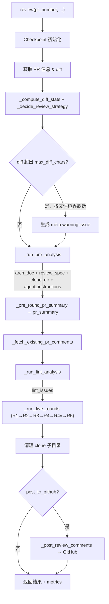

# LazyLLM Git PR Review 完整流程说明

本文档描述 `lazyllm.tools.git.review` 模块的完整 PR review 端到端流程。入口为 `runner.py` 中的 `review()` 函数，依次经过预分析（架构解析、历史规范提取）、五轮 LLM 分析（R1–R4v + R5 合并去重）、静态 Lint 融合，最终将结果发布到 GitHub。

源码目录：`lazyllm/tools/git/review/`（`runner.py`、`pre_analysis.py`、`rounds.py`、`constants.py`、`checkpoint.py`、`utils.py`、`poster.py`、`lint_runner.py`）。

---

## 1. 整体架构一览

### 1.1 模块职责

| 模块 | 职责 |
|------|------|
| `runner.py` | **主入口**：编排所有子模块；diff 拉取与截断；策略决策（`_ReviewStrategy`）；meta warning 生成；清理 clone 目录；发布评论 |
| `pre_analysis.py` | 仓库 clone；架构文档生成（`analyze_repo_architecture`）；历史 review 规范提取（`analyze_historical_reviews`）；PR 摘要；R2 Agent 工具集构建 |
| `rounds.py` | **五轮 review 核心**：R1 hunk 级分析、R2 自适应 Agent 分析、R3 全局架构分析、R4 设计文档 + 架构师评审 + R4v ReactAgent 验证、R5 合并去重 |
| `lint_runner.py` | 静态 Lint 分析（不调用 LLM），结果直接注入 R5 |
| `checkpoint.py` | 断点续传：PR 级 checkpoint；阶段枚举 `ReviewStage`；失效控制（`_invalidated_from`） |
| `constants.py` | 上下文预算常量；`BudgetManager`；issue 密度控制；diff 启发式压缩 |
| `utils.py` | LLM 调用封装（重试/QPS）；diff 解析；JSON 解析与修复；进度报告 |
| `poster.py` | 拉取已有 PR 评论；提交 GitHub review（批量 `submit_review` + 逐条 fallback） |

### 1.2 端到端流程图



### 1.3 阶段顺序总览

| # | 阶段 | 主要产物 |
|---|------|----------|
| 0 | Checkpoint 初始化 | `pr_dir`、`checkpoint.json`、`resume_from → _invalidated_from` |
| 1 | Diff 拉取与截断 | `diff_text`（按文件边界截断至 `max_diff_chars`）、`hunks` |
| 2 | 策略决策 | `_DiffStats`、`_ReviewStrategy`（R2 参数自适应） |
| 3 | Meta Warning | 截断时插入 `source='meta'` 的 issue |
| 4 | 预分析 | `arch_doc`、`review_spec`、`clone_dir`、`agent_instructions` |
| 5 | PR 摘要 | `pr_summary` |
| 6 | 已有评论 | `existing_comments`（供 R5 去重） |
| 7 | Lint 分析 | `lint_issues`（直接注入 R5，不过 LLM） |
| 8 | Round 1 | hunk 级静态审查 issue 列表 |
| 9 | Round 2 | 自适应 Agent/LLM 深度上下文审查（chunk 模式 + group 模式） |
| 10 | Round 3 | 全局架构视角多文件批量分析 |
| 11 | Round 4 | R4a PR 设计文档 → R4b 架构师评审 issue → R4v ReactAgent 验证 |
| 12 | Round 5 | 确定性去重 + LLM 合并 + Lint 融合 → `final_comments` |
| 13 | 发布 | 提交 GitHub review；更新 checkpoint `UPLOAD` 阶段 |
| 14 | 清理 | 删除 `{pr_dir}/clone/`；保留 `checkpoint.json` |

---

## 2. 入口 `review()`（`runner.py`）

### 2.1 函数签名

```python
def review(
    pr_number: int,
    repo: str = 'LazyAGI/LazyLLM',
    token: Optional[str] = None,
    backend: Optional[str] = None,
    llm: Optional[Any] = None,
    api_base: Optional[str] = None,
    post_to_github: bool = True,
    max_diff_chars: Optional[int] = 120000,
    max_hunks: Optional[int] = 50,         # 保留字段，当前不截断 hunks
    arch_cache_path: Optional[str] = None,
    review_spec_cache_path: Optional[str] = None,
    fetch_repo_code: bool = True,
    max_history_prs: int = 20,
    checkpoint_path: Optional[str] = None,
    clear_checkpoint: bool = False,
    resume_from: Optional[ReviewStage] = None,
    language: str = 'cn',
    keep_clone: bool = False,
) -> Dict[str, Any]
```

### 2.2 Diff 截断策略

当 `diff_text` 超过 `max_diff_chars`（默认 120000）时，`_truncate_diff_at_file_boundary()` 在 **`diff --git` 文件边界** 处截断（而非中途截断），并在末尾插入 `... [diff truncated: N file(s) omitted]` 标记，同时生成类型为 `meta` 的 warning issue 插入最终结果头部。

### 2.3 Review 策略自适应（`_ReviewStrategy`）

根据 `_DiffStats`（总有效行数、文件数）自动选择 R2 参数：

| PR 规模 | 触发条件 | `max_files_for_r2` | `large_file_threshold` | `max_chunks_per_file` |
|---------|---------|---------------------|------------------------|----------------------|
| 极大 | >3000 有效行 或 >50 文件 | 10 | 100 行 | 2 |
| 大 | >1000 行 或 >20 文件 | 15 | 150 行 | 2 |
| 普通 | 其余 | 20（`R2_MAX_FILES`） | 200 行 | 3（`R2_MAX_CHUNKS_PER_FILE`） |

超出 `max_files_for_r2` 的文件直接 R1 透传（passthrough），不进入 R2 深度分析。

### 2.4 返回值结构

```python
{
    'summary': str,                  # 一句话摘要（issue 数、posted 数）
    'comments': List[Dict],          # meta_warnings + R5 最终 issue 列表
    'comments_posted': int,          # 成功发布到 GitHub 的评论数
    'comment_stats': Dict,           # 按 bug_category 统计
    'pr_summary': str,               # PR 变更摘要
    'pr_design_doc': str,            # R4a 生成的 PR 设计文档
    'original_review_code': str,     # review 模块自身源码快照（可复现）
    'metrics': {
        'r2_mode': 'mixed' | 'skip',
        'r2_files_chunk': int,       # chunk 模式处理的文件数
        'r2_files_group': int,       # group 模式处理的文件数
        'r2_files_skipped': int,     # 超出 max_files_for_r2 而跳过的文件数
        'r2_chunks_total': int,      # chunk 模式产生的总 chunk 数
        'truncated_diff_flag': bool,
        'truncated_hunks_flag': bool,  # 当前始终为 False（hunks 不再截断）
        'lint_issues_count': int,
    }
}
```

---

## 3. 预分析（`pre_analysis.py`）

### 3.1 编排 `_run_pre_analysis`

- 默认 `arch_cache_path`：`~/.lazyllm/review/cache/{safe_repo}/arch.json`。
- 默认 `review_spec_cache_path`：`~/.lazyllm/review/cache/{safe_repo}/spec.json`。
- `fetch_repo_code=True` 且无缓存 `arch_doc`：完整执行 clone → `analyze_repo_architecture`。
- `fetch_repo_code=True` 且已有缓存 `arch_doc`：从 checkpoint 恢复；若 `clone_dir` 不存在则重新 clone 供 R2 Agent 使用。
- `fetch_repo_code=False`：不 clone；仍执行 `analyze_historical_reviews` 拉取规则（若无缓存）。
- 返回：`(arch_doc, review_spec, clone_dir, agent_instructions)`。

### 3.2 架构文档生成 `analyze_repo_architecture`

生成结构化架构文档，分 4 步：

1. **快照收集**（无 LLM）：`_collect_structured_snapshot()`，预算 6000 字符，收集目录树、`__init__.py` 头部、依赖文件、`AGENTS.md` 等。
2. **大纲生成**（1× JSON LLM）：输入 `snapshot[:4000]`，输出每节 `title` / `focus` / `search_hints`（13 个节）。
3. **各节内容填充**（若干次 LLM）：摘要链 `prev_summaries` 受 `_ARCH_PREV_SUMMARY_BUDGET=1500` 约束，避免上下文爆炸。
4. **Public API Catalog 构建**（1× JSON LLM + 正则扫描）：目录树 ≤4000 字符；结果合并进 `arch_doc` 的 `[Public API Catalog]` 节，供 R4 复用检查使用。

最终落盘 `arch.json`，包含 `arch_doc`、`arch_index`、`arch_symbol_index` 等字段。

### 3.3 历史 review 规范提取 `analyze_historical_reviews`

从最近 `max_history_prs` 个已合并 PR 的评论中提取规则卡片：

1. 拉取 PR 评论，过滤 bot 评论。
2. 超长评论先 LLM 压缩。
3. 多 PR 评论合并后抽取结构化规则。
4. 规则格式：`Rule ID`、`Title`、`Severity`、`Detect`（检测方式）、`Bad/Good Example`、`Auto Fix Suggestion`。
5. 跨文件一致性规则单独提取。
6. 结果写入 `spec.json` 和 checkpoint。

### 3.4 框架约定提取 `analyze_framework_conventions`

从历史 PR 的 bot-reply 对话中提取框架约定（不盲信用户拒绝）：

1. 构建回复链：利用 `in_reply_to_id` 将评论组织为对话链。
2. 筛选高可信对话（仅以下两种模式）：
   - **三方验证**：bot 评论 → 任意用户回复 → 同一 bot 账号再次回复（bot 自己认可了框架机制）。
   - **Maintainer 修正**：bot 评论 → maintainer 回复（通过 `author_association` 字段判断 OWNER/MEMBER/COLLABORATOR）。
3. 对筛选出的高可信对话调用 LLM 判断是否揭示了框架约定（verdict = `framework_convention`）。
4. 提取结果追加到 `agent_instructions`，供 R1–R4 各轮使用。
5. 结果缓存在 `spec.json` 的 `framework_conventions` 键中。

### 3.5 PR 摘要（1× 文本 LLM）

输入 `pr_body[:800]` + `diff_text[:5000]`，输出一段自然语言摘要，用于为后续各轮提供 PR 意图背景。

### 3.6 R2 Agent 工具集 `_build_scoped_agent_tools_with_cache`

限定在 `clone_dir` 内，提供以下只读工具：

| 工具 | 功能 |
|------|------|
| `read_file_scoped` | 读取单个文件内容 |
| `read_files_batch` | 批量读取多个文件 |
| `grep_callers` | 搜索调用方 |
| `search_scoped` | 在仓库中搜索关键词 |
| `list_dir_scoped` | 列出目录内容 |
| `shell_scoped` | 执行只读 shell 命令 |
| `analyze_symbol` | 分析符号定义与用法（内部可再调 LLM，结果带进程内缓存） |

### 3.7 上下文裁剪工具

- **`_extract_arch_for_file(arch_doc, file_path, max_chars=3000)`**：按 `[Section]` 分段解析；`_ARCH_ALWAYS_INJECT` 关键节加权；Public API Catalog 按文件路径范围（`_candidate_scopes`）预过滤。
- **`_lookup_relevant_rules(review_spec, diff_content, max_detail)`**：从 `diff_content` 前 200 行提取关键词匹配规则；完整规则卡最多 `max_detail` 条。

---

## 4. 五轮分析（`rounds.py`）

### 4.1 Round 1：hunk 级静态审查

**目标**：最大召回率，逐块扫描所有可见的代码问题。

**机制**：
- **并发**：`ThreadPoolExecutor(max_workers=4)`，按文件分组，多 hunk 可并发。
- **窗口分批**：同文件多 hunk 按 `R1_WINDOW_MAX_HUNKS=30` / `R1_WINDOW_MAX_DIFF_CHARS=60000` 分窗口，避免单次 prompt 超限。
- **抽象方法子类检测**：diff 中含抽象方法变更时，自动注入子类实现签名到文件上下文，检测子类是否同步更新。
- **简洁性检查**：额外检查 diff 新增行（`+` 行）的冗余/啰嗦问题，以 `bug_category="style"`、`severity="normal"` 输出。
- **每次 LLM 调用输入**：截断后的 hunk 内容、`_read_file_context`（±50 行 + 类/函数 scope）、`_extract_arch_for_file(..., 3000)`、`review_spec`/`pr_summary` 片段（各前 600 字符）、可选 `symbol_index`、`agent_instructions`。
- **输出控制**：全 PR 按 `max_issues_for_diff`（每 100 有效行最多 5 条）/ `cap_issues_by_severity` 限流。
- **Checkpoint**：键 `r1_hunk_{safe_path}_{new_start}`，支持断点续跑。

#### R1 检查项（10 类）

| 类别（`bug_category`） | 检查内容 |
|------------------------|---------|
| `logic` | 边界条件、null 值处理、错误分支逻辑 |
| `type` | 类型不匹配、隐式类型转换 |
| `safety` | 注入攻击、权限提升、敏感数据泄露 |
| `exception` | 缺少/错误的异常处理；多操作的错误应聚合后统一抛出而非逐个失败 |
| `performance` | 冗余计算、大对象内存、低效循环 |
| `concurrency` | 竞态条件、死锁风险 |
| `design` | 错误抽象、不当继承、违反现有协议模式的新接口（如接受整个对象而非窄接口）、模块间不必要耦合 |
| `style` | 命名/注释/格式规范；新增代码的冗余变量、可简化的条件、可用推导式替换的循环 |
| `maintainability` | 重复代码、高耦合、代码/配置放在错误模块（违反模块所有权规则） |
| `dependency` | 新增硬依赖但应为可选依赖（应放 `extras_require` 而非 `install_requires`） |

#### R1 严格不报规则（7 条）

1. 未变更的上下文行中已存在的问题（不属于本 diff 引入）。
2. Lint/style 工具错误：未使用 import、行太长、复杂度指标、空行规范等。
3. 防御性编程模式：`max(n, 1)`、`or default`、`if x is None: x = []`、guard clause 等（除非引入具体逻辑错误）。
4. 无法确认现有代码库中存在兼容接口时，不报"重复代码/应复用 X"。
5. 抽象方法/基类接口变更，未确认至少一个子类未更新时不报"破坏性变更"。
6. 入口脚本（`server.py`、`main.py`、`__main__.py` 或含 `if __name__ == "__main__":` 块）中的顶层副作用。
7. 每 100 有效 diff 行最多 5 条 issue，超出时按严重性保留最高优先级的。

---

### 4.2 Round 2：自适应深度上下文分析

**目标**：利用仓库完整代码上下文，验证 R1 issue 有效性，并发现需要跨文件才能发现的问题。

#### 文件分类

```
_classify_files_for_r2(file_diffs, large_file_threshold, max_files_for_r2)
  → large_files  (chunk 模式：diff 有效行 > large_file_threshold)
  → small_files  (group 模式：diff 有效行 ≤ large_file_threshold)
  → skipped_files (超出 max_files_for_r2，直接 R1 透传)
```

文件按有效 diff 行数**降序**排列，确保最重要的文件优先进入 chunk 模式。

#### Chunk 模式（大文件）

1. **相关小文件合并**：分析大文件 diff 中的 `import` 语句，找到相关小文件附加到上下文（上限 `_R2_RELATED_DIFF_BUDGET`）。
2. **Agent 上下文收集（阶段A — 目标驱动自由探索）**：`compress_diff_for_agent_heuristic(fdiff, _R2_AGENT_DIFF_BUDGET)` 压缩 diff 后，用 `ReactAgent`（`max_retries=8`）探索仓库上下文，`force_summarize=True`，`keep_full_turns=2`，带超时控制。
   - 阶段A prompt 注入 `agent_instructions`（框架约定），使 agent 在探索时理解框架机制。
   - 探索策略为**目标驱动**（非线性步骤），agent 可根据中间发现动态调整方向，支持 2 层符号追踪。
   - 工具集包含 `read_file_skeleton_scoped`（骨架优先策略）、`analyze_symbol`、`grep_callers`、`read_file_scoped`、`search_scoped` 等，支持单轮内并行调用。
   - 阶段A输出结构化 JSON：`explored_symbols`、`related_files`（含行范围）、`base_classes`、`framework_notes`。
   - **不接收 R1 issues**，避免确认偏差，保持纯信息收集职责。
   - 工具调用过程记录为**探索日志**（`exploration_log`），传递给阶段B。
3. **Rich Context 构建（确定性中间步骤）**：`_r2_build_rich_context()` 根据阶段A的 JSON 输出：
   - 读取 `related_files[].lines` 标出的代码片段（大范围 >200 行时使用 Grep 导航式读取，只读命中行上下文）。
   - 为每个相关文件和基类文件提取 `_extract_file_skeleton()`（类签名、函数签名）。
   - 附加 `framework_notes` 和 `exploration_log`。
   - 超预算时使用 `_r2_trim_rich_context()` 按段落优先级压缩（Framework Notes > skeleton > 代码片段），不做硬截断。
   - 总量上限 `_R2_RICH_CONTEXT_BUDGET=12000` 字符。
4. **分块抽取（阶段B）**：diff 预算根据 `symbol_context` 和 `file_skeleton` 实际大小**动态计算**（`_r2_diff_budget()`），超预算自动分页。每 chunk 调用 `_r2_extract_issues()`（1× JSON LLM）：
   - `symbol_context` 使用 `_r2_trim_rich_context()` 结构化压缩（上限 12000）。
   - `file_skeleton` 使用 `_r2_trim_skeleton()` 按 diff 相关性三遍渐进式压缩（上限 8000）。
   - `shared_context` 使用 `_r2_trim_shared_context()` 按段落优先级压缩（上限 4000）。
   - 输入包含 rich context、`review_spec`、`agent_instructions`。
   - 对每条 R1 issue 作 **KEEP / MODIFY / DISCARD** 三选一决策。
   - 发现仅凭跨文件上下文才能察觉的**新 issue**。
   - 记录被 DISCARD 的 R1 `path:line` 键（进入 `discarded_r1_keys`）。
5. 每文件 chunk 数受 `max_chunks_per_file` 约束（最大硬上限 `R2_MAX_CHUNKS_HARD=8`）。

#### Group 模式（小文件）

1. `_r2_group_files(small_files)`：按**目录**分组，每组最多 5 个文件。
2. 每组 **1× JSON LLM**（非 Agent）：将同组文件 diff 一起分析，关注**跨文件一致性**。
3. 当 `files_block` 超过 40000 字符时，自动拆分为多个子 group 分别处理（`_r2_split_group_if_needed`），不做硬截断。

#### R2 新增检查项（需跨文件上下文才能发现）

| 检查项 | 说明 |
|--------|------|
| 接口不一致 | 方法签名已变更但调用方未同步更新 |
| 抽象违规 | 绕过基类契约，直接访问实现细节 |
| 设计破坏 | 违反代码库现有模式的变更 |
| 缺少对称更新 | 更新了一侧但遗漏了对称方法（如 encode/decode、serialize/deserialize） |
| 依赖方向违规 | 低层模块导入了高层模块 |
| 协议违规 | 新类/接口接受整个对象而非窄接口；违反模块所有权规则；新增应为可选的硬依赖 |

#### R2 共享上下文

`_r2_build_shared_context(diff_text)`：提取跨文件共享的符号、PR 内依赖关系、接口变更摘要等，上限 `_R2_SHARED_CTX_BUDGET=4000`，可跨 chunk 复用。

---

### 4.3 Round 3：全局架构分析

**目标**：从系统架构师视角，分析多文件变更对整体架构的影响。

**机制**：
- `_round3_pack_file_batches()`：按上下文预算（`SINGLE_CALL_CONTEXT_BUDGET - len(arch_use) - ...`）将文件分组成 batch，每 batch **1× JSON LLM**。
- 输入：`arch_doc`（截断至 38k）、`_lookup_relevant_rules(review_spec, batch_diff[:12000], max_detail=12)`、`prev_json`（R1+R2 issue 摘要，每条 problem 前 100 字符，总长 16k）。
- 输出校验：`path` 须在 batch 内，`line` 须落在 diff 新增行范围内（`_round3_issue_line_valid`）。

#### R3 检查项（6 类）

| 检查项 | 说明 |
|--------|------|
| 模块边界违规 | 变更是否模糊了模块间职责边界 |
| 重复逻辑 | 类似逻辑是否已在其他地方实现 |
| 耦合增加 | 是否在原本独立的组件间引入了紧耦合 |
| 设计模式违规 | 是否破坏了现有模式（注册表、工厂、观察者等） |
| 违反项目 review 标准 | 历史 PR 中提取的项目级规则卡片 |
| 依赖反转违规 | 低层模块是否导入了高层模块 |

---

### 4.4 Round 4：PR 设计文档 + 架构师评审

**目标**：站在主架构师视角，评估整体设计质量，不重复前三轮的 bug 查找。

**默认两步路径**（`prefer_combined=False`）：

**R4a — PR 设计文档生成**（1× 文本 LLM）：
- 输入：`arch_doc`（~12k）+ `pr_summary` + `diff_text`。
- 输出结构化 PR 设计文档，包含以下 9 个节：
  1. 背景与问题定义
  2. 设计目标
  3. 设计方案（核心思路、备选方案、架构合规性）
  4. 模块影响分析
  5. API 设计
  6. 使用方式（Usage Example）
  7. 兼容性与影响范围
  8. 风险与注意事项
  9. 可扩展性分析

**R4b — 架构师视角 review**（1× JSON LLM）：
- 输入：`arch_doc`（~42k）+ `pr_design_doc`（~12k）+ `diff_text`（标注行号）。
- 聚焦 `bug_category: design | maintainability` 类问题。
- Prompt 包含 `## Verification Constraints` 节，要求在上报任何 issue 前先验证：惯例一致性、依赖方向、设计意图、变更范围。

**R4v — ReactAgent 验证**（ReactAgent，按文件批量）：
- 输入：R4b 候选 issue 列表 + `clone_dir` + 与 R2 相同的 agent 工具集。
- 三层合并策略，最小化模型调用次数：
  1. **Pre-filter**（零 LLM 调用）：丢弃 `severity=normal` 且 `suggestion` 含模糊措辞（`consider`、`might want to`、`could potentially` 等）的 issue。
  2. **文件分组**：按 `path` 分组，每个文件一次 ReactAgent session（共享读取上下文）。
  3. **Batch cap**（`_R4V_BATCH_CAP=5`）：单文件 issue 超过 5 条时，按 severity 降序分批（critical → medium → normal）。
- 每次 ReactAgent session 读取相关代码、检查项目惯例、搜索已有工具，输出 `KEEP / DROP / MODIFY` 裁决。
- 典型节省：10–15 issue / 4–6 文件 → 3–5 次 ReactAgent 调用（节省 60–75%）。

**可选合并路径**（`prefer_combined=True`）：1× 文本 LLM + JSON 解析，期望单个 JSON `{"pr_design_doc": ..., "issues": [...]}`；解析失败则 fallback 到两步路径。

#### R4b 评估维度（10 个）

| 维度 | 核心问题 |
|------|----------|
| 1. 模块职责 | 是否单一职责？是否上帝类/模块？逻辑是否应放在别处？ |
| 2. 分层与依赖 | 层边界是否清晰？是否有循环依赖？依赖方向是否一致？ |
| 3. API 设计 | 是否最小化暴露？参数是否自文档化？是否符合最小惊讶原则？是否有隐式约束？ |
| 4. 一致性 | 接口模式/初始化约定/错误处理/命名是否与同模块保持一致？ |
| 5. 抽象与复用 | 是否重复实现了 Public API Catalog 中已有的功能？抽象层级是否合适？ |
| 6. 复杂度与简洁性 | 是否最简实现？是否有不必要的中间变量/包装类/间接层？ |
| 7. 可扩展性 | 扩展点是否正确？是否有魔法字符串/数字应改为枚举或配置项？ |
| 8. 可替换性与解耦 | 是否依赖具体类而非接口？是否有全局状态依赖？ |
| 9. 可测试性 | 是否可单元测试？副作用是否与纯逻辑混在一起？ |
| 10. 总体设计裁决 | 是否最优设计？最重要的架构改进点是什么？ |

---

### 4.5 Round 5：Lint 融合 + 合并去重

**目标**：将 R1–R4 的 issue 与 Lint 结果统一，去除重复，并与已有 PR 评论比对，输出最终高质量 issue 列表。

**处理流程**：

1. **来源汇聚**：`tag(r1_passthrough, 'r1') + tag(r2, 'r2') + tag(r3, 'r3') + tag(r4v, 'r4') + tag(lint_issues, 'lint')`。
   - `r1_passthrough`：已被 R2 覆盖的文件的 R1 issue 会去除 `r2_covered_keys` 和 `discarded_r1_keys` 中的条目。

2. **确定性去重** `_deterministic_dedup()`：
   - 第一轮：按 `(path, line, bug_category)` 分组；组内按 **severity 优先**，同 severity 按 **source 优先级** `r2 > r1 > r3 > r4` 选一条。
   - 第二轮：对同 `(path, line)` 不同 category 的条目，用 token 重叠度（阈值 0.6）合并相似 problem，附加各自的 suggestion。

3. **超长内容压缩**：超长 issue/评论先批量 LLM 压成短句（`_compress_new_issues` / `_compress_existing_comments`）。

4. **LLM 合并去重**（1× JSON LLM）：压缩后的新 issue 与已有 PR 评论对比：
   - 去除精确/近似重复（同 path+line 时 r2 优先于 r1）；
   - 合并同根因问题；
   - 过滤已有 PR 评论已覆盖的问题；
   - 按 critical → medium → normal 重排序。
   - **Fallback**：若 LLM 返回空，按 severity 排序 deduped 列表直接输出。

5. 每条最终 issue 携带 **`_review_version: 2`** 标记；旧格式 `final` checkpoint 触发整表重算。

---

### 4.6 Lint 分析（`lint_runner.py`）

在五轮 LLM 分析**之前**独立运行，不消耗 LLM 调用次数。

| 工具 | 语言 | 错误级别推断 |
|------|------|-------------|
| `ruff` / `flake8` | Python | E9/F8/syntax → critical；W/C → medium |
| `eslint` | JS/TS/JSX/TSX | 按规则严重性 |
| `golint` | Go | 按规则严重性 |
| `rubocop` | Ruby | 按规则严重性 |
| `clippy` | Rust | 按规则严重性 |

- 只保留 **diff 覆盖行** 上的 lint 结果（精确行级过滤）。
- 若环境中缺少对应工具，输出 `WARNING` 并跳过（不影响其他轮次）。
- 结果以 `{"source": "lint", ...}` 直接注入 R5。

---

## 5. 全局预算管理

### 5.1 关键常量（`constants.py`）

| 常量 | 值 | 说明 |
|------|-----|------|
| `SINGLE_CALL_CONTEXT_BUDGET` | 120000 字符 | 单次 LLM 请求上下文上限 |
| `R1_DIFF_BUDGET` | `SINGLE_CALL_CONTEXT_BUDGET - 25000` ≈ 95k | R1 同批 hunk diff 总长上限 |
| `R1_WINDOW_MAX_HUNKS` | 30 | R1 单窗口最大 hunk 数 |
| `R1_WINDOW_MAX_DIFF_CHARS` | 60000 | R1 单窗口最大 diff 字符数 |
| `R2_MAX_FILES` | 20 | R2 最多处理的文件数（普通 PR） |
| `R2_MAX_CHUNKS_PER_FILE` | 3 | R2 每文件最多 chunk 数（普通 PR） |
| `R2_MAX_CHUNKS_HARD` | 8 | R2 每文件 chunk 数硬上限 |
| `R2_UNIT_DIFF_BUDGET` | 40000 字符 | R2 单个 review 单元（大文件 + 相关小文件）的 diff 上限 |
| `TOTAL_CALL_BUDGET` | 60 次 | 整个 review session 的 LLM 调用总预算 |
| `ISSUE_DENSITY_LINE_BLOCK` | 100 行 | issue 密度控制块大小 |
| `ISSUE_DENSITY_MAX_PER_BLOCK` | 5 条 | 每块最多 issue 数 |

### 5.2 各阶段上下文用量

| 阶段 | 关键上下文分配 |
|------|---------------|
| R1 hunk | hunk 截断至 ~80 行；arch 3000 字符；review_spec/pr_summary 各 600 字符 |
| R2 chunk（Agent） | diff 预算动态计算（`_r2_diff_budget`）；symbol_context 上限 12000（结构化压缩）；file_skeleton 上限 8000（相关性压缩）；shared_context 4000（优先级压缩）；arch 6000；R1 list 8000；review_spec 1200 |
| R2 group | arch 4000；shared_context 4000（优先级压缩）；files_block 40000（超预算自动分页）；r1_json 4000 |
| R3 batch | arch 38000；prev_json 16000；budget_files = 剩余预算 |
| R4a（文档） | arch 12000；diff 剩余预算 |
| R4b（架构师） | arch 42000；pr_design_doc 12000；diff 剩余预算 |
| R4v（验证） | 每批 issue JSON；ReactAgent 使用与 R2 相同工具集；限定在 `clone_dir` 范围内 |
| R5 | 超长内容先压缩；1× JSON LLM |

### 5.3 长文本采样 `_sample_text`

对超长文本（如 `arch_doc`）采用 **head + middle + tail** 三段采样（各取 1/3），替代纯截头，确保长文档首、中、尾部信息均有覆盖。

### 5.4 `BudgetManager`

`BudgetManager(total=120000, total_calls=60)` 统一跟踪字符预算（`allocate`）和调用预算（`consume_call` / `remaining_calls`），支持按优先级分配多个命名槽位。当前各轮字符截断以 `clip_text` / 固定 slice 为主，`BudgetManager` 作为统一入口可逐步迁移。

---

## 6. LLM 调用类型汇总

| 类型 | 用途 |
|------|------|
| **JSON LLM** | R1 hunk 分析、R2 chunk 抽取、R2 group 联合、R3 全局分析、R4b 架构师评审、R5 合并去重、架构 outline 生成、规则提取、Public API Catalog 构建 |
| **文本 LLM** | arch 各节内容填充、PR 摘要、R4a PR 设计文档；R4 `prefer_combined=True` 时的单次合并尝试 |
| **ReactAgent** | R2 chunk 模式的上下文收集（工具：scoped 读写/搜索/shell + `analyze_symbol` + `read_file_skeleton_scoped`）；R4v 架构 issue 验证（相同工具集，按文件批量分组） |
| **重试机制** | `_llm_call_with_retry()`：JSON 解析失败/限流时自动重试 + `json_repair` 兜底 |

---

## 7. 缓存与断点续传（`checkpoint.py`）

### 7.1 两层存储

| 层级 | 路径 | 内容 |
|------|------|------|
| **PR 级 checkpoint** | `~/.lazyllm/review/cache/{safe_repo}/{pr_number}/checkpoint.json` | `diff_text`、`pr_summary`、`r1_hunk_*`、`r2_file_*`、`r2_disc_*`、`r2_group_*`、`r2_shared_context`、`r3`、`pr_design_doc`、`r4`、`r4v`、`final_comments`、`clone_dir`、`_stage_done_*`、`_invalidated_from` |
| **仓库级 arch/spec 缓存** | `~/.lazyllm/review/cache/{safe_repo}/arch.json` / `spec.json` | `arch_doc`、`arch_section_*`、`public_api_catalog`、`agent_instructions`、`review_spec` 等 |

### 7.2 阶段顺序 `ReviewStage.ordered()`

```
CLONE → ARCH → SPEC → PR_SUMMARY → R1 → R2 → R3 → R4A → R4 → R4V → FINAL → UPLOAD
```

### 7.3 失效控制

- `resume_from=ReviewStage.X`：写入 `_invalidated_from`，不物理删除历史字段；`get(key)` 对 stage index ≥ invalidation 起点的键返回 `None`。
- `clear_checkpoint=True`：删除 checkpoint 文件和整个 `pr_dir`（优先级高于 `resume_from`）。
- `mark_stage_done(UPLOAD)` 时清除 `_invalidated_from`，完整跑通后下游缓存恢复可用。
- `get('clone_dir')`：若目录不存在（已清理），返回 `None`，触发重新 clone。

### 7.4 成功结束后的目录状态

- 删除：`{pr_dir}/clone/`（repo 源码）
- 保留：`{pr_dir}/checkpoint.json`（可供下次断点续传）

---

## 8. 评论发布（`poster.py`）

- **`_fetch_existing_pr_comments`**：拉取 `list_review_comments`，规范化 `body` / `path` / `line`，供 R5 去重。
- **`_build_commentable_lines`**：解析 diff hunks 构建合法行号集合（避免 GitHub 422 错误）。
- **`_filter_commentable`**：过滤不在 diff range 内的行号；无 `path` / `line` 的 issue（如 meta warning）不作为行评发出。
- **`_post_review_comments`**：使用 **`submit_review`**（`commit_id=head_sha`，`event=COMMENT`，附 `review_body` + 行评）；遇 403 限流时按退避策略重试（`[60, 120, 300]` 秒）；分批（30 条/批）发布，已成功批次记录在 checkpoint，支持断点续传。

---

## 9. 完整检查项速查表

| 来源 | 类别 / 维度 | 典型发现 |
|------|------------|---------|
| **R1** | `logic` | 边界条件、null 值、错误分支 |
| **R1** | `type` | 类型不匹配、隐式转换 |
| **R1** | `safety` | 注入、权限提升、敏感数据泄露 |
| **R1** | `exception` | 缺少/错误异常处理；错误未聚合 |
| **R1** | `performance` | 冗余计算、大对象、低效循环 |
| **R1** | `concurrency` | 竞态条件、死锁 |
| **R1** | `design` | 错误抽象、违反现有协议模式、不必要耦合 |
| **R1** | `style` | 命名/注释/冗余变量/可简化条件/可用推导式替换的循环 |
| **R1** | `maintainability` | 重复代码、高耦合、代码放在错误模块 |
| **R1** | `dependency` | 新增硬依赖应为可选依赖 |
| **R2（新增）** | 接口不一致 | 签名变更但调用方未更新 |
| **R2（新增）** | 抽象违规 | 绕过基类契约 |
| **R2（新增）** | 设计破坏 | 违反现有代码库模式 |
| **R2（新增）** | 缺少对称更新 | encode 改了但 decode 未改 |
| **R2（新增）** | 依赖方向违规 | 低层模块导入高层模块 |
| **R2（新增）** | 协议违规 | 新接口接受整对象而非窄接口；违反模块所有权 |
| **R3** | 模块边界违规 | 职责模糊 |
| **R3** | 重复逻辑 | 类似逻辑已在他处实现 |
| **R3** | 耦合增加 | 原本独立组件现在紧耦合 |
| **R3** | 设计模式违规 | 破坏注册表/工厂/观察者等模式 |
| **R3** | 违反项目规范 | 历史 PR 提取的项目级规则 |
| **R3** | 依赖反转违规 | 低层导入高层 |
| **R4** | 模块职责 | 上帝类/模块、逻辑分散 |
| **R4** | 分层与依赖 | 层边界、循环依赖 |
| **R4** | API 设计 | 最小化暴露、最小惊讶原则、隐式约束 |
| **R4** | 一致性 | 接口模式/初始化/错误处理/命名不一致 |
| **R4** | 抽象与复用 | 重复实现已有 API Catalog 功能 |
| **R4** | 复杂度与简洁性 | 不必要中间变量/包装类/间接层 |
| **R4** | 可扩展性 | 魔法字符串/数字、硬编码实现 |
| **R4** | 可替换性与解耦 | 依赖具体类、全局状态 |
| **R4** | 可测试性 | 副作用混入纯逻辑、隐式状态 |
| **R4** | 总体设计裁决 | 最重要架构改进点 |
| **Lint** | 语法/风格 | ruff/flake8/eslint/golint/clippy 报告的 diff 行级错误 |

---

## 10. 已知局限

| 区域 | 现象 | 备注 |
|------|------|------|
| diff 截断 | `max_diff_chars` 截断后，被截掉的文件完全不进入任何轮次 | 已有 meta warning 告知 reviewer |
| 架构 outline | `snapshot[:4000]`，快照预算 6000 字符 | 部分快照内容未进入 outline 生成 |
| PR 摘要 | `body[:800]`、`diff[:5000]` | 大 PR 尾部变更在预摘要中不可见 |
| R1 规则注入 | `review_spec`/`pr_summary` 各 600 字符 | 与 R3 全量规则注入不对称 |
| R2 chunk Agent | 阶段A输出 JSON 解析失败时 fallback 为原始文本；探索日志最多保留 20 条 | `_r2_build_rich_context` 有 fallback 逻辑 |
| R2 group | 超 40000 字符自动拆分子 group；无 Agent 探索 | 复杂跨文件语义依赖由 Agent 模式补充 |
| 规则匹配 | `_lookup_relevant_rules` 仅用 diff 前 200 行提关键词 | 关键词集中在尾部时匹配可能偏差 |
| R5 去重 | 确定性步骤仅折叠相同 category；跨 category 同位置重复依赖 LLM | LLM fallback 时退化为 severity 排序 |
| BudgetManager | 已提供类与调用预算追踪，各轮尚未全面切换 | 与旧 `clip_*` 并存 |

---

*若后续调整 budget 常量、`ReviewStage.ordered()`、R2 策略、R4/R4v/R5 行为、检查项或增加新轮次，请同步更新本文档。*
