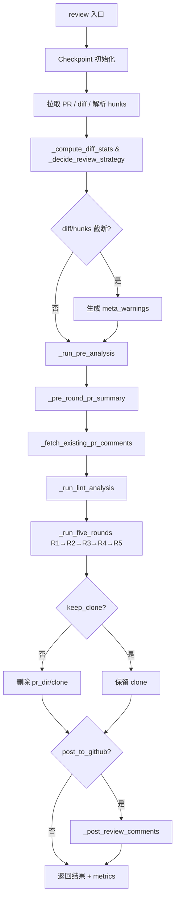

# LazyLLM Git PR Review 完整流程说明

本文档描述 `lazyllm.tools.git.review` 中一次 PR review 的端到端流程：预分析、四轮 LLM 分析（R1–R4）、Lint 融合、合并去重（R5），以及缓存与断点续跑。源码目录：`lazyllm/tools/git/review/`（`runner.py`、`pre_analysis.py`、`rounds.py`、`constants.py`、`checkpoint.py`、`utils.py`、`poster.py`、`lint_runner.py`）。

全局单次请求上下文预算见 `constants.SINGLE_CALL_CONTEXT_BUDGET`（默认 **80000** 字符），全局 LLM 调用总预算见 `constants.TOTAL_CALL_BUDGET`（默认 **60** 次）。

---

## 1. 端到端流程总览

### 1.1 流程图



### 1.2 阶段一览

| 顺序 | 阶段 | 主要产物 / 作用 |
|------|------|-----------------|
| 0 | Checkpoint | `pr_dir`、`checkpoint.json`、`resume_from` → `_invalidated_from` |
| 1 | Diff + 策略 | `diff_text`（可 `max_diff_chars` 截断）、`hunks`（可 `max_hunks` 截断）、`_DiffStats`、`_ReviewStrategy` |
| 2 | Meta warnings | 若触发截断则插入类型为 `meta` 的 issue |
| 3 | 预分析 | `arch_doc`、`review_spec`、`clone_dir`、`agent_instructions` |
| 4 | PR 摘要 | `pr_summary` |
| 5 | 已有评论 | `existing_comments`（供 R5 去重，**不**参与 R1–R4 生成） |
| 6 | Lint | `lint_issues`（基于 `lint_runner`，直接注入 R5，不经 LLM 轮次） |
| 7 | R1 | 按 hunk / 批次的静态审查 + **简洁性检查** |
| 8 | R2 | 自适应：大文件走 **chunk 模式**（Agent + 分块抽取），小文件走 **group 模式**（分组联合 LLM） |
| 9 | R3 | 多文件分批的全局 / 规则视角 |
| 10 | R4 | R4a（生成 PR 设计文档）→ R4b（架构师级 issue）；可选 `prefer_combined=True` 单次 JSON |
| 11 | R5 | 先 **`_deterministic_dedup`**（同 path+line+category 折叠），再压缩 + **1×JSON LLM** 与已有评论合并；注入 Lint issue |
| 12 | 发帖 | `submit_review` / 逐条 `create_review_comment` |
| 13 | 清理 | 默认删除 `{pr_dir}/clone/`，保留 `checkpoint.json` |

---

## 2. 入口 `review()`（`runner.py`）

### 2.1 Checkpoint

- `pr_dir = {lazyllm.config['home']}/review/cache/{safe_repo}/{pr_number}/`。
- `checkpoint_path` 默认：`{pr_dir}/checkpoint.json`。
- `clear_checkpoint=True`：清空 checkpoint 文件并删除 `pr_dir`，从零开始。
- 否则：`resume_from=ReviewStage.X` 时写入 `_invalidated_from`（**不物理删除**历史字段），见第 7 节。

### 2.2 Diff + 策略决策

1. `diff_text`：优先 `ckpt.get('diff_text')`；否则 API 拉取，可按 `max_diff_chars`（默认 120000）截断并写回 checkpoint。
2. `hunks = _parse_unified_diff(diff_text)`，可按 `max_hunks`（默认 50）截断。
3. `diff_stats = _compute_diff_stats(...)` → `_DiffStats`（总有效行数、文件数、每文件有效行数、截断标志）。
4. `strategy = _decide_review_strategy(diff_stats)` → `_ReviewStrategy`：

| PR 规模 | `max_files_for_r2` | `large_file_threshold` | `max_chunks_per_file` |
|---------|--------------------|------------------------|----------------------|
| 极大（>3000 有效行 或 >50 文件） | 10 | 100 | 2 |
| 大（>1000 行 或 >20 文件） | 15 | 150 | 2 |
| 普通 | `R2_MAX_FILES`(20) | 200 | `R2_MAX_CHUNKS_PER_FILE`(3) |

5. 若发生截断，生成类型为 `meta` 的 warning issue（`source='meta'`），在最终结果列表头部插入。

### 2.3 Lint 分析

在五轮 LLM 分析之前，若 `clone_dir` 有效，调用 `_run_lint_analysis(diff_text, clone_dir)`（`lint_runner.py`）。Lint issue **直接注入 R5**，不经过 R1–R4，不消耗 LLM 调用次数。

### 2.4 返回值

```python
{
    'summary': '...',
    'comments': final_comments,      # meta_warnings + R5 输出
    'comments_posted': posted,
    'comment_stats': stats,
    'pr_summary': pr_summary,
    'pr_design_doc': '...',          # R4 产出
    'original_review_code': '...',
    'metrics': {
        'r2_mode': 'mixed',          # 'skip' 若 enable_r2=False
        'r2_files_chunk': N,
        'r2_files_group': N,
        'r2_files_skipped': N,
        'r2_chunks_total': N,
        'truncated_diff_flag': bool,
        'truncated_hunks_flag': bool,
        'lint_issues_count': N,
    }
}
```

---

## 3. 全局预算

### 3.1 字符预算

| 常量 / 阶段 | 说明 |
|-------------|------|
| `SINGLE_CALL_CONTEXT_BUDGET` | 单次请求总上下文约 **80k** 字符 |
| `R1_DIFF_BUDGET` | `SINGLE_CALL_CONTEXT_BUDGET - 25000` ≈ **55k**，R1 同一批内合并的 hunk diff 总长上限 |
| R1 单 hunk | hunk 内容 `_truncate_hunk_content` 约 80 行；`review_spec`/`pr_summary` 各前 **600** 字符 |
| R2 chunk 模式 | Agent diff 压缩至 `_R2_AGENT_DIFF_BUDGET`；每块抽取前用 `_filter_symbol_context_for_chunk`（最多 **3000** 字符）；`shared_context` 上限 `_R2_SHARED_CTX_BUDGET=4000`；抽取阶段 arch `_R2_ARCH_BUDGET=6000`；R1 列表 `_R2_R1_BUDGET=8000` |
| R2 group 模式 | `arch_snippet` 前 **4000** 字符；`shared_context[:_R2_SHARED_CTX_BUDGET]`；`files_block[:40000]`；`round1_json[:4000]` |
| R3 | `arch_use` 约 **38k**；`prev_json` 默认最多 **16k**；多文件按 `budget_files` 打包成 batch |
| R4a | `arch` 约 **12k**，`diff` 按 hunk 预算 |
| R4b | `arch` 约 **42k**，`pr_design_doc` 约 **12k** |
| R4（合并可选） | `prefer_combined=True` 时 `arch` 约 **40k**，`diff` = `SINGLE_CALL_CONTEXT_BUDGET - 42000` |
| R5 | 长评论 / issue 批量 LLM 压缩后 + **1×JSON LLM** |

### 3.2 调用预算（`BudgetManager`）

`BudgetManager(total=80000, total_calls=60)` 同时跟踪字符预算（`allocate`）和调用预算（`consume_call` / `remaining_calls`）。当前各轮字符截断仍以 `clip_text` / 固定 slice 为主；`BudgetManager` 为统一入口，可在后续逐步迁移。

### 3.3 `_sample_text`（长文本采样）

对于超长文本（如 arch_doc），采用 **head + middle + tail** 三段采样（各取 1/3），替代纯截头，保证长文档首、中、尾部信息均有覆盖。

---

## 4. 预分析（`pre_analysis.py`）

### 4.1 编排 `_run_pre_analysis`

- 默认 `arch_cache_path`：`{repo_cache_dir}/arch.json`；`review_spec_cache_path`：`{repo_cache_dir}/spec.json`。
- **`fetch_repo_code=True` 且无 `arch_doc`**：`_run_arch_analysis`（clone → `analyze_repo_architecture`）。
- **`fetch_repo_code=True` 且已有 `arch_doc`**：从 checkpoint 恢复；若缺 `clone_dir` 则再 clone 供 R2 Agent；尽量加载 `agent_instructions`。
- **`fetch_repo_code=False`**：不重新 clone；仍走 `_run_spec_analysis` 拉规则（若 checkpoint 无 `review_spec`）。
- 返回：`(arch_doc, review_spec, clone_dir, agent_instructions)`。

### 4.2 架构文档 `analyze_repo_architecture`

1. **`_collect_structured_snapshot`**（无 LLM）：预算 `_ARCH_SNAPSHOT_BUDGET=6000`，目录树、`__init__.py` 头、依赖、`AGENTS.md` 等。
2. **`_arch_generate_outline`**（**1×JSON LLM**）：输入 `snapshot[:4000]`，输出每节 `title` / `focus` / `search_hints`。
3. **各节填充**（若干次 LLM，摘要链 `prev_summaries` 受 `_ARCH_PREV_SUMMARY_BUDGET=1500` 约束）。
4. **`_build_public_api_catalog`**（**1×JSON LLM** + 正则扫描）：目录树≤4000，结果合并进 `arch_doc` 的 `[Public API Catalog]`。
5. **落盘** `arch.json`：`arch_doc`、`arch_index`、`arch_symbol_index` 等。

### 4.3 历史 review 规则 `analyze_historical_reviews`

拉取已合并 PR 评论，过滤 bot，长评论压缩再抽规则，多 PR 合并，写入 `spec.json` / checkpoint。

规则格式包含 `Rule ID`、`Title`、`Severity`、`Detect`、`Bad/Good Example`、`Auto Fix Suggestion` 等结构化字段，以及跨文件一致性规则。

### 4.4 PR 摘要

**1×文本 LLM**：`pr_body[:800]`、`diff_text[:5000]`。

### 4.5 上下文裁剪

- **`_extract_arch_for_file(arch_doc, file_path, max_chars=3000)`**：解析 `[Section]`；`_ARCH_ALWAYS_INJECT` 标题加权；Public API Catalog 按 `_candidate_scopes(file_path)` 过滤。
- **`_lookup_relevant_rules(review_spec, diff_content, max_detail)`**：从 diff_content **前 200 行** 提关键词匹配规则，完整规则卡最多 `max_detail` 条。

### 4.6 Round 2 用 Agent 工具（`clone_dir` 限定在仓库内）

`_build_scoped_agent_tools_with_cache`：`read_file_scoped`、`read_files_batch`、`grep_callers`、`search_scoped`、`list_dir_scoped`、`shell_scoped`（只读），以及带缓存的 **`analyze_symbol`**（内部可再调 LLM）。

---

## 5. 五轮分析（`rounds.py`）

### 5.1 Round 1：按 hunk / 批次静态审查

- **并发**：`ThreadPoolExecutor(max_workers=4)`，按文件分组。
- **批处理**：同文件多个 hunk 按 **`R1_DIFF_BUDGET`** 合并；单 hunk 走单条分析。
- **抽象方法检测**：若 diff 中含抽象方法变更，自动注入子类实现签名到文件上下文，检测子类是否同步更新。
- **简洁性检查（新增）**：在每次 R1 调用中额外检查 diff 中**新增行**的代码冗余问题（如一次性变量、可简化的条件、可用推导式替换的循环等），使用 `bug_category="style"` 和 `severity="normal"` 报出。
- **每条输入**：截断 hunk、`_read_file_context`（含 scope）、`_extract_arch_for_file(..., 3000)`、`review_spec`/`pr_summary` 片段、可选 `symbol_index`、`agent_instructions`。
- **输出**：JSON 数组；全 PR 按 `max_issues_for_diff` / `cap_issues_by_severity` 限流。
- **Checkpoint**：`r1_hunk_{safe_path}_{new_start}`。

### 5.2 Round 2：自适应 Agent 审查（chunk 模式 + group 模式）

#### 文件分类

```
_classify_files_for_r2(file_diffs, large_file_threshold, max_files)
→ large_files (chunk 模式), small_files (group 模式), skipped_files
```

- 按每文件有效 diff 行数降序排列；总文件数超过 `max_files_for_r2` 的部分进入 `skipped_files`（R1 passthrough）。
- 有效行数 > `large_file_threshold` → large；否则 → small。

#### Chunk 模式（大文件）

1. **相关小文件合并**：`_find_related_small_files(fdiff, remaining_small, file_diffs)` 通过分析大文件 diff 中的 `import` 语句，找到与之相关的小文件，附加到 `symbol_context` 中（上限 `_R2_RELATED_DIFF_BUDGET`）。
2. **Agent 上下文收集**：`compress_diff_for_agent_heuristic(fdiff, _R2_AGENT_DIFF_BUDGET)` → `_r2_build_file_context`（`ReactAgent`，工具：scoped 读写/搜索/shell + `analyze_symbol`，`force_summarize=True`，`keep_full_turns=2`，超时控制）。
3. **分块抽取**：`_split_file_diff_into_chunks(fdiff, _R2_EXTRACT_DIFF_CHUNK)`，每块先 `_filter_symbol_context_for_chunk(symbol_context, diff_chunk)`（从 chunk 提取标识符，过滤 Agent 输出中相关行，截断至 3000 字符），再调用 `_r2_extract_issues(...)`（KEEP/MODIFY/DISCARD R1 issue + 新 issue），记录被丢弃的 R1 `path:line`。
4. 每文件 chunk 数受 `max_chunks_per_file`（策略决定）约束。
5. **Checkpoint**：`r2_file_*`、`r2_disc_*`。

#### Group 模式（小文件）

1. `_r2_group_files(small_files)` 按**目录**分组，每组最多 5 个文件。
2. 每组 **1×LLM**（非 Agent），将同组文件 diff 一起送入，关注**跨文件一致性**（接口、对称更新、共享状态、分层依赖等）。
3. **Checkpoint**：`r2_group_{group_key}`。

#### 共享上下文

`r2_shared_context`（`_r2_build_shared_context(diff_text)`）：跨文件共享的符号、PR 内依赖、接口变更等，上限 `_R2_SHARED_CTX_BUDGET=4000`，可缓存。

### 5.3 Round 3：多文件分批全局分析

- **输入**：`r1 + r2` 作为 `prev_issues`，按文件过滤到当前 batch。
- **每 batch 1×JSON LLM**：`arch_doc` 截断至 ~38k；`_lookup_relevant_rules(..., batch_diff[:12000], max_detail=12)`；`prev_json` 由 `_round3_build_prev_json` 生成（默认总长 **16k**，每条 problem 前 **100** 字符）。
- **校验**：issue 的 `path` 须在 batch 内且行号在 diff 新增行范围内。

### 5.4 Round 4：设计文档 + 架构师评审

**默认两步路径**（`prefer_combined=False`）：

1. **R4a** `_round4_generate_pr_doc`：1×文本 LLM，输入 diff + arch（约 12k），输出结构化 PR 设计文档（含背景、设计目标、方案、模块影响、API 设计、兼容性、风险等）。
2. **R4b** `_round4_architect_review`：1×JSON LLM，输入 arch（约 42k）+ `pr_design_doc` + diff，输出架构师视角的 issue（聚焦 design / maintainability 类别）。

**可选合并路径**（`prefer_combined=True`）：1×文本 LLM + JSON 解析，期望单个 JSON `{"pr_design_doc", "issues"}`；解析失败则 fallback 到两步。

`pr_design_doc` 与 `r4` 写入 checkpoint；`review()` 返回值中的 `pr_design_doc` 来自 checkpoint。

### 5.5 Round 5 (FINAL)：Lint 融合 + 合并去重

1. **Lint 注入**：`lint_issues`（来自 `lint_runner`）带 `source='lint'` 标签，与 R1–R4 结果一同送入 R5。
2. **`_deterministic_dedup`**：按 **`(path, line, bug_category)`** 分组；组内按 **severity 优先**，同 severity 时按 **`source` 优先级** `r2 > r1 > r3 > r4` 选一条。
3. **压缩**：超长评论 / issue 批量 LLM 压成短句（`_compress_existing_comments` / `_compress_new_issues`）。
4. **1×JSON LLM**：新 issue 与已有 PR 评论对比去重；同 path+line 时 r2 优先于 r1；输出仅 `idx` 等，再从 deduped 列表恢复完整字段。
5. **Fallback**：若 LLM 返回空，按 critical > medium > normal 排序 deduped 列表。
6. 每条最终 issue 带 **`_review_version: 2`**；旧格式 final 触发整表重算。

### 5.6 R5 输入与 R1 透传

`r1_passthrough`：若文件被 R2 覆盖，去除 `r2_covered_files` 与 `discarded_r1_keys` 和 `r2_covered_keys` 中已处理的 R1 issue，避免重复。

最终输入 R5：`tag(r1_passthrough, 'r1') + tag(r2, 'r2') + tag(r3, 'r3') + tag(r4, 'r4') + tag(lint_issues, 'lint')`。

---

## 6. Lint 分析（`lint_runner.py`）

- 在 `_run_five_rounds` 之前独立运行（仅需 `clone_dir`，不调用 LLM）。
- 对 diff 涉及的文件运行 lint 工具（如 flake8 及插件），只保留 **diff 覆盖的行** 上的 lint 结果。
- 若用户环境缺少对应语言的 lint 工具，输出 warning 并跳过。
- 结果以 `{"source": "lint", ...}` 格式直接注入 R5，不经过 R1–R4 轮次。

---

## 7. 发帖（`poster.py`）

- **`_fetch_existing_pr_comments`**：`list_review_comments`，规范化 `body` / `path` / `line`。
- **`_post_review_comments`**：优先 **`submit_review`**（`commit_id=head_sha`，`event=COMMENT`，附 `review_body` + 行评）；失败则逐条 **`create_review_comment`**。
- 无 `path` / `line` 的 issue（如 meta warning）**不会**作为行评发出。

---

## 8. 缓存与断点（`checkpoint.py` + `runner.py`）

### 8.1 两套存储

| 类型 | 路径 | 内容 |
|------|------|------|
| **PR checkpoint** | `{pr_dir}/checkpoint.json` | `diff_text`、`pr_summary`、`r1_hunk_*`、`r2_file_*`、`r2_disc_*`、`r2_group_*`、`r2_shared_context`、`r3`、`pr_design_doc`、`r4`、`final`、`clone_dir`、`_stage_done_*`、`_invalidated_from` |
| **Repo 级 arch/spec** | `~/.lazyllm/review/cache/{safe_repo}/arch.json` / `spec.json` | `arch_doc`、`arch_section_*`、`public_api_catalog`、`agent_instructions`、`review_spec` 等 |

### 8.2 `ReviewStage.ordered()`

`CLONE → ARCH → SPEC → PR_SUMMARY → R1 → R2 → R3 → R4 → FINAL`

（`_REVIEW_STAGE_ORDER` 为模块级常量列表，`ReviewStage.ordered()` 直接返回该列表，避免每次调用重建。）

### 8.3 `resume_from`、`_invalidated_from` 与 `clone_dir`

- 传入 `resume_from`：写入 **`_invalidated_from`**，不删旧字段。
- **`get('clone_dir')`**：若目录不存在（成功收尾已删 `pr_dir/clone/`），返回 `None`，触发预分析路径重新 clone。
- **`_stage_for_key`**：聚合键 `r1`/`r2` 分别映射到 `ReviewStage.R1`/`R2`；`r2_group_*` → `R2`；`r2_shared_context` → `R2`；`diff_text` → `CLONE`。
- **`get(key)`**：若 key 对应 stage index ≥ invalidation 起点，返回 `None`。
- **`should_use_cache(stage)`**：无 `resume_from` 且无 `_invalidated_from` → 全部可用；有 `_invalidated_from` 则仅 `stage < invalidated` 可用；有 `resume_from` 则仅 `stage < resume_from` 可用。
- **`mark_stage_done(stage)`**：仅在 `stage == FINAL` 时清除 `_invalidated_from`，保证在一次完整跑通前下游缓存键始终被屏蔽。

### 8.4 `clear_checkpoint=True`

删除 checkpoint 文件并整个 `pr_dir`（与成功结束时只删 `clone/` 不同）。

### 8.5 成功结束后的目录

删除 **`{pr_dir}/clone/`**；**保留** `checkpoint.json`。

---

## 9. LLM 调用与工具小结

| 类型 | 用途 |
|------|------|
| **JSON** | R1、R2 chunk 抽取、R2 group 联合、R3、R5、架构 outline、规则、Public API |
| **文本** | arch 各节、PR 摘要、R4a 设计文档；R4 `prefer_combined=True` 时的单次合并尝试 |
| **Agent** | **Round 2 chunk 模式**的 `ReactAgent`（上下文收集），工具为 scoped 读写/搜索/shell + `analyze_symbol` |
| **重试** | `utils` 中对 JSON 解析失败、限流等有重试与 `json_repair` 兜底 |

---

## 10. 文件索引

| 模块 | 职责 |
|------|------|
| `runner.py` | 编排、diff 策略决策、meta warning、预分析、lint、五轮、清理 clone、发帖 |
| `constants.py` | `SINGLE_CALL_CONTEXT_BUDGET`、`TOTAL_CALL_BUDGET`、`R2_MAX_FILES`、`BudgetManager`、issue 密度与 diff 启发式压缩 |
| `pre_analysis.py` | clone、架构、规则、PR 摘要、Public API、arch 裁剪、Agent 工具 |
| `rounds.py` | R1–R5、R2 chunk/group 两种模式、抽象方法子类检测、R4 两步/可选合并、R5 确定性去重 + Lint 融合 |
| `lint_runner.py` | Lint 分析（diff 过滤行级 lint 结果） |
| `checkpoint.py` | PR 断点、stage、`clone_dir` 校验、键映射、invalidation、`FINAL` 才清除 `_invalidated_from` |
| `utils.py` | LLM 封装、diff 解析、评论规范化、review body |
| `poster.py` | 拉已有评论、提交 review / 行评 |

---

## 11. 已知局限（截断与覆盖相关）

| 区域 | 现象 | 风险 / 备注 |
|------|------|-------------|
| 架构 outline | `snapshot[:4000]`，快照预算 6000 | 部分快照未进入 outline |
| PR 预摘要 | `body[:800]`、`diff[:5000]` | 大 PR 尾部变更在预摘要中不可见 |
| runner diff | `max_diff_chars` 截断整份 diff（**已有 meta warning**） | 超大 PR 后续 hunk 无法进入任一轮；截断时有明确告警 |
| R1 | `review_spec`/`pr_summary` 各 600 字符 | 与 R3 全量规则 + 长 arch 不对称 |
| R2 chunk | 全文件一次 Agent；分块侧已用 `_filter_symbol_context_for_chunk` 对齐 | Agent 可能未覆盖极长 diff 尾部；过滤基于标识符启发式 |
| R2 group | `files_block[:40000]`；无 Agent 探索 | 复杂跨文件语义依赖 Agent 覆盖不足 |
| 规则匹配 | `_lookup_relevant_rules` 仅用 diff **前 200 行** | 关键词集中在尾部时匹配可能偏 |
| R4 默认两步 | R4a `arch` 约 12k | 设计文档受 arch 截断影响 |
| R5 跨 category 去重 | 确定性步骤只折叠**相同 category** | 跨 category 同 path+line 重复仍依赖 LLM |
| BudgetManager | 已提供类与 call 追踪，**各轮尚未全面改用 `allocate`** | 与旧 `clip_*` 并存 |

---

## 12. 可优化方向

| 方向 | 说明 |
|------|------|
| R2 group 模式增强 | 当前 group 模式为单次 LLM，可对较重要的组升级为 Agent 模式 |
| 规则匹配扩大窗口 | `_lookup_relevant_rules` 将 diff 采样从前 200 行扩展为 `_sample_text` 三段采样 |
| 预算统一 | 将 R1/R3/R4 等逐步迁移到 `BudgetManager.allocate`，与 `total_calls` 联动限流 |
| 缓存复用 | `analyze_symbol` 进程内缓存已存在；`r2_shared_context` 已缓存；arch/spec 可进一步多级复用 |
| R5 确定性策略扩展 | 对「同 path+line 不同 category」增加确定性折叠规则（需谨慎） |
| 检索增强 | 对长 `arch_doc` / `review_spec` 接入 `lazyllm.tools.rag.retriever.ContextRetriever` 按需检索 |
| meta warning 可见性 | 截断 warning 可选单独渠道（如 PR 评论摘要开头）通知 reviewer |

---

## 13. 评估与运行指标（Evaluation & Metrics）

`review()` 返回的 `metrics` 字典包含：

| 字段 | 说明 |
|------|------|
| `r2_mode` | `'mixed'` 或 `'skip'` |
| `r2_files_chunk` | chunk 模式处理的文件数 |
| `r2_files_group` | group 模式处理的文件数 |
| `r2_files_skipped` | 超出 `max_files_for_r2` 而跳过的文件数 |
| `r2_chunks_total` | chunk 模式产生的总 chunk 数 |
| `truncated_diff_flag` | diff 是否被截断 |
| `truncated_hunks_flag` | hunks 是否被截断 |
| `lint_issues_count` | Lint 分析发现的 issue 数 |

其余更细粒度指标（各轮 issue 数、LLM 调用次数、耗时等）如需采集，建议在 `_run_five_rounds` 内增加埋点，写入 `pr_dir/review_metrics.json`。

---

*若后续调整 budget、`ReviewStage.ordered()`、R2 策略、R4/R5 行为或增加埋点，请同步更新本文档。*
