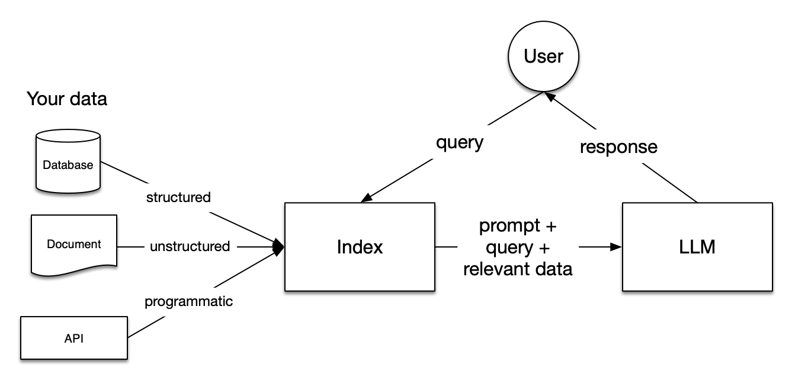

## RAG

检索增强生成（Retrieval-augmented Generation, RAG）是当前备受关注的大模型前沿技术之一。其工作原理是，当模型需要生成文本或回答问题时，首先会从一个庞大的文档集合中检索出相关的信息。这些检索到的信息随后用于指导生成过程，从而显著提高生成文本的质量和准确性。通过这种方式，RAG能够在处理复杂问题时提供更加精确和有意义的回答，是自然语言处理领域的重要进展之一。这种方法的优越性在于它结合了检索和生成的优势，使得模型不仅能够生成流畅的文本，还能基于真实数据提供有依据的回答。



本文展示了如何利用LazyLLM搭建自己的RAG应用。

我们来看一个例子 `rag.py`：

```python
# -*- coding: utf-8 -*-

import lazyllm
from lazyllm import (
    pipeline,
    parallel,
    bind,
    SentenceSplitter,
    Document,
    Retriever,
    Reranker,
)

# ----- Part 1 ----- #

prompt = (
    "You will play the role of an AI Q&A assistant and complete a dialogue task. In this task, "
    "you need to provide your answer based on the given context and question."
)

documents = Document(
    dataset_path="rag_master", embed=lazyllm.OnlineEmbeddingModule(), create_ui=False
)

documents.create_node_group(
    name="sentences", transform=SentenceSplitter, chunk_size=1024, chunk_overlap=100
)

# history has the form of [[query1, answer1], [quer2, answer2], ...]
history = []

# ----- Part 2 ----- #

with pipeline() as ppl:

    # ----- 2.1 ----- #

    with parallel().sum as ppl.prl:
        prl.retriever1 = Retriever(
            documents,
            group_name="CoarseChunk",
            similarity="bm25_chinese",
            similarity_cut_off=0.003,
            topk=3,
        )
        prl.retriever2 = Retriever(
            documents, group_name="sentences", similarity="cosine", topk=3
        )

    # ----- 2.2 ----- #

    ppl.reranker = Reranker(
        "ModuleReranker", model="bge-reranker-large", topk=1
    ) | bind(query=ppl.input)

    # ----- 2.3 ----- #

    ppl.formatter = (
        lambda nodes, query: dict(
            context_str="".join([node.get_content() for node in nodes]), query=query
        )
    ) | bind(query=ppl.input)

    # ----- 2.4 ----- #

    ppl.llm = lazyllm.OnlineChatModule(stream=False).prompt(
        lazyllm.ChatPrompter(prompt, extro_keys=["context_str"])
    ) | bind(llm_chat_history=history)

# ----- Part 3 ----- #

rag = lazyllm.ActionModule(ppl)
rag.start()

while True:
    query = input("query(enter 'quit' to exit): ")
    if query == "quit":
        break
    res = rag(query)
    print(f"answer: {str(res)}\n")
    history.append([query, res])
```

要把这个例子跑起来，首先要按照 [快速入门](/) 的 “环境准备” 小节中的说明配置好环境，然后设置我们申请到的日日新平台的变量：

```bash
export LAZYLLM_SENSENOVA_API_KEY=<申请到的api key>
export LAZYLLM_SENSENOVA_SECRET_KEY=<申请到的 secret key>
```

和本地需要检索的文档目录（注意这个目录指的是数据目录的父目录，例如我们的数据位于 `/d1/d2/d3/`，那么这里的值应该是 `/d1/d2`）：

```bash
export LAZYLLM_DATA_PATH=</path/to/data/dir> # rag data is in `/path/to/data/dir/rag_master` in this example
```

然后运行：

```bash
python3 rag.py
```

看到运行成功的提示之后，输入要查询的词，等待程序返回结果。

这个例子比较复杂，下面我们来详细分析一下。

先看第 1 部分，主要是准备一些后面会用到的数据。

首先为本次应用指定 prompter，这有助于提示 AI 优先根据我们提供的文档内容来回答问题。

接着将本地文档的内容转化为向量，主要由 [Document][lazyllm.tools.Document] 这个类来完成。它会遍历指定的目录，将文档按照指定的规则解析，然后通过 embedding 模块将其转化为向量保存起来。

接着创建一个名为 `sentences` 的 node group，指定了 `SentenceSplitter` 作为转换规则，将文档按照拆分成指定大小的块，并且相邻两个块之间有部分内容重合。关于 `SentenceSplitter` 的用法可以参考 [SentenceSplitter][lazyllm.tools.SentenceSplitter]。

`history` 字段用于保存上下文内容。

第 2 部分，主要是创建整个处理过程的 pipeline。例子中的各个模块关系是这样的：


* 2.1 添加了 retriever1，使用 `SentenceSplitter` 按照 chunk_size 为 1024，chunk_overlap 为 100 分割文档，并使用 `bm25_chinese` 来对文档进行相似度排序，丢弃相似度小于 0.003 的文档，最后取最相似的前 3 篇文档；retriever2 使用自定义的 `sentences` group，采用 `cosine` 计算相似度，取最相似的前 3 篇文档。关于 `Retriever` 的接口使用说明可以参考 [Retriever][lazyllm.tools.Retriever]。

* 2.2 的 `Reranker` 模块将 2.1 中的两个 `Retriever` 的结果合并起来并排序，取排序结果最好的 1 篇文档传给大模型作为回答的参考资料。注意这里通过 `bind()` 函数把用户的输入也传进来供 `Reranker` 参考。`Reranker` 的接口可以参考 [Reranker][lazyllm.tools.Reranker]。

* 2.3 创建了一个 formatter，作用是将前一步中 `Reranker` 返回的文档内容连接起来。

* 2.4 收到了来自用户指定的参考数据，再结合上下文（通过 `bind()` 把 `history` 传给我们的大模型）得到结果。

第 3 部分中，由于 `Pipeline` 不能直接执行，我们使用 `ActionModule` 将其转换成可执行的模块，然后后续的流程和 [快速入门](/) 中类似，这里不再重复。
