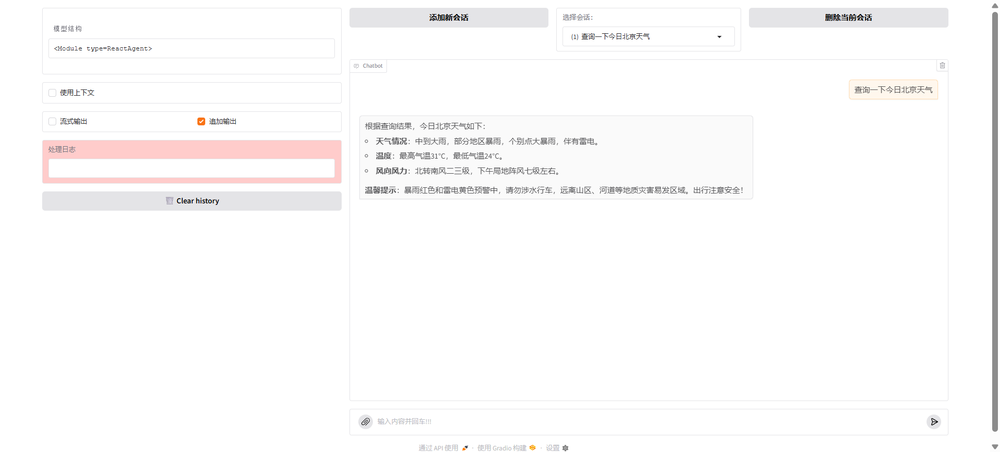
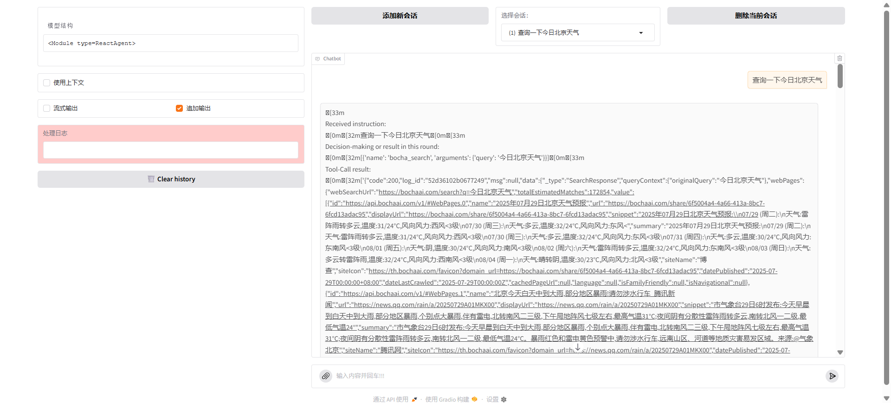

# 使用 LazyLLM 构建智能搜索代理

LazyLLM 支持创建使用语言模型作为推理引擎的智能代理，这些代理能够确定采取什么行动以及如何与外部工具交互。智能代理可以分析用户查询，决定何时使用特定工具，并处理结果以提供全面的响应。这种工具调用能力是构建能够与现实世界交互的智能代理的基础。

!!! abstract "通过本节您将学习到 LazyLLM 的以下要点"

    - 如何通过 @fc_register 创建和注册代理可用的自定义工具。
    - 如何使用 [OnlineChatModule][lazyllm.module.OnlineChatModule] 设置语言模型作为代理的推理引擎。
    - 如何配置 [ReactAgent][lazyllm.tools.agent.ReactAgent] 以智能决定何时调用工具。
    - 如何使用 [WebModule][lazyllm.tools.webpages.WebModule] 部署带有 Web 界面的代理以便交互。

让我们开始吧！

## 环境准备

### 安装依赖

首先，安装 LazyLLM：

```bash
pip install lazyllm
```

### 环境变量

您需要设置 API 密钥：

```bash
export BOCHA_API_KEY=your_bocha_api_key
export LAZYLLM_DEEPSEEK_API_KEY=your_deepseek_api_key
```

**Bocha API 密钥申请：**

1. 访问 [Bocha Open 平台](https://open.bochaai.com/overview)
2. 注册并登录您的账户
3. 在"API KEY管理"页面创建新的 API 密钥
4. 复制生成的 API 密钥并设置到环境变量中

> ❗ 注意：获取 **博查 API 免费额度** 的方式，请参考 [开发文档](https://bocha-ai.feishu.cn/wiki/RWdvw557Li3IJekGeLkcDFa3n1f)。
> 在 [博查 API 主页](https://open.bochaai.com/overview) 的 **资源包管理** 中，订阅 **免费试用** 即可。

**DeepSeek API 密钥申请：**

1. 访问 [DeepSeek 平台](https://platform.deepseek.com/)
2. 注册并登录您的账户
3. 在"API Keys"页面创建新的 API 密钥
4. 复制生成的 API 密钥并设置到环境变量中

### 依赖包

确保您安装了所需的依赖：

```bash
pip install httpx
```

## 定义工具

首先，让我们定义一个代理可以使用的搜索工具。在 LazyLLM 中，我们使用 `@fc_register("tool")` 装饰器来注册函数作为工具：

```python
import os
import httpx
import lazyllm
from lazyllm.tools import fc_register

@fc_register("tool")
def bocha_search(query: str) -> str:
    """
    使用 Bocha 搜索 API 查询信息
    
    Args:
        query (str): 搜索查询，例如："LazyLLM 框架"、"最新 AI 发展"
    
    Returns:
        str: 搜索结果摘要
    """
    try:
        # 从环境变量获取 API 密钥
        api_key = os.getenv('BOCHA_API_KEY')
        if not api_key:
            return "错误：未设置 BOCHA_API_KEY 环境变量"
        
        # 向 Bocha API 发送请求
        url = "https://api.bochaai.com/v1/web-search"
        headers = {
            "Authorization": f"Bearer {api_key}",
            "Content-Type": "application/json"
        }
        data = {
            "query": query,
            "summary": True,
            "freshness": "noLimit",
            "count": 10
        }
        
        with httpx.Client(timeout=30) as client:
            response = client.post(url, headers=headers, json=data)
            if response.status_code == 200:
                return response.text
            return f"搜索失败：{response.status_code}"
            
    except Exception as e:
        return f"搜索错误：{str(e)}"
```

`@fc_register("tool")` 装饰器会自动使此函数对 LazyLLM 代理可用。函数的文档字符串很重要，因为它帮助代理理解何时以及如何使用该工具。

## 使用语言模型

LazyLLM 通过 `OnlineChatModule` 提供对各种在线语言模型的便捷访问：

```python
# 创建 LLM
llm = lazyllm.OnlineChatModule(
    source="deepseek",
    timeout=30
)
```

您也可以使用其他提供商：

```python
# OpenAI
llm = lazyllm.OnlineChatModule(source="openai")

# Anthropic Claude
llm = lazyllm.OnlineChatModule(source="claude")

# 本地模型
llm = lazyllm.OnlineChatModule(source="ollama")
```

## 创建代理

现在让我们创建一个可以使用搜索工具的 ReactAgent：

```python
def create_agent():
    """创建配置好的搜索代理"""
    # 创建 LLM
    llm = lazyllm.OnlineChatModule(
        source="deepseek",
        timeout=30
    )
    
    # 创建 ReactAgent
    agent = lazyllm.tools.agent.ReactAgent(
        llm=llm,
        tools=["bocha_search"],  # 引用我们注册的工具
        max_retries=2,
        return_trace=False,
        stream=False
    )
    
    return agent
```

`ReactAgent` 遵循 ReAct（推理和行动）范式，它允许代理：

- **思考**需要做什么
- **行动**通过在需要时调用工具
- **观察**结果并继续推理

## 运行代理

让我们用一个简单的查询来测试我们的代理：

```python
# 创建代理
agent = create_agent()

# 运行查询
result = agent("搜索关于 LazyLLM 框架的最新信息")
print(result)
```

代理将：

1. 分析查询
2. 决定使用 `bocha_search` 工具
3. 使用适当的搜索词调用工具
4. 处理结果并提供全面的答案

## Web 界面

LazyLLM 让部署带有 Web 界面的代理变得简单：



```python
def start_web_interface():
    """启动 Web 界面"""
    print("启动博查搜索工具 Web 界面...")
    
    try:
        # 检查 API 密钥
        if not os.getenv('BOCHA_API_KEY'):
            print("警告：未设置 BOCHA_API_KEY 环境变量")
            print("请设置：export BOCHA_API_KEY=your_api_key")
            return
            
        # 创建代理
        agent = create_agent()
        
        # 启动 Web 界面
        web_module = lazyllm.WebModule(
            agent,
            port=8848,
            title="博查搜索代理"
        )
        
        print(f"Web 界面已启动：http://localhost:8848")
        print("按 Ctrl+C 停止服务")
        
        web_module.start().wait()
        
    except KeyboardInterrupt:
        print("\n停止服务...")
    except Exception as e:
        print(f"启动失败：{e}")
```

## 流式响应

要启用流式响应，请修改代理配置：



```python
agent = lazyllm.tools.agent.ReactAgent(
    llm=llm,
    tools=["bocha_search"],
    max_retries=2,
    return_trace=False,
    stream=True  # 启用流式输出
)
```

## 添加记忆功能

LazyLLM 代理可以通过 Web 界面自动维护对话历史，或者您可以实现自定义记忆功能来增强代理在对话中维护上下文的能力。

记忆功能使代理能够：

- 记住之前的对话和用户偏好
- 在多次交互中维护上下文
- 基于对话历史提供更个性化的响应
- 积累关于正在进行的项目或主题的知识

*自定义记忆实现将在未来更新中添加。*

## 完整示例

这是完整的工作示例：

```python
#!/usr/bin/env python3
# -*- coding: utf-8 -*-
"""
使用 LazyLLM 框架的搜索工具代理
支持博查搜索 API 的 Web 界面
"""

import os
import httpx
import lazyllm
from lazyllm.tools import fc_register


@fc_register("tool")
def bocha_search(query: str) -> str:
    """
    使用 Bocha 搜索 API 查询信息
    
    Args:
        query (str): 搜索查询，例如："LazyLLM 框架"、"最新 AI 发展"
    
    Returns:
        str: 搜索结果摘要
    """
    try:
        # 从环境变量获取 API 密钥
        api_key = os.getenv('BOCHA_API_KEY')
        if not api_key:
            return "错误：未设置 BOCHA_API_KEY 环境变量"
        
        # 向 Bocha API 发送请求
        url = "https://api.bochaai.com/v1/web-search"
        headers = {
            "Authorization": f"Bearer {api_key}",
            "Content-Type": "application/json"
        }
        data = {
            "query": query,
            "summary": True,
            "freshness": "noLimit",
            "count": 10
        }
        
        with httpx.Client(timeout=30) as client:
            response = client.post(url, headers=headers, json=data)
            if response.status_code == 200:
                return response.text
            return f"搜索失败：{response.status_code}"
            
    except Exception as e:
        return f"搜索错误：{str(e)}"


def create_agent():
    """创建配置好的搜索代理"""
    # 创建 LLM
    llm = lazyllm.OnlineChatModule(
        source="deepseek",
        timeout=30)
    
    # 创建 ReactAgent
    agent = lazyllm.tools.agent.ReactAgent(
        llm=llm,
        tools=["bocha_search"],
        max_retries=2,
        return_trace=False,
        stream=False
    )
    
    return agent


def start_web_interface():
    """启动 Web 界面"""
    print("启动博查搜索工具 Web 界面...")
    
    try:
        # 检查 API 密钥
        if not os.getenv('BOCHA_API_KEY'):
            print("警告：未设置 BOCHA_API_KEY 环境变量")
            print("请设置：export BOCHA_API_KEY=your_api_key")
            return
            
        # 创建代理
        agent = create_agent()
        
        # 启动 Web 界面
        web_module = lazyllm.WebModule(
            agent,
            port=8848,
            title="博查搜索代理"
        )
        
        print(f"Web 界面已启动：http://localhost:8848")
        print("按 Ctrl+C 停止服务")
        
        web_module.start().wait()
        
    except KeyboardInterrupt:
        print("\n停止服务...")
    except Exception as e:
        print(f"启动失败：{e}")


if __name__ == "__main__":
    start_web_interface()
```

## 使用示例

### 命令行使用

```python
# 创建和使用代理
agent = create_agent()

# 搜索技术信息
result = agent("搜索 Python 异步编程最佳实践")
print(result)

# 搜索新闻
result = agent("查找 AI 领域的最新突破")
print(result)
```

### Web 界面使用

1. 运行脚本：`python tool_agent.py`
2. 在浏览器中打开 `http://localhost:8848`
3. 通过 Web 界面与代理开始对话

## 总结

LazyLLM 提供了一个强大且易于使用的框架来构建智能代理。只需几行代码，您就可以：

- 注册自定义工具
- 创建复杂的代理
- 部署 Web 界面
- 处理流式和记忆功能

这个框架使构建可以与外部 API 交互并为用户查询提供智能响应的生产就绪 AI 代理变得容易。有关 LazyLLM 的更多信息，请查看[官方文档](docs.lazyllm.ai/)和示例。
