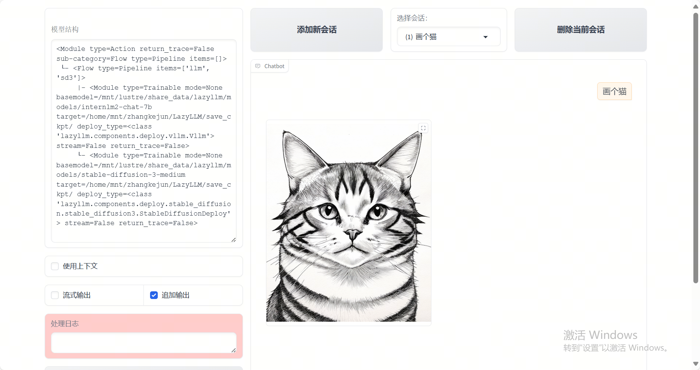

# multi_modal_output_agent

本项目展示了如何使用 [LazyLLM](https://github.com/LazyAGI/LazyLLM) 构建一个多模态智能 Agent。

通过本节您将学习到 LazyLLM 的以下要点:

- 如何调用Stable Diffusion模型生成图像。
- 如何封装并注册一个函数为工具；
- 如何用几行代码就用 `WebModule` 启动客户端服务

## 代码实现

### 项目依赖

确保你已安装以下依赖：

```bash
pip install lazyllm
```
### 设计提示词
我们设计一个提示词，在其中指定它的角色为绘画提示词大师，并且可以进行翻译，可以根据用户的输入进行提示词生成和扩写。具体如下：
```python
prompt = ('You are a drawing prompt word master who can convert any Chinese content entered by the user into English drawing prompt words. '
          'In this task, you need to convert any input content into English drawing prompt words, and you can enrich and expand the prompt word content.')
```
### 设置模型
基于lazyllm构建自己的大语言模型，并将刚刚写好的提示词设置给它：
```python
llm = lazyllm.TrainableModule('internlm2-chat-7b').prompt(lazyllm.ChatPrompter(prompt))
```
与此同时我们还需要再引入SD3模型，这是一个非LLM模型，但TrainableModule支持以LLM的方式进行使用，即直接在 TrainableModule 中指定模型名即可：
```python
sd3 = lazyllm.TrainableModule('stable-diffusion-3-medium')
```
### 组装应用
LazyLLM 中有很多类型的控制流，控制流一般就是用于控制数据的流向。通过控制流将模块组装起来，以构成我们的Agent。这里我们选择使用 Pipeline上下文管理器来构建一个 LazyLLM 的控制流程， 实现顺序执行：先大模型生成提示词，再将提示词喂给SD3模型来获取图像。
```python
with pipeline() as ppl:
    ppl.llm = lazyllm.TrainableModule('internlm2-chat-7b').prompt(lazyllm.ChatPrompter(prompt))
    ppl.sd3 = lazyllm.TrainableModule('stable-diffusion-3-medium')
```
### 启动应用
最后，我们将控制流 ppl 套入一个客户端，并启动部署（start()），在部署完后保持客户端不关闭（wait()）。
```python
lazyllm.WebModule(ppl, port=23468).start().wait()
```
### 完整代码
import lazyllm
from lazyllm import pipeline

prompt = ('You are a drawing prompt word master who can convert any Chinese content entered by the user into English drawing prompt words. '
          'In this task, you need to convert any input content into English drawing prompt words, and you can enrich and expand the prompt word content.')

with pipeline() as ppl:
    ppl.llm = lazyllm.TrainableModule('internlm2-chat-7b').prompt(lazyllm.ChatPrompter(prompt))
    ppl.sd3 = lazyllm.TrainableModule('stable-diffusion-3-medium')

lazyllm.WebModule(ppl, port=23468).start().wait()

效果如下：

