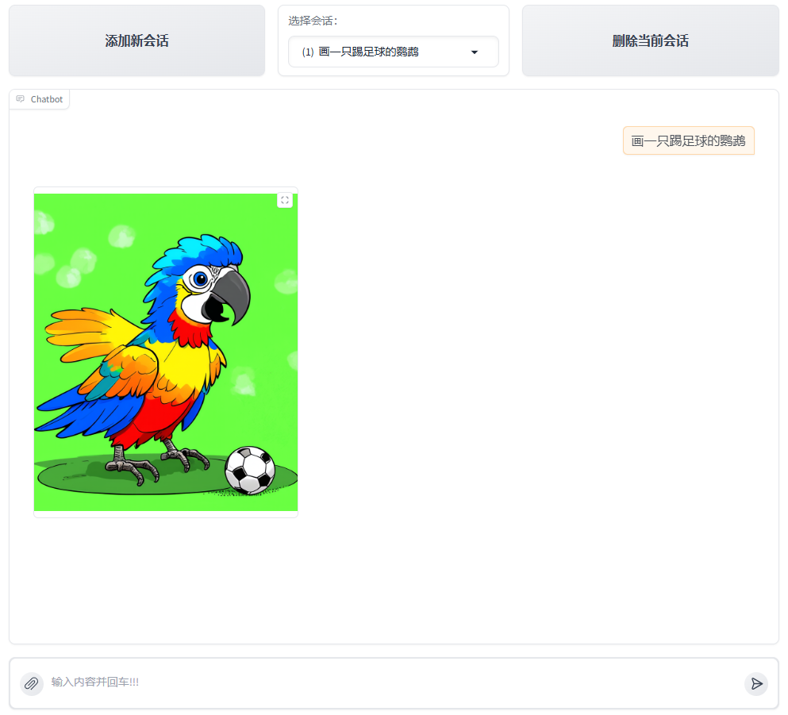

# multi_modal_output_agent

本项目展示了如何使用 [LazyLLM](https://github.com/LazyAGI/LazyLLM) 构建一个多模态智能 Agent。

通过本节您将学习到 LazyLLM 的以下要点:

- 如何调用Stable Diffusion模型生成图像。
- 如何封装并注册一个函数为工具；
- 如何用几行代码就用 `WebModule` 启动客户端服务

## 代码实现

### 项目依赖

确保你已安装以下依赖：

```bash
pip install lazyllm
```

### 步骤详解

#### Step 1: 初始化大模型与图像生成模型

```python
llm = TrainableModule("internlm2-chat-7b").start()
sd3 = TrainableModule("stable-diffusion-3-medium").start()
```

#### Step 2: 定义提示任务

将中文内容转换为英文绘画提示词（Prompt）

```python
def convert_to_prompt(content: str) -> str:
    '''
    Convert Chinese description into detailed English prompt words for image generation.

    Args:
        content (str): Chinese text describing the image to be generated.
    '''
    system_prompt = (
        "You are a drawing prompt word master who can convert any Chinese content "
        "entered by the user into English drawing prompt words. "
        "In this task, you need to convert any input content into English drawing prompt words, "
        "and you can enrich and expand the prompt word content."
    )
    full_prompt = f"{system_prompt}\n\nInput:\n{content}"
    llm1 = llm.share()
    return llm1(full_prompt)
```

使用 Stable Diffusion 生成图像

```python
def generate_image(prompt: str) -> str:
    '''
    Generate an image based on the given English prompt and style.

    Args:
        prompt (str): The English prompt describing the image.
    '''
    _sd3 = sd3.share()
    return _sd3(prompt)
```


#### Step 3: 工具函数注册

使用 `@fc_register("tool")` 注册多个工具函数：

```python
@fc_register("tool")
def convert_to_prompt(content: str) -> str:
    '''
    Convert Chinese description into detailed English prompt words for image generation.

    Args:
        content (str): Chinese text describing the image to be generated.
    '''
    system_prompt = (
        "You are a drawing prompt word master who can convert any Chinese content "
        "entered by the user into English drawing prompt words. "
        "In this task, you need to convert any input content into English drawing prompt words, "
        "and you can enrich and expand the prompt word content."
    )
    full_prompt = f"{system_prompt}\n\nInput:\n{content}"
    llm1 = llm.share()
    return llm1(full_prompt)
```

```python
@fc_register("tool")
def generate_image(prompt: str) -> str:
    '''
    Generate an image based on the given English prompt and style.

    Args:
        prompt (str): The English prompt describing the image.
    '''
    _sd3 = sd3.share()
    return _sd3(prompt)
```

#### Step 4: 使用Agent

让大模型调用我们定义好的工具：

```python
agent = FunctionCallAgent(llm.share(), tools=["convert_to_prompt", "generate_image"])
```

### 示例运行结果

示例输入：

```python
query = "请画一只正在踢足球的鹦鹉"
```

得到的图像：


有没有可能使用更简单的方式一键实现上述功能？

可以通过 [Pipeline](https://docs.lazyllm.ai/zh-cn/latest/API%20Reference/flow/#lazyllm.flow.Pipeline) 控制流来组装应用，只需四行代码，就可以在客户端实现上面的功能：

```python
with pipeline() as ppl:
    ppl.llm = lazyllm.TrainableModule('internlm2-chat-7b').prompt(lazyllm.ChatPrompter(prompt))
    ppl.sd3 = lazyllm.TrainableModule('stable-diffusion-3-medium')
lazyllm.WebModule(ppl, port=23466).start().wait()
```

示例：
